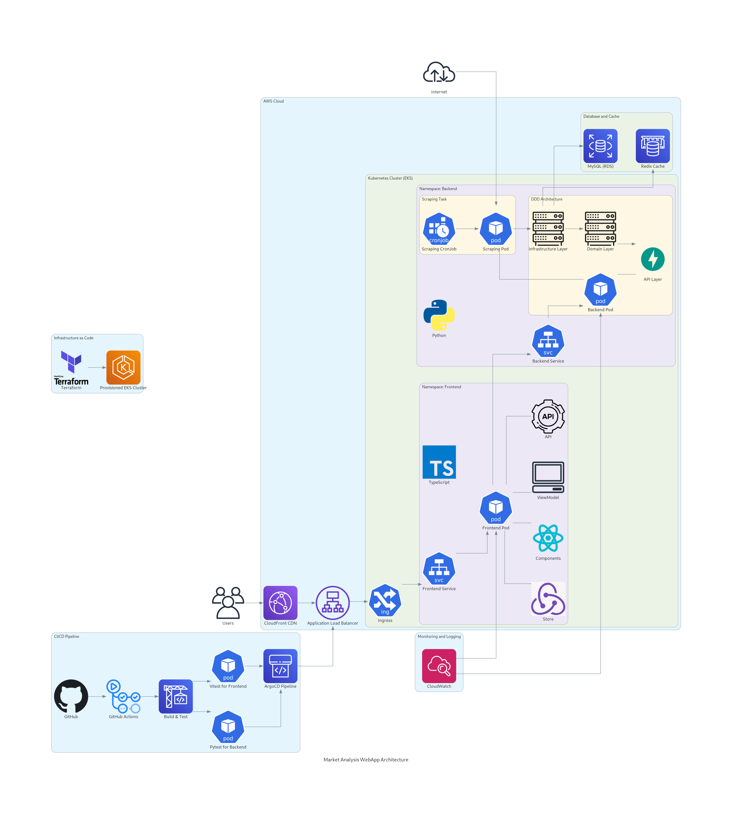

# 📈 Market Analysis Web App

<div align="center">


**様々な市場データを統合分析する次世代Webアプリケーション**

*Modern Web Development × Cloud Native × Domain Driven Design*

</div>

---

## 🎯 プロジェクト概要

価格情報だけでなく、**取引量・参加者動向・各種市場指標**を統合的に可視化・分析できるWebアプリケーションです。

投資判断をサポートし、意思決定の精度を高めるために、ユーザーごとにカスタマイズ可能なダッシュボードや、データの自動取得・監視機能を備えた**クラウドネイティブアプリケーション**として設計されています。

### 💡 開発コンセプト
- **モダンな技術スタック**による高品質な実装
- **チーム開発**を意識した設計・コード品質
- **保守運用性**を重視したアーキテクチャ
- **エンタープライズレベル**の信頼性・拡張性

---

## ✨ 主な機能

### 🔧 実装済み機能
- ✅ **ユーザー認証システム** (JWT認証・メール認証)
- ✅ **RESTful API設計** (OpenAPI準拠)
- ✅ **レスポンシブUI** (React + TypeScript)
- ✅ **データベース設計** (MySQL + Redis)
- ✅ **コンテナ化** (Docker + Kubernetes)
- ✅ **GitOps運用** (ArgoCD)
- ✅ **市場データ自動取得** (Webスクレイピング)

### 🚧 開発中・未実装機能
- 🔄 **カスタムダッシュボード** (ドラッグ&ドロップUI)
- 🔄 **AWS本番環境デプロイ** (開発中)
- 📅 **ロールベースアクセス制御** (今後実装予定)
- 📅 **リアルタイム通知システム** (今後実装予定)
- 📅 **AI/機械学習による市場分析** (今後実装予定)

---

## 🛠️ 技術スタック

### バックエンド
```
Python 3.11+ | FastAPI | SQLAlchemy 2.x | Alembic | pytest
```
- **アーキテクチャ**: DDD (ドメイン駆動開発)
- **開発手法**: TDD (テスト駆動開発)
- **設計原則**: SOLID原則、デザインパターン活用

### フロントエンド
```
TypeScript 5.x | React 18 | Redux Toolkit | Vitest
```
- **アーキテクチャ**: CBD (コンポーネントベース開発)
- **開発手法**: FP (関数型プログラミング) + TDD
- **UI設計**: ViewModel導入、型安全性重視

### インフラ・DevOps
```
Docker | Kubernetes | Helm | ArgoCD | Terraform
```
- **開発環境**: VS Code Dev Containers
- **CI/CD**: GitHub Actions + ArgoCD (GitOps)
- **インフラ**: AWS (予定) + IaC (Terraform)
- **監視**: Grafana + Loki + Fluent Bit

### データベース
```
MySQL 8.0 | Redis | SQLAlchemy ORM
```

---

## 🏗️ アーキテクチャ設計

### システム構成図
<div align="center">
  
</div>

*AWS上でのクラウドネイティブアーキテクチャ構成*

### バックエンド構成
```
src/
├── application/          # アプリケーション層
│   ├── web/api/         # Web API
│   └── background_workers/ # バックグラウンド処理
├── domain/              # ドメイン層
│   ├── entities/        # エンティティ
│   ├── services/        # ドメインサービス
│   ├── repositories/    # リポジトリインターフェース
│   └── value_objects/   # 値オブジェクト
└── infrastructure/      # インフラ層
    ├── mysql/          # MySQL実装
    ├── redis/          # Redis実装
    └── authentication/ # 認証実装
```
- データアクセス層: RDSとの連携、データ取得・永続化
- ビジネスロジック層: スクレイピング、データ加工、ユーザー管理
- API層: FastAPIによるAPIエンドポイント提供

### フロントエンド構成
```
src/
├── components/          # Reactコンポーネント
├── viewModels/         # ViewModel層
├── store/              # Redux状態管理
├── api/                # API通信
└── types/              # TypeScript型定義
```
- プレゼンテーション層: ReactコンポーネントによるUI構築
- 状態管理層: Reduxによる状態管理
- データ取得層: バックエンドAPIとの通信

---

## 🚀 セットアップ & 開発環境

### 前提条件
- Docker Desktop
- VS Code + Dev Containers拡張機能

### クイックスタート

```bash
# 1. リポジトリクローン
git clone https://github.com/your-username/market-analysis-webapp.git
cd market-analysis-webapp

# 2. VS Code Dev Containerで開発環境起動
code .
# Command Palette → "Dev Containers: Reopen in Container"

# 3. アプリケーション起動
docker-compose up -d

# 4. ブラウザでアクセス
# Frontend: http://localhost:3000
# Backend API: http://localhost:8000/docs
```

### テスト実行

```bash
# バックエンドテスト
cd backend && pytest --cov=src

# フロントエンドテスト  
cd frontend && npm run test:coverage
```

---

## 📁 プロジェクト構成

<details>
<summary>📂 ディレクトリ構成 (クリックで展開)</summary>

```
project/
├── .devcontainer/              # 開発コンテナ設定
├── .github/workflows/          # GitHub Actions CI/CD
├── argocd/                     # ArgoCD設定
├── backend/                    # バックエンドアプリケーション
│   ├── src/
│   │   ├── application/        # アプリケーション層
│   │   ├── domain/            # ドメイン層
│   │   └── infrastructure/    # インフラ層
│   ├── tests/                 # テストコード
│   └── alembic/               # DBマイグレーション
├── frontend/                   # フロントエンドアプリケーション
│   ├── src/
│   │   ├── components/        # Reactコンポーネント
│   │   ├── viewModels/        # ViewModel層
│   │   ├── store/             # Redux状態管理
│   │   └── api/               # API通信層
│   └── tests/                 # テストコード
├── k8s/                       # Kubernetes manifests
├── mysql/                     # MySQL設定
├── redis/                     # Redis設定
└── docker-compose.yml         # 開発環境設定
```

</details>

---

## 🎨 技術的ハイライト

### 🔐 セキュリティ
- **JWT認証** + **リフレッシュトークン**による安全な認証
- **パスワードハッシュ化** (bcrypt)
- **入力検証** (Pydantic)
- **CORS設定** による適切なアクセス制御

### 📊 データベース設計
- **正規化** されたテーブル設計
- **インデックス** 最適化
- **マイグレーション** 管理 (Alembic)
- **接続プール** による効率的なDB接続

### 🧪 品質保証
- **テストカバレッジ 80%以上** を目標
- **型安全性** (TypeScript strict mode + mypy)
- **リンター/フォーマッター** 統一 (ESLint, Prettier, Black)
- **CI/CD** による自動テスト実行

### ☁️ クラウドネイティブ
- **コンテナ化** (Docker multi-stage build)
- **Kubernetes** による本格運用設計
- **GitOps** (ArgoCD) による宣言的デプロイメント
- **IaC** (Terraform) による環境の再現性確保

---

## 📈 今後の開発計画

### Phase 1: 基本機能完成 (短期)
- [ ] カスタムダッシュボードUI完成
- [ ] 市場データ取得・表示機能の拡充
- [ ] ユーザー管理機能の拡充

### Phase 2: 高度な機能実装 (中期)
- [ ] AI/機械学習による分析機能
- [ ] リアルタイム通知システム
- [ ] モバイルアプリ対応 (PWA)

### Phase 3: 本格運用開始 (長期)
- [ ] AWS本番環境構築・デプロイ
- [ ] 監視・ログ基盤の充実
- [ ] パフォーマンス最適化

---

## 🤝 開発について

### 開発方針
- **アジャイル開発** による迅速な価値提供
- **コードレビュー** による品質向上
- **ドキュメント** の充実
- **テスト** を重視した堅牢な実装

### 貢献方法
1. Issues作成による機能提案・バグ報告
2. Pull Requestによるコード貢献
3. ドキュメント改善

---

## 📄 ライセンス

MIT License

---

## 📞 お問い合わせ

ご質問・ご提案がございましたら、お気軽にIssueまたはPull Requestをお送りください。

---

<div align="center">

**⭐ 気に入ったらスターをお願いします！⭐**

*Built with ❤️ and modern technologies*

</div>

