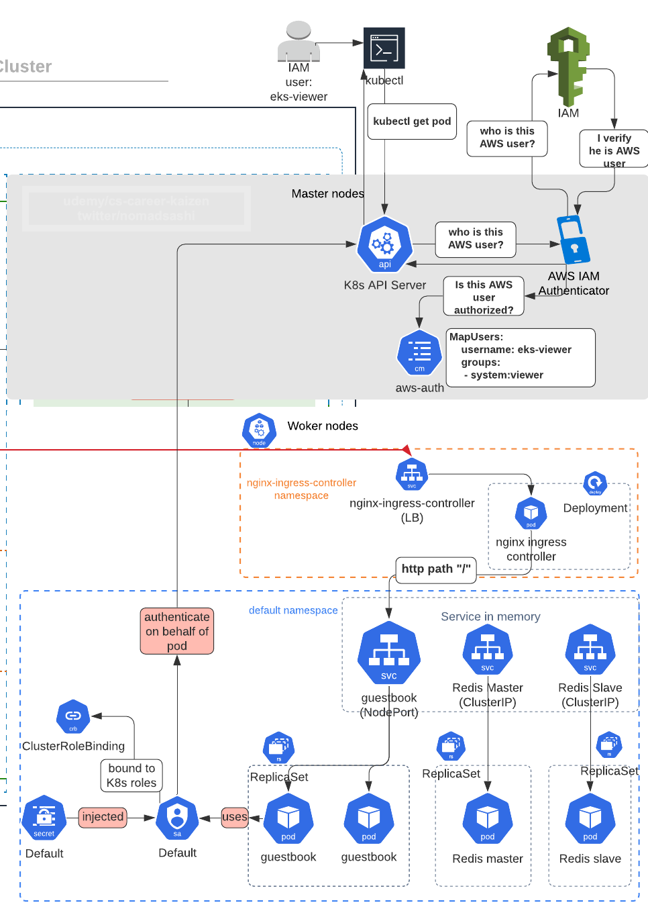
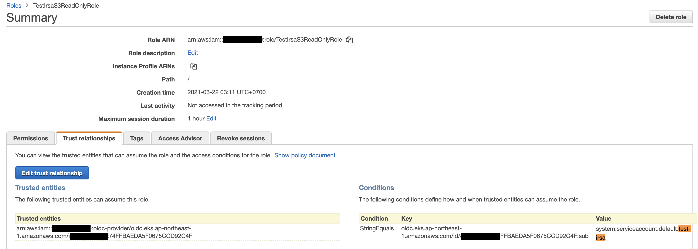

# (ベストプラクティス) Security: IRSA(IAM Role for Service Account）を使い、PodレベルのAWSへの認可を設定

## Service Accountを使ったPodのK8sクラスターへの認証（Authentication）をおさらい


1. まずPodのリソースYAMLでService Accountを指定すると, Podの代わりのService AccountがAPI serverに認証するためのトークンを、コンテナ内のファイルにVolumeがマウントされる（`/var/run/secrets/kubernetes.io/serviceaccount/token`）
2. Podはコンテナ内のファイルにVolumeがマウントされたトークンでAPI serverに認証される


## EKS NodeのInstance Profileを使ったPodのAWSリソースへの認可（Authorization）


1. PodはEKSワーカーノード上に起動し, そのEC2インスタンスにはAWS IAM instance profileがアタッチされている
2. つまりPod内のコンテナはEC2のインスタンスメタデータのURL（`169.254.169.254/latest/meta-data/iam/security-credentials/IAM_ROLE_NAME`）から、一時的なIAM credentialsを取得することができる

コンテナをEKSに起動して、シェルでコンテナ内に入り、インスタンスメタデータのURL（`169.254.169.254/latest/meta-data/iam/security-credentials/IAM_ROLE_NAME`）をチェック

```sh
# コンテナをEKSに起動
kubectl run --image curlimages/curl --restart Never --command curl -- /bin/sh -c "sleep 500"

# シェルでコンテナ内に入り
kubectl exec -it curl sh

# インスタンスメタデータのURLにアクセス
curl 169.254.169.254/latest/meta-data/iam/security-credentials
```

ここで問題なのが最小権限のルールが破られて、どのPodも同じEC2のAWS Instance ProfileにアタッチされたAWS IAM Roleにアクセスができることです。（つまり、ノードレベルのAWS認可）


## IRSA(IAM Role for Service Account、またはPodレベルのIAM認可）アーキテクチャの解剖


1. `kubectl apply -f`コマンドを使ってPodを起動する時, YAMLがAPI Serverに送られ、API ServerにあるAmazon EKS Pod Identity webhookが、常時YAMLリソースにService AccountとそのService AccountのAnnotationにAWS IAM Role ARNがあるか見ています
2. `irsa-service-account`というService Accountに eks.amazonaws.com/role-arn annotationがあるので, webhookがAWS_ROLE_ARNやAWS_WEB_IDENTITY_TOKEN_FILEという環境変数をPodにInjectoします（aws-iam-token projected volumeがマウントされる）
3. Service accoountがOIDC経由でAWS IAMから認証が取れた後、JWT トークンをOIDCから受け取り `AWS_WEB_IDENTITY_TOKEN_FILE`に保存します
4. コンテナが`aws s3 ls`などのAWS CLIコマンドを実行すると、Podが`AWS_WEB_IDENTITY_TOKEN_FILE`に保存されたトークンを使って`sts:assume-role-with-web-identity`コマンドを実行し、AWS IAM roleをAssumeします。そのIAM Roleの一時的なCredentialsを使って`aws s3 ls`が実行されます


# Step 1: Understand the requirements for IRSA

AWS IRSA doc: https://docs.aws.amazon.com/eks/latest/userguide/iam-roles-for-service-accounts.html says there are 3 steps:
1. (req1) OIDCプロバイダーを作成し、クラスターにアソシエイト
2. (req2) NamespaceとServiceAccountとOIDCエンドポイントを指定したIAM assumable roleを作成
3. (req3) k8s service accountにIAM role ARNのAnnotationを追加


# Step 2: (req1) OIDCプロバイダーを作成し、クラスターにアソシエイト

AWS Terraform EKS moduleにIRSAのサンプルがあります: https://github.com/terraform-aws-modules/terraform-aws-eks/tree/master/examples/irsa

IRSA関連のファイルは[resource_modules/container/eks/irsa.tf](resource_modules/container/eks/irsa.tf)です
```sh
# IAM Roles for EKS Service-Accounts (IRSA)を有効化

# The Root CA Thumbprint for an OpenID Connect Identity Provider is currently
# Being passed as a default value which is the same for all regions and
# Is valid until (Jun 28 17:39:16 2034 GMT).
# https://crt.sh/?q=9E99A48A9960B14926BB7F3B02E22DA2B0AB7280
# https://docs.aws.amazon.com/IAM/latest/UserGuide/id_roles_providers_create_oidc_verify-thumbprint.html
# https://github.com/terraform-providers/terraform-provider-aws/issues/10104

resource "aws_iam_openid_connect_provider" "oidc_provider" {
  count           = var.enable_irsa && var.create_eks ? 1 : 0 # <---- enable_irsaのFlag
  client_id_list  = [local.sts_principal]
  thumbprint_list = [var.eks_oidc_root_ca_thumbprint]
  url             = flatten(concat(aws_eks_cluster.this[*].identity[*].oidc.0.issuer, [""]))[0]
}
```

もし`enable_irsa`がtrueだった場合、`irsa.tf`は`aws_iam_openid_connect_provider` resource を作成します。([AWS doc](https://docs.aws.amazon.com/eks/latest/userguide/iam-roles-for-service-accounts.html)).


# Step 3: `Composition` layerのterraform.tfvarsで、`enable_irsa`インプット変数をtrueに設定

[composition/eks-demo-infra/ap-northeast-1/prod/terraform.tfvars](composition/eks-demo-infra/ap-northeast-1/prod/terraform.tfvars)で, `enable_irsa`のValueを設定
```sh
## IRSA (IAM role for service account) ##
enable_irsa      = true
```

[composition/eks-demo-infra/ap-northeast-1/prod/main.tf](composition/eks-demo-infra/ap-northeast-1/prod/main.tf)で, `enable_irsa`のValueをcomposition layerからinfrastructure layerのインプット変数`enable_irsa`に設定:
```sh
########################################
# EKS
########################################
module "eks" {
  source = "../../../../infrastructure_modules/eks"

  ## EKS ##
  create_eks                     = var.create_eks
  cluster_version                = var.cluster_version
  cluster_name                   = local.cluster_name
  cluster_endpoint_public_access = var.cluster_endpoint_public_access
  vpc_id                         = module.vpc.vpc_id
  subnets                        = module.vpc.private_subnets

  # note: either pass worker_groups or node_groups
  # this is for (EKSCTL API) unmanaged node group
  self_managed_node_groups = var.self_managed_node_groups

  # this is for (EKS API) managed node group
  eks_managed_node_groups = var.eks_managed_node_groups

  manage_aws_auth_configmap = var.manage_aws_auth_configmap
  create_aws_auth_configmap = var.create_aws_auth_configmap
  # add roles that can access K8s cluster
  aws_auth_roles = local.aws_auth_roles
  # add IAM users who can access K8s cluster
  aws_auth_users = var.aws_auth_users

  enabled_cluster_log_types     = var.enabled_cluster_log_types
  cluster_log_retention_in_days = var.cluster_log_retention_in_days

  ## IRSA (IAM role for service account) ##
  enable_irsa = var.enable_irsa # <------ STEP 2

  test_irsa_service_account_namespace = var.test_irsa_service_account_namespace
  test_irsa_service_account_name      = var.test_irsa_service_account_name

  ## Common tag metadata ##
  env      = var.env
  app_name = var.app_name
  tags     = local.eks_tags
  region   = var.region
}
```


また`enable_irsa`インプット変数を[composition/eks-demo-infra/ap-northeast-1/prod/variables.tf](composition/eks-demo-infra/ap-northeast-1/prod/variables.tf)に定義 
```sh
## IRSA & cluster autoscaler ##
variable "enable_irsa" {
  description = "Whether to create OpenID Connect Provider for EKS to enable IRSA	"
}
```


# Step 4: `enable_irsa`インプット変数をinfrastructure layerからresource module layerへパス

[infrastructure_modules/eks/main.tf](infrastructure_modules/eks/main.tf)で, `cluster_enabled_log_types`の値をresource moduleの`cluster_enabled_log_types`インプット変数にパス
```sh
module "eks_cluster" {
  source = "../../resource_modules/container/eks"

  create = var.create_eks

  cluster_name                   = var.cluster_name
  cluster_version                = var.cluster_version
  cluster_endpoint_public_access = var.cluster_endpoint_public_access

  vpc_id     = var.vpc_id
  subnet_ids = var.subnets

  # Self Managed Node Group(s)
  # self_managed_node_groups takes precedence to self_managed_node_group_defaults
  self_managed_node_groups = var.self_managed_node_groups

  # use KMS key to encrypt EKS worker node's root EBS volumes
  self_managed_node_group_defaults = {
    key_name = module.key_pair.key_name

    iam_role_additional_policies = {}
  }

  # aws-auth configmap
  manage_aws_auth_configmap = var.manage_aws_auth_configmap
  create_aws_auth_configmap = var.create_aws_auth_configmap
  aws_auth_roles            = var.aws_auth_roles
  aws_auth_users            = var.aws_auth_users

  # Extend node-to-node security group rules. Ref: https://github.com/terraform-aws-modules/terraform-aws-eks/blob/master/examples/self_managed_node_group/main.tf#L78
  # WARNING: need this for metrics-server to work, asn well as istio ingress/egress's readiness to work at http://:15021/healthz/ready. Ref: https://github.com/kubernetes-sigs/metrics-server/issues/1024#issuecomment-1124870217
  node_security_group_additional_rules = {
    ingress_self_all = {
      description = "Node to node all ports/protocols"
      protocol    = "-1"
      from_port   = 0
      to_port     = 0
      type        = "ingress"
      self        = true
    },
    egress_all = {
      description = "Node to all ports/protocols" # WARNING: need this for egress to mongoDB 27017-27019
      protocol    = "-1"
      from_port   = 0
      to_port     = 0
      type        = "egress"
      cidr_blocks = ["0.0.0.0/0"]
    },
    ingress_cluster_api_ephemeral_ports_tcp = {
      description                   = "Cluster API to K8S services running on nodes"
      protocol                      = "tcp"
      from_port                     = 1025
      to_port                       = 65535
      type                          = "ingress"
      source_cluster_security_group = true
    },
  }

  # WARNING: needs this to allow kubeseal to work. Ref: https://github.com/bitnami-labs/sealed-secrets/issues/699#issuecomment-1064424553
  cluster_security_group_additional_rules = {
    egress_nodes_ephemeral_ports_tcp = {
      description                = "Cluster API to K8S services running on nodes"
      protocol                   = "tcp"
      from_port                  = 1025
      to_port                    = 65535
      type                       = "egress"
      source_node_security_group = true
    }
  }

  # WARNING: changing this will force recreating an entire EKS cluster!!!
  # enable k8s secret encryption using AWS KMS. Ref: https://github.com/terraform-aws-modules/terraform-aws-eks/blob/master/examples/secrets_encryption/main.tf#L88
  cluster_encryption_config = {
    provider_key_arn = module.k8s_secret_kms_key.arn
    resources        = ["secrets"]
  }

  cluster_enabled_log_types     = var.enabled_cluster_log_types
  cluster_log_retention_in_days = var.cluster_log_retention_in_days

  enable_irsa                   = var.enable_irsa # <------- STEP 3

  tags = var.tags
}
```


また`enable_irsa`インプット変数を[infrastructure_modules/eks/variables.tf](infrastructure_modules/eks/variables.tf)に定義 
```sh
## IRSA & cluster autoscaler ##
variable "enable_irsa" {
  description = "Whether to create OpenID Connect Provider for EKS to enable IRSA	"
}
```


# Step 5: Terraform apply

```sh
cd composition/eks-demo-infra/ap-northeast-1/prod

# will use remote backend
terraform init -backend-config=backend.config

# usual steps
terraform plan
terraform apply

# output 
  + create
  ~ update in-place
+/- create replacement and then destroy

Terraform will perform the following actions:

      # module.eks.module.eks_cluster.data.template_file.userdata[0] will be read during apply
  # (config refers to values not yet known)
 <= data "template_file" "userdata"  {
      ~ id       = "6dcf640bbea6d3bedf141829385d1a94b8eb0ffbfd854947ed75bea8522fe030" -> (known after apply)
      ~ rendered = <<-EOT
            #!/bin/bash -e
            
            # Allow user supplied pre userdata code
            
            
            # Bootstrap and join the cluster
            /etc/eks/bootstrap.sh --b64-cluster-ca 'zzz' --apiserver-endpoint 'https://8BCC4AF6E74FFBAEDA5F0675CCD92C4F.gr7.ap-northeast-1.eks.amazonaws.com'  --kubelet-extra-args "--node-labels=env=prod,unmanaged-node=true --register-with-taints=prod-only=true:NoSchedule" 'eks-apne1-prod-terraform-eks-demo-infra'
            
            # Allow user supplied userdata code
        EOT -> (known after apply)
        # (2 unchanged attributes hidden)
    }

  # module.eks.module.eks_cluster.aws_autoscaling_group.workers[0] will be updated in-place
  ~ resource "aws_autoscaling_group" "workers" {
        id                        = "eks-apne1-prod-terraform-eks-demo-infra-worker-group-prod-120210321184411189300000015"
      ~ launch_configuration      = "eks-apne1-prod-terraform-eks-demo-infra-worker-group-prod-120210321191129042800000001" -> (known after apply)
        name                      = "eks-apne1-prod-terraform-eks-demo-infra-worker-group-prod-120210321184411189300000015"
        # (22 unchanged attributes hidden)

        # (6 unchanged blocks hidden)
    }

  # module.eks.module.eks_cluster.aws_cloudwatch_log_group.this[0] will be updated in-place
  ~ resource "aws_cloudwatch_log_group" "this" {
        id                = "/aws/eks/eks-apne1-prod-terraform-eks-demo-infra/cluster"
        name              = "/aws/eks/eks-apne1-prod-terraform-eks-demo-infra/cluster"
      ~ retention_in_days = 365 -> 90
        tags              = {
            "Application" = "terraform-eks-demo-infra"
            "Environment" = "prod"
        }
        # (1 unchanged attribute hidden)
    }

  # module.eks.module.eks_cluster.aws_iam_openid_connect_provider.oidc_provider[0] will be created
  + resource "aws_iam_openid_connect_provider" "oidc_provider" {  # <------ OIDC provider will be created
      + arn             = (known after apply)
      + client_id_list  = [
          + "sts.amazonaws.com",
        ]
      + id              = (known after apply)
      + thumbprint_list = [
          + "9e99a48a9960b14926bb7f3b02e22da2b0ab7280",
        ]
      + url             = "https://oidc.eks.ap-northeast-1.amazonaws.com/id/8BCC4AF6E74FFBAEDA5F0675CCD92C4F"
    }

  # module.eks.module.eks_cluster.aws_launch_configuration.workers[0] must be replaced
+/- resource "aws_launch_configuration" "workers" {
      ~ arn                              = "arn:aws:autoscaling:ap-northeast-1:YOUR_ACCOUNT_#:launchConfiguration:4bf8f80b-ffda-4edc-90f5-7d1f4043b1d9:launchConfigurationName/eks-apne1-prod-terraform-eks-demo-infra-worker-group-prod-120210321191129042800000001" -> (known after apply)
      ~ id                               = "eks-apne1-prod-terraform-eks-demo-infra-worker-group-prod-120210321191129042800000001" -> (known after apply)
      + key_name                         = (known after apply)
      ~ name                             = "eks-apne1-prod-terraform-eks-demo-infra-worker-group-prod-120210321191129042800000001" -> (known after apply)
      ~ user_data_base64                 = "zzz" -> (known after apply) # forces replacement
      - vpc_classic_link_security_groups = [] -> null
        # (8 unchanged attributes hidden)

      + ebs_block_device {
          + delete_on_termination = (known after apply)
          + device_name           = (known after apply)
          + encrypted             = (known after apply)
          + iops                  = (known after apply)
          + no_device             = (known after apply)
          + snapshot_id           = (known after apply)
          + volume_size           = (known after apply)
          + volume_type           = (known after apply)
        }

      + metadata_options {
          + http_endpoint               = (known after apply)
          + http_put_response_hop_limit = (known after apply)
          + http_tokens                 = (known after apply)
        }

        # (1 unchanged block hidden)
    }

  # module.eks.module.eks_cluster.random_pet.workers[0] must be replaced
+/- resource "random_pet" "workers" {
      ~ id        = "better-jaybird" -> (known after apply)
      ~ keepers   = {
          - "lc_name" = "eks-apne1-prod-terraform-eks-demo-infra-worker-group-prod-120210321191129042800000001"
        } -> (known after apply) # forces replacement
        # (2 unchanged attributes hidden)
    }

Plan: 3 to add, 2 to change, 2 to destroy.
```


# Step 6: (req2) NamespaceとServiceAccountとOIDCエンドポイントを指定したIAM assumable roleを作成

__Console, eksctl, or CLI__ を使ってservice accountのためにIAM roleとpolicyを作成する手順はAWS docにあります: https://docs.aws.amazon.com/eks/latest/userguide/create-service-account-iam-policy-and-role.html


AWS Terraform EKS module (https://github.com/terraform-aws-modules/terraform-aws-eks/blob/master/examples/irsa/irsa.tf)では, __Terraform__ を使ってIAM roleを作成しています。特に大事なのは `oidc_fully_qualified_subjects`というattributeです
```sh
module "iam_assumable_role_admin" {
  source                        = "terraform-aws-modules/iam/aws//modules/iam-assumable-role-with-oidc"
  version                       = "3.6.0"
  create_role                   = true
  role_name                     = "cluster-autoscaler"
  provider_url                  = replace(module.eks.cluster_oidc_issuer_url, "https://", "")
  role_policy_arns              = [aws_iam_policy.cluster_autoscaler.arn]
  oidc_fully_qualified_subjects = ["system:serviceaccount:${local.k8s_service_account_namespace}:${local.k8s_service_account_name}"] # <----- これ
}

resource "aws_iam_policy" "cluster_autoscaler" {
  name_prefix = "cluster-autoscaler"
  description = "EKS cluster-autoscaler policy for cluster ${module.eks.cluster_id}"
  policy      = data.aws_iam_policy_document.cluster_autoscaler.json
}

data "aws_iam_policy_document" "cluster_autoscaler" {
  statement {
    sid    = "clusterAutoscalerAll"
    effect = "Allow"

    actions = [
      "autoscaling:DescribeAutoScalingGroups",
      "autoscaling:DescribeAutoScalingInstances",
      "autoscaling:DescribeLaunchConfigurations",
      "autoscaling:DescribeTags",
      "ec2:DescribeLaunchTemplateVersions",
      "ec2:DescribeInstanceTypes"
    ]

    resources = ["*"]
  }

  statement {
    sid    = "clusterAutoscalerOwn"
    effect = "Allow"

    actions = [
      "autoscaling:SetDesiredCapacity",
      "autoscaling:TerminateInstanceInAutoScalingGroup",
      "autoscaling:UpdateAutoScalingGroup",
    ]

    resources = ["*"]

    condition {
      test     = "StringEquals"
      variable = "autoscaling:ResourceTag/kubernetes.io/cluster/${module.eks.cluster_id}"
      values   = ["owned"]
    }

    condition {
      test     = "StringEquals"
      variable = "autoscaling:ResourceTag/k8s.io/cluster-autoscaler/enabled"
      values   = ["true"]
    }
  }
}
```


必要なインプットは __k8s namespaceとservice account name__ です。 


それではIRSAをテストするために、`test-irsa` podを`default` k8s namespace内に作成し, `test-irsa` service accountを`test-irsa` podに関連づけます。そしてデモとして、S3 read permissionsを`test-irsa` podに与えます。

[composition/eks-demo-infra/ap-northeast-1/prod/terraform.tfvars](composition/eks-demo-infra/ap-northeast-1/prod/terraform.tfvars),
```sh
## IRSA (IAM role for service account) ##
enable_irsa                                            = true

# specify k8s namespace and service account
test_irsa_service_account_namespace                = "default"
test_irsa_service_account_name                     = "test-irsa"
```

[composition/eks-demo-infra/ap-northeast-1/prod/main.tf](composition/eks-demo-infra/ap-northeast-1/prod/main.tf)で, infraレイヤーのインプット変数`test_irsa_service_account_namespace`と`test_irsa_service_account_name`のValueをAssign
```sh
########################################
# EKS
########################################
module "eks" {
  source = "../../../../infrastructure_modules/eks"

  ## EKS ##
  create_eks      = var.create_eks
  cluster_version = var.cluster_version
  cluster_name    = local.cluster_name
  vpc_id          = local.vpc_id
  subnets         = local.private_subnets

  # note: either pass worker_groups or node_groups
  # this is for (EKSCTL API) unmanaged node group
  worker_groups = var.worker_groups

  # this is for (EKS API) managed node group
  node_groups = var.node_groups

  # add roles that can access K8s cluster
  map_roles = local.map_roles

  # specify AWS Profile if you want kubectl to use a named profile to authenticate instead of access key and secret access key
  kubeconfig_aws_authenticator_env_variables = local.kubeconfig_aws_authenticator_env_variables

  ## IRSA (IAM role for service account) ##
  enable_irsa                                  = var.enable_irsa

  test_irsa_service_account_namespace                = var.test_irsa_service_account_namespace  # <------ STEP 6
  test_irsa_service_account_name                     = var.test_irsa_service_account_name
```


また`test_irsa_service_account_namespace`と`test_irsa_service_account_name`インプット変数も [composition/eks-demo-infra/ap-northeast-1/prod/variables.tf](composition/eks-demo-infra/ap-northeast-1/prod/variables.tf)で定義
```sh
## test_irsa_iam_assumable_role ##
variable "test_irsa_service_account_namespace" {
  description = "K8s namespace under which service account exists"
}
variable "test_irsa_service_account_name" {
  description = "K8s service account (on behalf of pods) to allow assuming AWS IAM role through OIDC via AWS STS"
}
```


# Step 7: IAM assumable roleとIAM policy modulesをinfrastructure layerで作成

[infrastructure_modules/eks/main.tf](infrastructure_modules/eks/main.tf)で, IAM roleとIAM policyのmodulesを定義：
```sh
## test_irsa_iam_assumable_role ##
module "test_irsa_iam_assumable_role" {
  source = "../../resource_modules/identity/iam/iam-assumable-role-with-oidc"

  create_role  = var.create_eks ? true : false
  role_name    = local.test_irsa_iam_role_name
  provider_url = replace(module.eks_cluster.cluster_oidc_issuer_url, "https://", "")
  role_policy_arns = [
    data.aws_iam_policy.s3_read_only_access_policy.arn # <------- AWS Managed IAM policyのARN
  ]
  oidc_fully_qualified_subjects = ["system:serviceaccount:${var.test_irsa_service_account_namespace}:${var.test_irsa_service_account_name}"] <----- STEP 7: this is where magic happens, specifying which pod in k8s namespace and service account can assume this IAM role
}
```

[infrastructure_modules/eks/data.tf](infrastructure_modules/eks/data.tf)で, ローカル変数と、AWS Managed IAM policy `AmazonS3ReadOnlyAccess`をFetchするdata resourceを定義:
```sh
locals {
    ## test_irsa_iam_assumable_role ##
  test_irsa_iam_role_name = "TestIrsaS3ReadOnlyRole"
}

data "aws_iam_policy" "s3_read_only_access_policy" {
  arn = "arn:aws:iam::aws:policy/AmazonS3ReadOnlyAccess"　# <--- AWS Managed IAM policyのARN
}
```

そして`test_irsa_service_account_namespace`と`test_irsa_service_account_name`のインプット変数を[infrastructure_modules/eks/variables.tf](infrastructure_modules/eks/variables.tf)で定義
```sh
## test_irsa_iam_assumable_role ##
variable "test_irsa_service_account_namespace" {
  description = "K8s namespace under which service account exists"
}
variable "test_irsa_service_account_name" {
  description = "K8s service account (on behalf of pods) to allow assuming AWS IAM role through OIDC via AWS STS"
}
```

ここで問題なのが、`test_irsa_iam_assumable_role` moduleがレファレンスしようとしているresource module `../../resource_modules/identity/iam/iam-assumable-role-with-oidc`がまだ存在しないこと
```sh
module "test_irsa_iam_assumable_role" {
  source = "../../resource_modules/identity/iam/iam-assumable-role-with-oidc"
```

ということで、次のステップで`resource_modules/identity/iam` moduleを作ります。


# Step 8: AWS Terraform module for IAMをresource module layerにコピー

すでに https://github.com/terraform-aws-modules/terraform-aws-iam/tree/master/modules から[resource_modules/identity/iam](resource_modules/identity/iam)にコピー済み：

```sh
$ tree . -d
.
├── compute
│   ├── ec2_key_pair
│   └── security_group
├── container
│   ├── ecr
│   └── eks
│       ├── modules
│       │   ├── fargate
│       │   └── node_groups
│       ├── scripts
│       └── templates
├── database
│   └── dynamodb
├── identity
│   ├── iam
│   │   ├── group # <--------- from AWS Terraform IAM module
│   │   ├── iam-assumable-role-with-oidc   # <--------- from AWS Terraform IAM module
│   │   ├── instance_profile # <--------- from AWS Terraform IAM module
│   │   ├── password_policy # <--------- from AWS Terraform IAM module
│   │   ├── policy # <--------- from AWS Terraform IAM module
│   │   └── role # <--------- from AWS Terraform IAM module
│   └── kms_key
├── network
│   └── vpc
└── storage
    └── s3
```


# Step 9: Terraform apply

```sh
cd composition/eks-demo-infra/ap-northeast-1/prod

# will need to download remote Terraform IAM modules
terraform init -backend-config=backend.config

# usual steps
terraform plan
terraform apply

# output 
  + create
  ~ update in-place
+/- create replacement and then destroy

Terraform will perform the following actions:

# module.eks.module.test_irsa_iam_assumable_role.aws_iam_role.this[0] will be created
  + resource "aws_iam_role" "this" {
      + arn                   = (known after apply)
      + assume_role_policy    = jsonencode(
            {
              + Statement = [
                  + {
                      + Action    = "sts:AssumeRoleWithWebIdentity"
                      + Condition = {
                          + StringEquals = {
                              + oidc.eks.ap-northeast-1.amazonaws.com/id/8BCC4AF6E74FFBAEDA5F0675CCD92C4F:sub = [
                                  + "system:serviceaccount:default:test-irsa",  # <---- IAM role should contain k8s ns and sa names
                                ]
                            }
                        }
                      + Effect    = "Allow"
                      + Principal = {
                          + Federated = "arn:aws:iam::YOUR_ACCOUNT_#:oidc-provider/oidc.eks.ap-northeast-1.amazonaws.com/id/8BCC4AF6E74FFBAEDA5F0675CCD92C4F"
                        }
                      + Sid       = ""
                    },
                ]
              + Version   = "2012-10-17"
            }
        )
      + create_date           = (known after apply)
      + force_detach_policies = false
      + id                    = (known after apply)
      + managed_policy_arns   = (known after apply)
      + max_session_duration  = 3600
      + name                  = "TestIrsaS3ReadOnlyRole"
      + path                  = "/"
      + unique_id             = (known after apply)

      + inline_policy {
          + name   = (known after apply)
          + policy = (known after apply)
        }
    }

  # module.eks.module.test_irsa_iam_assumable_role.aws_iam_role_policy_attachment.custom[0] will be created
  + resource "aws_iam_role_policy_attachment" "custom" {
      + id         = (known after apply)
      + policy_arn = "arn:aws:iam::aws:policy/AmazonS3ReadOnlyAccess"
      + role       = "TestIrsaS3ReadOnlyRole"
    }

Plan: 2 to add, 0 to change, 0 to destroy.
```


# Step 10: 作成されたAWS IAM roleがk8s namespaceとservice account名を含んでいるかチェック




# Step 11: (req3) IAM roleをservice accountのAnnotationに追加


IAM roleをservice accountのAnnotationに追加するAWSのDoc: https://docs.aws.amazon.com/eks/latest/userguide/specify-service-account-role.html

```sh
apiVersion: v1
kind: ServiceAccount
metadata:
  annotations: # <---- Step 11
    eks.amazonaws.com/role-arn: arn:aws:iam::<AWS_ACCOUNT_ID>:role/<IAM_ROLE_NAME> # <---- Step 11
```


すでに[test_irsa_serviceaccount.yaml](test_irsa_serviceaccount.yaml)を作成済み:
```yaml
apiVersion: v1
kind: ServiceAccount
metadata:
  annotations:
    eks.amazonaws.com/role-arn: arn:aws:iam::YOUR_ACCOUNT_#:role/TestIrsaS3ReadOnlyRole  # <---- 注釈：前のステップで作ったIAM role ARNをペースト 
  name: test-irsa # service account name must match with the one specified in AWS IAM role
  namespace: default # namespace must match with the one specified in AWS IAM role
```

K8s service accountを作成
```sh
# 新しいShellを開く

# export AWS_PROFILE
export AWS_PROFILE=aws-demo

# set KUBECONFIG
export KUBECONFIG="${PWD}/kubeconfig_eks-apne1-prod-terraform-eks-demo-infra"

# test k8s authentication
kubectl get pod
No resources found in default namespace.

cd ../../../../
# test k8s authentication
kubectl get pod
No resources found in default namespace.

# yamlをアプライ
kubectl apply -f test_irsa_serviceaccount.yaml
```


次に[test_irsa_pod.yaml](test_irsa_pod.yaml)を使ってpodを`default` namespaceに作成し、S3 read permissionがあるかチェック :
```yaml
apiVersion: v1
kind: Pod
metadata:
  labels:
    run: test-irsa
  name: test-irsa
  namespace: default # namespace must match with the one specified in AWS IAM role
spec:
  containers:
  - command:
    - sleep
    - "500"
    image: amazon/aws-cli
    name: test-amazon
    resources: {}
  dnsPolicy: ClusterFirst
  restartPolicy: Never
  serviceAccountName: test-irsa # service account name must match with the one specified in AWS IAM role
```

アプライ
```sh
kubectl apply -f test_irsa_pod.yaml


# get pod
kubectl get pod
```

`aws-cli` container内にShellで接続
```sh
kubectl exec -it test-irsa sh

# 環境変数をリスト
sh-4.2# env
AWS_ROLE_ARN=arn:aws:iam::zzzz:role/TestIrsaS3ReadOnlyRole # <----- permitted assumable IAM role should be shown here
HOSTNAME=test-irsa
AWS_WEB_IDENTITY_TOKEN_FILE=/var/run/secrets/eks.amazonaws.com/serviceaccount/token

# containerのAWSのIdentityが"TestIrsaS3ReadOnlyRole" IAM roleであるかチェック
sh-4.2# aws sts get-caller-identity
{
    "UserId": "AROAT4KKTLDRJV4MQK2FZ:botocore-session-1616360630",
    "Account": "zzzz",
    "Arn": "arn:aws:sts::xxxx:assumed-role/TestIrsaS3ReadOnlyRole/botocore-session-1616360630"
}

# containerがS3をReadできるかチェック
sh-4.2# aws s3 ls

# expected output
2021-02-16 10:24:19 s3-apne1-terraform-eks-demo-infra-prod-terraform-backend-99
```


反例として、`test`Pod [test_pod.yaml](test_pod.yaml)を作成し、Podを`test-irsa` service account に関連付けなかった場合はS3アクセスができないことをチェック:
```sh
apiVersion: v1
kind: Pod
metadata:
  labels:
    run: test
  name: test
  namespace: default
spec:
  containers:
  - command:
    - sleep
    - "500"
    image: amazon/aws-cli
    name: test
    resources: {}
  dnsPolicy: ClusterFirst
  restartPolicy: Never
  # serviceAccountName: test-irsa   # <------- don't use this service account
```

```sh
kubectl apply -f test_pod.yaml 

kubectl exec -it test sh

# 環境変数に"AWS_ROLE_ARN"がない
sh-4.2# env
HOSTNAME=test
KUBERNETES_PORT=tcp://172.20.0.1:443
KUBERNETES_PORT_443_TCP_PORT=443
TERM=xterm
KUBERNETES_SERVICE_PORT=443
KUBERNETES_SERVICE_HOST=172.20.0.1
PATH=/usr/local/sbin:/usr/local/bin:/usr/sbin:/usr/bin:/sbin:/bin
PWD=/aws
SHLVL=1
HOME=/root
KUBERNETES_PORT_443_TCP_PROTO=tcp
KUBERNETES_SERVICE_PORT_HTTPS=443
KUBERNETES_PORT_443_TCP_ADDR=172.20.0.1
KUBERNETES_PORT_443_TCP=tcp://172.20.0.1:443


# containerのAWSのIdentityが、"eks-apne1-prod-terraform-eks-de2021032118435120210000000f" IAM roleであり, k8s worker node (EC2)のinstance profileであることがわかる
sh-4.2# aws sts get-caller-identity
{
    "UserId": "AROAT4KKTLDRH4HCU4ZP6:i-06bd09f0341068680",
    "Account": "zzzz",
    "Arn": "arn:aws:sts::xxxx:assumed-role/eks-apne1-prod-terraform-eks-de2021032118435120210000000f/i-06bd09f0341068680"
}

# containerがS3をReadできるかチェック
sh-4.2# aws s3 ls

# S3 read permissionsがEC2 instance profileに含まれていないのでアクセスができない
An error occurred (AccessDenied) when calling the ListBuckets operation: Access Denied
```