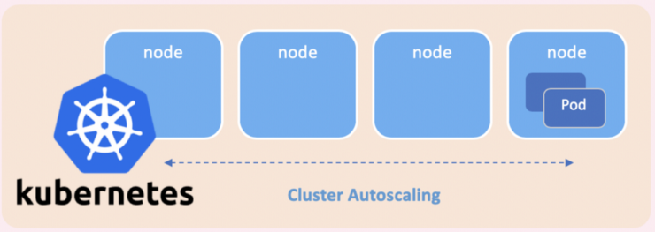
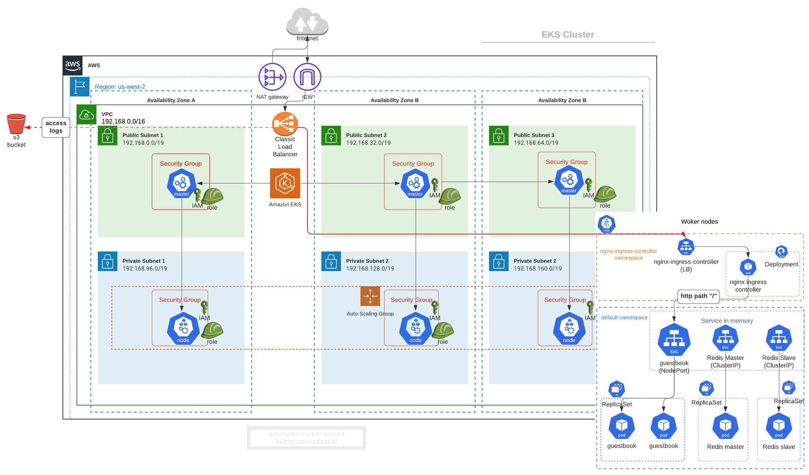
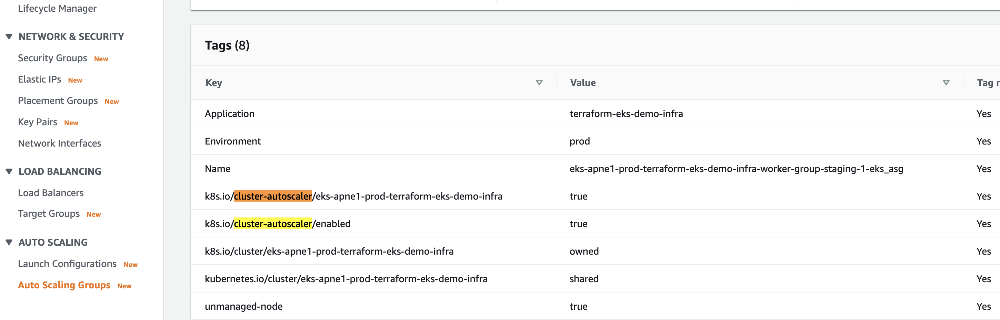
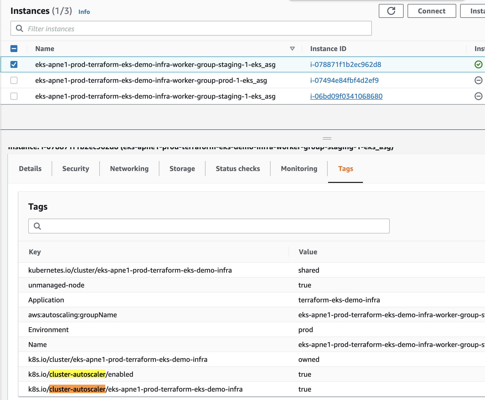
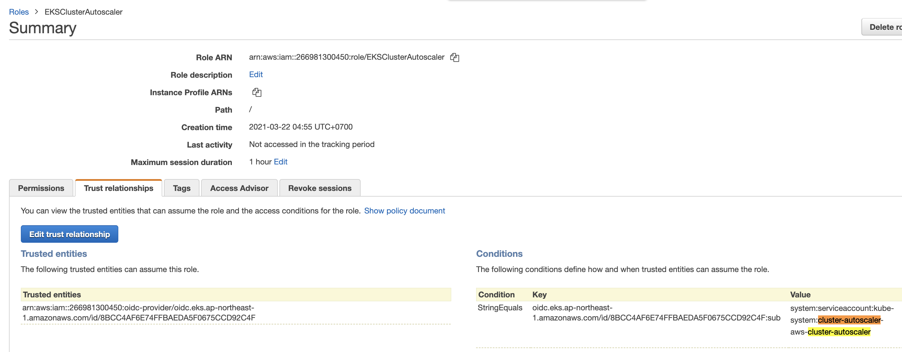
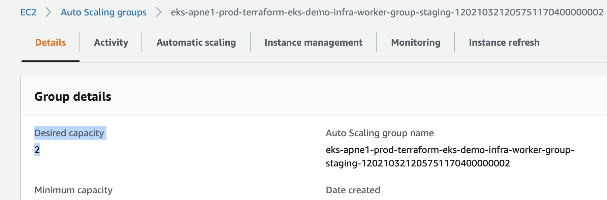
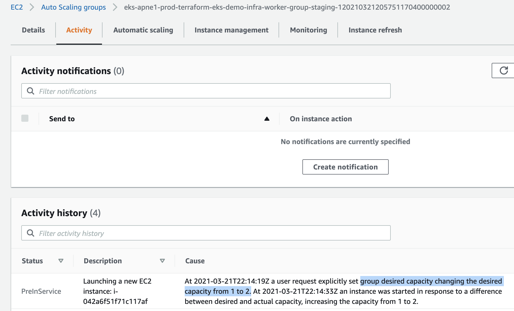

# K8s worker nodesをCluster Autoscaler (CA)を使ってスケールアウト・ダウンする（AWS ASGに似ている）





Cluster Autoscaler (CA) はクラスターノード（EC2インスタンス）の数を自動でスケールアップ・ダウンします。（AWS Auto Scaling Groupを利用）

CAの設定に必要な3つのステップ:
1. AWS ASGのタグを追加
2. cluster autoscalerへ認可（Authorization）のIAM パミッションをIRSA (Podレベル)かEC2 Instance Profile（ノードレベル）で追加by instance profile
3. cluster-autoscalerをHelm ChartとしてEKS clusterにインストール


# Step 1: (ch8で設定済み) K8sノードのlabelsとtaintsを設定


# Step 2: Cluster Autoscalerのauto-discoveryを有効化する

- [Github Kubernetes Autoscaler: Enable Autoscaler's auto-discovery by tags](https://github.com/kubernetes/autoscaler/blob/master/cluster-autoscaler/cloudprovider/aws/README.md#auto-discovery-setup)
- [Github Terraform-aws-module: Add the required tags to the worker group](https://github.com/terraform-aws-modules/terraform-aws-eks/blob/master/docs/autoscaling.md)

まずはcluster-autoscalerがどのASGをスケールアップ・ダウンするのか見つけるために、ASGにタグを追加
```
k8s.io/cluster-autoscaler/enabled
```
そして
```
k8s.io/cluster-autoscaler/<YOUR CLUSTER NAME>
```

> It is recommended to use a second tag like k8s.io/cluster-autoscaler/<YOUR CLUSTER NAME> when k8s.io/cluster-autoscaler/enabled is used across many clusters to prevent ASGs from different clusters recognized as the node groups


[eks-demo-infra/ap-northeast-1/prod/terraform.tfvars](eks-demo-infra/ap-northeast-1/prod/terraform.tfvars)で、`k8s.io/cluster-autoscaler/enabled`を`worker_groups`リストの最初のMap内の`tags`に追加
```sh
self_managed_node_groups = {
  prod = {
    name          = "worker-group-prod-1"
    instance_type = "m3.medium" # since we are using AWS-VPC-CNI, allocatable pod IPs are defined by instance size: https://docs.google.com/spreadsheets/d/1MCdsmN7fWbebscGizcK6dAaPGS-8T_dYxWp0IdwkMKI/edit#gid=1549051942, https://github.com/awslabs/amazon-eks-ami/blob/master/files/eni-max-pods.txt
    max_size      = 1
    min_size      = 1
    desired_size  = 1 # this will be ignored if cluster autoscaler is enabled: asg_desired_capacity: https://github.com/terraform-aws-modules/terraform-aws-eks/blob/master/docs/autoscaling.md#notes
    # this userdata will 1) block access to metadata to avoid pods from using node's IAM instance profile, 2) create /mnt/efs and auto-mount EFS to it using fstab, 3) install AWS Inspector agent,  4) install SSM agent. Note: userdata script doesn't resolve shell variable defined within,
    # ref: https://docs.aws.amazon.com/eks/latest/userguide/restrict-ec2-credential-access.html
    # UPDATE: Datadog agent needs to ping the EC2 metadata endpoint to retrieve the instance id and resolve duplicated hosts to be a single host, and currently no altenative solution so need to allow access to instance metadata unfortunately otherwise infra hosts get counted twice
    # additional_userdata = "yum install -y iptables-services; iptables --insert FORWARD 1 --in-interface eni+ --destination 169.254.169.254/32 --jump DROP; iptables-save | tee /etc/sysconfig/iptables; systemctl enable --now iptables; sudo mkdir /mnt/efs; sudo mount -t nfs -o nfsvers=4.1,rsize=1048576,wsize=1048576,hard,timeo=600,retrans=2,noresvport fs-02940981.efs.us-east-1.amazonaws.com:/ /mnt/efs; echo 'fs-02940981.efs.us-east-1.amazonaws.com:/ /mnt/efs nfs defaults,vers=4.1 0 0' >> /etc/fstab; sudo yum install -y https://s3.us-east-1.amazonaws.com/amazon-ssm-us-east-1/latest/linux_amd64/amazon-ssm-agent.rpm; sudo systemctl enable amazon-ssm-agent; sudo systemctl start amazon-ssm-agent"
    # escape double qoute in TF variable to avoid /bin/bash not found error when executing install-linx.sh. Ref: https://discuss.hashicorp.com/t/how-can-i-escape-double-quotes-in-a-variable-value/4697/2

    # use KMS key to encrypt EKS worker node's root EBS volumes
    # ref: https://github.com/terraform-aws-modules/terraform-aws-eks/blob/master/examples/self_managed_node_group/main.tf#L204C11-L215
    block_device_mappings = {
      xvda = {
        device_name = "/dev/xvda"
        ebs = {
          volume_size           = 100
          volume_type           = "gp3"
          encrypted             = true
          delete_on_termination = true
        }
      }
    }

    bootstrap_extra_args = "--kubelet-extra-args '--node-labels=env=prod,unmanaged-node=true,k8s_namespace=prod  --register-with-taints=prod-only=true:NoSchedule'" # <------------------ STEP 2 # for unmanaged nodes, taints and labels work only with extra-arg, not ASG tags. Ref: https://aws.amazon.com/blogs/opensource/improvements-eks-worker-node-provisioning/
    
    tags = {
      "unmanaged-node"                    = "true"
      "k8s.io/cluster-autoscaler/enabled" = "true"  # <----- STEP 2 # need this tag so clusterautoscaler auto-discovers node group: https://github.com/terraform-aws-modules/terraform-aws-eks/blob/master/docs/autoscaling.md
      "k8s_namespace"                     = "prod"
      "env"                               = "prod"
    }
  },
}
```

[eks-demo-infra/ap-northeast-1/prod/data.tf](eks-demo-infra/ap-northeast-1/prod/data.tf)で, `k8s.io/cluster-autoscaler/<YOUR CLUSTER NAME>`を`eks_tags`に追加:
```sh
locals {
  # note: "shared" tag needed for EKS to find VPC subnets by tags. Ref: https://docs.aws.amazon.com/eks/latest/userguide/network_reqs.html
  eks_tags = {
    Environment                                       = var.env
    Application                                       = var.app_name
    "kubernetes.io/cluster/${local.cluster_name}"     = "shared" # <----- STEP 2
    "k8s.io/cluster-autoscaler/${local.cluster_name}" = "true" # <----- STEP 2
  }
}
```

tfvarsは変数をinterpolateできないので、`k8s.io/cluster-autoscaler/${local.cluster_name}`はdata.tfで定義しています。


```sh
terraform apply


# output
  # module.eks.module.eks_cluster.data.template_file.userdata[0] will be read during apply
  # (config refers to values not yet known)
 <= data "template_file" "userdata"  {
      ~ id       = "e211f65e9dbd7cd8e8937e36fbcdf3cee4c512858b3239f236bbdcc9efa257f1" -> (known after apply)
      ~ rendered = <<-EOT
            #!/bin/bash -e
            
            # Allow user supplied pre userdata code
            
            
            # Bootstrap and join the cluster
            /etc/eks/bootstrap.sh --b64-cluster-ca 'xxx' --apiserver-endpoint 'https://8BCC4AF6E74FFBAEDA5F0675CCD92C4F.gr7.ap-northeast-1.eks.amazonaws.com'  --kubelet-extra-args "--node-labels=env=staging,unmanaged-node=true --register-with-taints=staging-only=true:PreferNoSchedule" 'eks-apne1-prod-terraform-eks-demo-infra'
            
            # Allow user supplied userdata code
        EOT -> (known after apply)
        # (2 unchanged attributes hidden)
    }

  # module.eks.module.eks_cluster.aws_autoscaling_group.workers[0] will be updated in-place
  ~ resource "aws_autoscaling_group" "workers" {
        id                        = "eks-apne1-prod-terraform-eks-demo-infra-worker-group-staging-120210321205751170400000002"
      ~ launch_configuration      = "eks-apne1-prod-terraform-eks-demo-infra-worker-group-staging-120210321205748510000000001" -> (known after apply)
        name                      = "eks-apne1-prod-terraform-eks-demo-infra-worker-group-staging-120210321205751170400000002"
        # (22 unchanged attributes hidden)

      + tag {
          + key                 = "k8s.io/cluster-autoscaler/eks-apne1-prod-terraform-eks-demo-infra"  # <---------CHANGED
          + propagate_at_launch = true
          + value               = "true"
        }
      + tag {
          + key                 = "k8s.io/cluster-autoscaler/enabled" # <---------CHANGED
          + propagate_at_launch = true
          + value               = "true"
        }
      + tag {
          + key                 = "kubernetes.io/cluster/eks-apne1-prod-terraform-eks-demo-infra" # <---------CHANGED
          + propagate_at_launch = true
          + value               = "shared"
        }
        # (6 unchanged blocks hidden)
    }

  # module.eks.module.eks_cluster.aws_cloudwatch_log_group.this[0] will be updated in-place
  ~ resource "aws_cloudwatch_log_group" "this" {
        id                = "/aws/eks/eks-apne1-prod-terraform-eks-demo-infra/cluster"
        name              = "/aws/eks/eks-apne1-prod-terraform-eks-demo-infra/cluster"
      ~ tags              = {
          + "k8s.io/cluster-autoscaler/eks-apne1-prod-terraform-eks-demo-infra" = "true"
          + "kubernetes.io/cluster/eks-apne1-prod-terraform-eks-demo-infra"     = "shared"
            # (2 unchanged elements hidden)
        }
        # (2 unchanged attributes hidden)
    }

  # module.eks.module.eks_cluster.aws_eks_cluster.this[0] will be updated in-place
  ~ resource "aws_eks_cluster" "this" {
        id                        = "eks-apne1-prod-terraform-eks-demo-infra"
        name                      = "eks-apne1-prod-terraform-eks-demo-infra"
      ~ tags                      = {
          + "k8s.io/cluster-autoscaler/eks-apne1-prod-terraform-eks-demo-infra" = "true"  # <---------CHANGED
          + "kubernetes.io/cluster/eks-apne1-prod-terraform-eks-demo-infra"     = "shared"  # <---------CHANGED
            # (2 unchanged elements hidden)
        }
        # (10 unchanged attributes hidden)


        # (4 unchanged blocks hidden)
    }

  # module.eks.module.eks_cluster.aws_iam_role.cluster[0] will be updated in-place
  ~ resource "aws_iam_role" "cluster" {
        id                    = "eks-apne1-prod-terraform-eks-de20210321183200998600000004"
        name                  = "eks-apne1-prod-terraform-eks-de20210321183200998600000004"
      ~ tags                  = {
          + "k8s.io/cluster-autoscaler/eks-apne1-prod-terraform-eks-demo-infra" = "true"
          + "kubernetes.io/cluster/eks-apne1-prod-terraform-eks-demo-infra"     = "shared"
            # (2 unchanged elements hidden)
        }
        # (9 unchanged attributes hidden)

        # (1 unchanged block hidden)
    }

  # module.eks.module.eks_cluster.aws_iam_role.workers[0] will be updated in-place
  ~ resource "aws_iam_role" "workers" {
        id                    = "eks-apne1-prod-terraform-eks-de2021032118435120210000000f"
        name                  = "eks-apne1-prod-terraform-eks-de2021032118435120210000000f"
      ~ tags                  = {
          + "k8s.io/cluster-autoscaler/eks-apne1-prod-terraform-eks-demo-infra" = "true"
          + "kubernetes.io/cluster/eks-apne1-prod-terraform-eks-demo-infra"     = "shared"
            # (2 unchanged elements hidden)
        }
        # (9 unchanged attributes hidden)

        # (1 unchanged block hidden)
    }

  # module.eks.module.eks_cluster.aws_launch_configuration.workers[0] must be replaced
+/- resource "aws_launch_configuration" "workers" {
      ~ arn                              = "arn:aws:autoscaling:ap-northeast-1:YOUR_ACCOUNT_#:launchConfiguration:681506f3-97c2-4bc9-bb6a-55a7cdd686dd:launchConfigurationName/eks-apne1-prod-terraform-eks-demo-infra-worker-group-staging-120210321205748510000000001" -> (known after apply)
      ~ id                               = "eks-apne1-prod-terraform-eks-demo-infra-worker-group-staging-120210321205748510000000001" -> (known after apply)
      + key_name                         = (known after apply)
      ~ name                             = "eks-apne1-prod-terraform-eks-demo-infra-worker-group-staging-120210321205748510000000001" -> (known after apply)
      ~ user_data_base64                 = "xxx" -> (known after apply) # forces replacement
      - vpc_classic_link_security_groups = [] -> null
        # (8 unchanged attributes hidden)

      + ebs_block_device {
          + delete_on_termination = (known after apply)
          + device_name           = (known after apply)
          + encrypted             = (known after apply)
          + iops                  = (known after apply)
          + no_device             = (known after apply)
          + snapshot_id           = (known after apply)
          + volume_size           = (known after apply)
          + volume_type           = (known after apply)
        }

      + metadata_options {
          + http_endpoint               = (known after apply)
          + http_put_response_hop_limit = (known after apply)
          + http_tokens                 = (known after apply)
        }

        # (1 unchanged block hidden)
    }

  # module.eks.module.eks_cluster.aws_security_group.cluster[0] will be updated in-place
  ~ resource "aws_security_group" "cluster" {
        id                     = "sg-032221e2c56374acf"
        name                   = "eks-apne1-prod-terraform-eks-demo-infra2021032118323698280000000d"
      ~ tags                   = {
          + "k8s.io/cluster-autoscaler/eks-apne1-prod-terraform-eks-demo-infra" = "true"
          + "kubernetes.io/cluster/eks-apne1-prod-terraform-eks-demo-infra"     = "shared"
            # (3 unchanged elements hidden)
        }
        # (8 unchanged attributes hidden)
    }

  # module.eks.module.eks_cluster.aws_security_group.workers[0] will be updated in-place
  ~ resource "aws_security_group" "workers" {
        id                     = "sg-0c519562d636926da"
        name                   = "eks-apne1-prod-terraform-eks-demo-infra2021032118323703320000000e"
      ~ tags                   = {
          + "k8s.io/cluster-autoscaler/eks-apne1-prod-terraform-eks-demo-infra" = "true"
            # (4 unchanged elements hidden)
        }
        # (8 unchanged attributes hidden)
    }

  # module.eks.module.eks_cluster.random_pet.workers[0] must be replaced
+/- resource "random_pet" "workers" {
      ~ id        = "generous-coyote" -> (known after apply)
      ~ keepers   = {
          - "lc_name" = "eks-apne1-prod-terraform-eks-demo-infra-worker-group-staging-120210321205748510000000001"
        } -> (known after apply) # forces replacement
        # (2 unchanged attributes hidden)
    }

  # module.eks.module.eks_node_ebs_kms_key.aws_kms_key.this will be updated in-place
  ~ resource "aws_kms_key" "this" {
        id                       = "292c4edb-f9b9-4f2c-aa39-175f1a404e68"
      ~ tags                     = {
          + "k8s.io/cluster-autoscaler/eks-apne1-prod-terraform-eks-demo-infra" = "true"
          + "kubernetes.io/cluster/eks-apne1-prod-terraform-eks-demo-infra"     = "shared"
            # (3 unchanged elements hidden)
        }
        # (9 unchanged attributes hidden)
    }

  # module.eks.module.k8s_secret_kms_key.aws_kms_key.this will be updated in-place
  ~ resource "aws_kms_key" "this" {
        id                       = "31d1604a-8a26-4d75-aa37-9e659a59ac23"
      ~ tags                     = {
          + "k8s.io/cluster-autoscaler/eks-apne1-prod-terraform-eks-demo-infra" = "true"
          + "kubernetes.io/cluster/eks-apne1-prod-terraform-eks-demo-infra"     = "shared"
            # (3 unchanged elements hidden)
        }
        # (9 unchanged attributes hidden)
    }

Plan: 2 to add, 9 to change, 2 to destroy.
```

Auto Scaling Groupのtagをチェック:



EC2を再起動し、ASGが新しいタグが含まれたLaunch Configを使って新しいEC2を起動するようにする




# Step 3: ASGのIAM パミッションを、cluster autoscalerにIRSA (Podレベル)で追加

CAはASGのサイズを変更したりするので、以下のIAM permissonsが必要です
```json
{
    "Version": "2012-10-17",
    "Statement": [
        {
            "Action": [
                "autoscaling:DescribeAutoScalingGroups",
                "autoscaling:DescribeAutoScalingInstances",
                "autoscaling:DescribeLaunchConfigurations",
                "autoscaling:DescribeTags",
                "autoscaling:SetDesiredCapacity",
                "autoscaling:TerminateInstanceInAutoScalingGroup",
                "ec2:DescribeLaunchTemplateVersions",
                "ec2:DescribeInstanceTypes"
            ],
            "Resource": "*",
            "Effect": "Allow"
        }
    ]
}
```


## 3.1 IAM roleを作成し、trust relationshipにservice accountとIAM role名を追加

### Composition layer
[composition/eks-demo-infra/ap-northeast-1/prod/terraform.tfvars](composition/eks-demo-infra/ap-northeast-1/prod/terraform.tfvars)で、cluster_autoscaler podが使うservice account nameとnamespaceを定義 
```sh
cluster_autoscaler_service_account_namespace           = "kube-system"
cluster_autoscaler_service_account_name                = "cluster-autoscaler-aws-cluster-autoscaler"
```

[composition/eks-demo-infra/ap-northeast-1/prod/main.tf](composition/eks-demo-infra/ap-northeast-1/prod/main.tf),
```sh
########################################
# EKS
########################################
module "eks" {
  source = "../../../../infrastructure_modules/eks"

  ## EKS ##
  create_eks      = var.create_eks
  cluster_version = var.cluster_version
  cluster_name    = local.cluster_name
  vpc_id          = local.vpc_id
  subnets         = local.private_subnets

  # note: either pass worker_groups or node_groups
  # this is for (EKSCTL API) unmanaged node group
  worker_groups = var.worker_groups

  # this is for (EKS API) managed node group
  node_groups = var.node_groups

  # add roles that can access K8s cluster
  map_roles = local.map_roles

  # specify AWS Profile if you want kubectl to use a named profile to authenticate instead of access key and secret access key
  kubeconfig_aws_authenticator_env_variables = local.kubeconfig_aws_authenticator_env_variables

  ## IRSA (IAM role for service account) ##
  enable_irsa                                  = var.enable_irsa
  test_irsa_service_account_namespace                = "default"
  test_irsa_service_account_name                     = "test-irsa"
  cluster_autoscaler_service_account_namespace = var.cluster_autoscaler_service_account_namespace # <------ STEP 3
  cluster_autoscaler_service_account_name      = var.cluster_autoscaler_service_account_name
```


[composition/eks-demo-infra/ap-northeast-1/prod/variables.tf](composition/eks-demo-infra/ap-northeast-1/prod/variables.tf)で,  `cluster_autoscaler_service_account_namespace`と`cluster_autoscaler_service_account_name`のインプット変数を定義
```sh
variable "cluster_autoscaler_service_account_namespace" {
  description = "K8s namespace under which service account exists"
}
variable "cluster_autoscaler_service_account_name" {
  description = "K8s service account (on behalf of pods) to allow assuming AWS IAM role through OIDC via AWS STS"
}
```


### Infra layer
[infrastructure_modules/eks/main.tf](infrastructure_modules/eks/main.tf)で, ２つのModule（Iam roleとIam policy）を作成
```sh
# IRSA ##
module "cluster_autoscaler_iam_assumable_role" {
  source = "../../resource_modules/identity/iam/iam-assumable-role-with-oidc"

  create_role                   = var.create_eks ? true : false
  role_name                     = local.cluster_autoscaler_iam_role_name
  provider_url                  = replace(module.eks_cluster.cluster_oidc_issuer_url, "https://", "")
  role_policy_arns              = [module.cluster_autoscaler_iam_policy.arn]
  oidc_fully_qualified_subjects = ["system:serviceaccount:${var.cluster_autoscaler_service_account_namespace}:${var.cluster_autoscaler_service_account_name}"] # <------- IRSA for Cluster Autoscaler pod by specifying namespace and service account 
}

module "cluster_autoscaler_iam_policy" {
  source = "../../resource_modules/identity/iam/policy"

  create_policy = var.create_eks ? true : false
  description   = local.cluster_autoscaler_iam_policy_description
  name          = local.cluster_autoscaler_iam_policy_name
  path          = local.cluster_autoscaler_iam_policy_path
  policy        = data.aws_iam_policy_document.cluster_autoscaler.json
}
```


[infrastructure_modules/eks/data.tf](infrastructure_modules/eks/data.tf)で, ローカル変数と、Cluster Autoscalerが必要なAWS ASG関連のIAM permissionsが定義されたIAM policy documentのdata resourceを定義:
```sh
locals {
  ## cluster_autoscaler_iam_role ##
  cluster_autoscaler_iam_role_name = "EKSClusterAutoscaler"

  ## cluster_autoscaler_iam_policy ##
  cluster_autoscaler_iam_policy_description = "EKS cluster-autoscaler policy for cluster ${module.eks_cluster.cluster_id}"
  cluster_autoscaler_iam_policy_name        = "${local.cluster_autoscaler_iam_role_name}Policy"
  cluster_autoscaler_iam_policy_path        = "/"
}

data "aws_iam_policy_document" "cluster_autoscaler" { # <------ STEP ４
  statement {
    sid    = "clusterAutoscalerAll"
    effect = "Allow"

    actions = [
      "autoscaling:DescribeAutoScalingGroups",
      "autoscaling:DescribeAutoScalingInstances",
      "autoscaling:DescribeLaunchConfigurations",
      "autoscaling:DescribeTags",
      "ec2:DescribeLaunchTemplateVersions",
      "ec2:DescribeInstanceTypes"
    ]

    resources = ["*"]
  }

  statement {
    sid    = "clusterAutoscalerOwn"
    effect = "Allow"

    actions = [
      "autoscaling:SetDesiredCapacity",
      "autoscaling:TerminateInstanceInAutoScalingGroup",
      "autoscaling:UpdateAutoScalingGroup",
    ]

    resources = ["*"]

    # limit who can assume the role
    # ref: https://docs.aws.amazon.com/eks/latest/userguide/iam-roles-for-service-accounts-technical-overview.html
    # ref: https://www.terraform.io/docs/providers/aws/r/eks_cluster.html#enabling-iam-roles-for-service-accounts

    condition {
      test     = "StringEquals"
      variable = "autoscaling:ResourceTag/kubernetes.io/cluster/${module.eks_cluster.cluster_id}" # <------- specifying ASG by tag we added in STEP 1
      values   = ["shared"]
    }

    condition {
      test     = "StringEquals"
      variable = "autoscaling:ResourceTag/k8s.io/cluster-autoscaler/enabled" # <------- specifying ASG by tag we added in STEP 1
      values   = ["true"]
    }
  }
}
```


[infrastructure_modules/eks/variables.tf](infrastructure_modules/eks/variables.tf)で, infra layerのインプット変数を定義
```sh
## IRSA & cluster autoscaler ##
variable "cluster_autoscaler_service_account_namespace" {
  description = "K8s namespace under which service account exists"
}

variable "cluster_autoscaler_service_account_name" {
  description = "K8s service account (on behalf of pods) to allow assuming AWS IAM role through OIDC via AWS STS"
}
```


```sh
# download modules
terraform init -backend-config=backend.config

terraform apply

# plan output
# module.eks.module.cluster_autoscaler_iam_assumable_role.aws_iam_role.this[0] will be created
  + resource "aws_iam_role" "this" {
      + arn                   = (known after apply)
      + assume_role_policy    = jsonencode(
            {
              + Statement = [
                  + {
                      + Action    = "sts:AssumeRoleWithWebIdentity"
                      + Condition = {
                          + StringEquals = {
                              + oidc.eks.ap-northeast-1.amazonaws.com/id/8BCC4AF6E74FFBAEDA5F0675CCD92C4F:sub = [
                                  + "system:serviceaccount:kube-system:cluster-autoscaler-aws-cluster-autoscaler",
                                ]
                            }
                        }
                      + Effect    = "Allow"
                      + Principal = {
                          + Federated = "arn:aws:iam::YOUR_ACCOUNT_#:oidc-provider/oidc.eks.ap-northeast-1.amazonaws.com/id/8BCC4AF6E74FFBAEDA5F0675CCD92C4F"
                        }
                      + Sid       = ""
                    },
                ]
              + Version   = "2012-10-17"
            }
        )
      + create_date           = (known after apply)
      + force_detach_policies = false
      + id                    = (known after apply)
      + managed_policy_arns   = (known after apply)
      + max_session_duration  = 3600
      + name                  = "EKSClusterAutoscaler"
      + path                  = "/"
      + unique_id             = (known after apply)

      + inline_policy {
          + name   = (known after apply)
          + policy = (known after apply)
        }
    }

  # module.eks.module.cluster_autoscaler_iam_assumable_role.aws_iam_role_policy_attachment.custom[0] will be created
  + resource "aws_iam_role_policy_attachment" "custom" {
      + id         = (known after apply)
      + policy_arn = (known after apply)
      + role       = "EKSClusterAutoscaler"
    }

  # module.eks.module.cluster_autoscaler_iam_policy.aws_iam_policy.this[0] will be created
  + resource "aws_iam_policy" "this" {
      + arn         = (known after apply)
      + description = "EKS cluster-autoscaler policy for cluster eks-apne1-prod-terraform-eks-demo-infra"
      + id          = (known after apply)
      + name        = "EKSClusterAutoscalerPolicy"
      + path        = "/"
      + policy      = jsonencode(
            {
              + Statement = [
                  + {
                      + Action   = [
                          + "ec2:DescribeLaunchTemplateVersions",
                          + "autoscaling:DescribeTags",
                          + "autoscaling:DescribeLaunchConfigurations",
                          + "autoscaling:DescribeAutoScalingInstances",
                          + "autoscaling:DescribeAutoScalingGroups",
                        ]
                      + Effect   = "Allow"
                      + Resource = "*"
                      + Sid      = "clusterAutoscalerAll"
                    },
                  + {
                      + Action    = [
                          + "autoscaling:UpdateAutoScalingGroup",
                          + "autoscaling:TerminateInstanceInAutoScalingGroup",
                          + "autoscaling:SetDesiredCapacity",
                        ]
                      + Condition = {
                          + StringEquals = {
                              + autoscaling:ResourceTag/k8s.io/cluster-autoscaler/enabled                             = [
                                  + "true",
                                ]
                              + autoscaling:ResourceTag/kubernetes.io/cluster/eks-apne1-prod-terraform-eks-demo-infra = [
                                  + "shared",
                                ]
                            }
                        }
                      + Effect    = "Allow"
                      + Resource  = "*"
                      + Sid       = "clusterAutoscalerOwn"
                    },
                ]
              + Version   = "2012-10-17"
            }
        )
    }

  # module.eks.module.eks_cluster.aws_autoscaling_group.workers[0] will be updated in-place
  ~ resource "aws_autoscaling_group" "workers" {
        id                        = "eks-apne1-prod-terraform-eks-demo-infra-worker-group-staging-120210321205751170400000002"
        name                      = "eks-apne1-prod-terraform-eks-demo-infra-worker-group-staging-120210321205751170400000002"
        # (23 unchanged attributes hidden)

      + tag {
          + key                 = "kubernetes.io/cluster/eks-apne1-prod-terraform-eks-demo-infra"
          + propagate_at_launch = true
          + value               = "owned"
        }
        # (8 unchanged blocks hidden)
    }

Plan: 3 to add, 1 to change, 0 to destroy.
```

作成されたIAM roleのTrust relationshipをチェック



# Step 4: Cluster Autoscaler(CA）をHelm chartでインストール

Helm chart:
- (obsolete) https://github.com/helm/charts/tree/master/stable/cluster-autoscaler
- (new, requiring K8s 1.8+) https://github.com/kubernetes/autoscaler/tree/master/charts/cluster-autoscaler
 

まずは[overrides.yaml](overrides.yaml)を編集。

```yaml
awsRegion: ap-northeast-1 # <----- AWS region

rbac:
  create: true
  serviceAccount:
    annotations: # ref: https://github.com/kubernetes/autoscaler/tree/master/charts/cluster-autoscaler#aws---iam-roles-for-service-accounts-irsa
      eks.amazonaws.com/role-arn: "arn:aws:iam::YOUR_ACCOUNT_#:role/EKSClusterAutoscaler" # <----- Step 3で作成したIAM roleのARNに変更すること!

autoDiscovery:
  clusterName: eks-apne1-prod-terraform-eks-demo-infra # <--------クラスターの名前
  enabled: true

# usage
# helm repo add autoscaler https://kubernetes.github.io/autoscaler
# helm install cluster-autoscaler     autoscaler/cluster-autoscaler     --namespace kube-system     --values overrides.yaml
```

HelmのConfigファイルをローカルに保存
```sh
# export AWS_PROFILE
export AWS_PROFILE=aws-demo

# set KUBECONFIG
export KUBECONFIG="${PWD}/kubeconfig_eks-apne1-prod-terraform-eks-demo-infra"

# test k8s authentication
kubectl get pod
No resources found in default namespace.

cd ../../../../
# test k8s authentication
kubectl get pod
No resources found in default namespace.


helm repo add autoscaler https://kubernetes.github.io/autoscaler

# ca.yamlを保存
helm install cluster-autoscaler \
    autoscaler/cluster-autoscaler \
    --namespace kube-system \
    --values overrides.yaml \
    --dry-run \
    -o yaml > ca.yaml

# optional: デフォルトのvalues.yamlも保存可能
helm show values autoscaler/cluster-autoscaler > values.yaml
```


保存されたyamlsをチェックした後, 実際にHelmでリソースをインストール
```sh
# you could pull helm chart to local to lock in the version
helm pull autoscaler/cluster-autoscaler

# そして`cluster-autoscaler`という名前のHelm Chartのリリース名でインストール (Helmが名前を追加して最終的には`cluster-autoscaler-aws-cluster-autoscaler`というservice accountが作られる。この名前がステップ２で指定したService Account名とマッチしないといけない)。またこのCAを`kube-system`namespaceにインストール。 (重要: IRSAの設定で指定したService Account名とNamespace名を指定)
helm install cluster-autoscaler \
    autoscaler/cluster-autoscaler \
    --namespace kube-system \
    --values overrides.yaml
```

アウトプット
```sh
NAME: cluster-autoscaler
LAST DEPLOYED: Mon Mar 22 05:03:33 2021
NAMESPACE: kube-system
STATUS: deployed
REVISION: 1
TEST SUITE: None
NOTES:
To verify that cluster-autoscaler has started, run:

  kubectl --namespace=kube-system get pods -l "app.kubernetes.io/name=aws-cluster-autoscaler,app.kubernetes.io/instance=cluster-autoscaler"
```

cluster-autoscaler podが起動しているのをチェック:
```sh
kubectl --namespace=kube-system get pods -l "app.kubernetes.io/name=aws-cluster-autoscaler,app.kubernetes.io/instance=cluster-autoscaler"

# アウトプット
NAME                                                        READY   STATUS    RESTARTS   AGE
cluster-autoscaler-aws-cluster-autoscaler-d6dc94f6c-7bmjx   1/1     Running   0          62s
```

作成されたservice account nameが`cluster-autoscaler-aws-cluster-autoscaler`であることもチェック
```sh
kubectl get sa -n kube-system

# アウトプット
NAME                                        SECRETS   AGE
cluster-autoscaler-aws-cluster-autoscaler   1         107s
```


# Step 5: Cluster AutoscalerのIAM roleが正しいかチェック

[test_ca_irsa_pod.yaml](test_ca_rsa_pod.yaml)を使って、`amazon/aws-cli`コンテナを`kube-system` Namespace内のPod内に起動。また`cluster-autoscaler-aws-cluster-autoscaler`のService AccountをPodに関連付け、CA podのシミュレーションをする
```yaml
apiVersion: v1
kind: Pod
metadata:
  name: test-irsa
  namespace: kube-system # <----- namespace must be kube-system as defined in terraform.tfvars
spec:
  serviceAccountName: cluster-autoscaler-aws-cluster-autoscaler # <----- use this SA name
  containers:
  - image: amazon/aws-cli
    name: test-irsa
    command:
    - sleep
    - "1500"
```

Podを起動
```sh
kubectl apply -f test_ca_irsa_pod.yaml

# Podか起動しているかチェック
kubectl get pod test-irsa -n kube-system

# Pod内にShellで接続
kubectl exec -it test-irsa -n kube-system sh
```

envsがInjectされているかチェック
```sh
env | grep AWS

# expected output
AWS_ROLE_ARN=arn:aws:iam::xxxx:role/EKSClusterAutoscaler # <------- this
AWS_WEB_IDENTITY_TOKEN_FILE=/var/run/secrets/eks.amazonaws.com/serviceaccount/token # <------- this
CLUSTER_AUTOSCALER_AWS_CLUSTER_AUTOSCALER_SERVICE_PORT=8085
CLUSTER_AUTOSCALER_AWS_CLUSTER_AUTOSCALER_PORT_8085_TCP_ADDR=172.20.132.165
CLUSTER_AUTOSCALER_AWS_CLUSTER_AUTOSCALER_PORT_8085_TCP_PORT=8085
CLUSTER_AUTOSCALER_AWS_CLUSTER_AUTOSCALER_SERVICE_PORT_HTTP=8085
AWS_DEFAULT_REGION=ap-northeast-1
CLUSTER_AUTOSCALER_AWS_CLUSTER_AUTOSCALER_PORT_8085_TCP=tcp://172.20.132.165:8085
AWS_REGION=ap-northeast-1
CLUSTER_AUTOSCALER_AWS_CLUSTER_AUTOSCALER_PORT=tcp://172.20.132.165:8085
CLUSTER_AUTOSCALER_AWS_CLUSTER_AUTOSCALER_SERVICE_HOST=172.20.132.165
CLUSTER_AUTOSCALER_AWS_CLUSTER_AUTOSCALER_PORT_8085_TCP_PROTO=tcp
```


```
$ ls -ls /var/run/secrets/eks.amazonaws.com/serviceaccount/token
0 lrwxrwxrwx 1 root root 12 Apr 29 18:42 /var/run/secrets/eks.amazonaws.com/serviceaccount/token -> ..data/token

$ whoami
root

$ id
uid=0(root) gid=0(root) groups=0(root)

$ cat /var/run/secrets/eks.amazonaws.com/serviceaccount/token
```

podがASG関連のPermissionsを持っているかチェック
```sh
# aws autoscaling describe-auto-scaling-instancesコマンドを実行
aws autoscaling describe-auto-scaling-instances --region ap-northeast-1

# successful output
{
    "AutoScalingInstances": [
        {
            "InstanceId": "i-xxxxx",
            "InstanceType": "m3.medium",
            "AutoScalingGroupName": "eks-apne1-prod-terraform-eks-demo-infra-worker-group-staging-120210321205751170400000002",　# <---- これ
            "AvailabilityZone": "ap-northeast-1c",
            "LifecycleState": "InService",
            "HealthStatus": "HEALTHY",
            "LaunchConfigurationName": "eks-apne1-prod-terraform-eks-demo-infra-worker-group-staging-120210321212453319100000001",
            "ProtectedFromScaleIn": false
        }
    ]
}
```


他のASG permissionであるset-desired-capacityをテスト
```sh
# 注釈： "auto-scaling-group-name"のValueを、前のdescribe-auto-scaling-instancesコマンドのアウトプットの値に変える
aws autoscaling set-desired-capacity \
    --auto-scaling-group-name eks-apne1-prod-terraform-eks-demo-infra-worker-group-staging-12021052018085640660000000e \
    --desired-capacity 2 \
    --region ap-northeast-1

# check from AWS EC2 ASG console if desired capacity is updated
```






逆にこのPodがS3のPermissionsがないことをチェック
```sh
$ aws s3 ls

# expected output
An error occurred (AccessDeniedException) when calling the aws s3 ls operation: 
```


# Step 6: Metrics Serverをインストール
```
kubectl apply -f https://github.com/kubernetes-sigs/metrics-server/releases/download/v0.3.6/components.yaml
```

metrics-serverのdeploymentをチェック
```bash
kubectl get deployment metrics-server -n kube-system
```

アウトプット
```bash
NAME             READY   UP-TO-DATE   AVAILABLE   AGE
metrics-server   1/1     1            1           82s
```


# Step 7. CAのAuto Scalingをテスト

テストPodを起動
```
kubectl create namespace test
kubectl apply -f test_scaling.yaml
```

deploymentとpodをチェック
```
kubectl get deploy -n test
kubectl get pod -n test -o wide
```

worker nodeのリソースRequestとLimitをチェック
```
kubectl top node
kubectl describe node ip-10-1-103-244.ec2.internal
```

アウトプット
```sh
Allocated resources:
  (Total limits may be over 100 percent, i.e., overcommitted.)
  Resource                    Requests     Limits
  --------                    --------     ------
  cpu                         910m (47%)   2500m (129%) # <---- これ
  memory                      852Mi (15%)  1052Mi (18%) # <---- これ
  ephemeral-storage           0 (0%)       0 (0%)
  attachable-volumes-aws-ebs  0            0
```

CPU limitが`2500m`でmemory limitが`1052Mi`なのがわかる

Nginx deploymentを10個のレプリカにスケールアウト 
```
kubectl scale --replicas=10 deployment/test-scaling -n test
```

Podのステータスをチェック
```sh
kubectl get pod -n test

NAME                                READY   STATUS    RESTARTS   AGE
test_scaling-98ffcf4f7-2skcx   0/1     Pending   0          42s
test_scaling-98ffcf4f7-5wsgn   0/1     Pending   0          42s
test_scaling-98ffcf4f7-99gmv   0/1     Pending   0          42s
test_scaling-98ffcf4f7-hw57s   0/1     Pending   0          42s
test_scaling-98ffcf4f7-lmq6l   0/1     Pending   0          42s
test_scaling-98ffcf4f7-n5hss   1/1     Running   0          42s
test_scaling-98ffcf4f7-rp9ng   1/1     Running   0          5m11s
test_scaling-98ffcf4f7-rzdtj   1/1     Running   0          42s
test_scaling-98ffcf4f7-scpb8   0/1     Pending   0          42s
test_scaling-98ffcf4f7-wt2vf   0/1     Pending   0          42s
```

pending podのEventをDescribeコマンドでチェック
```
kubectl describe pod test_scaling-5b9dfddc87-ttnrt -n test
```

アウトプットで`pod triggered scale-up`が表示される
```sh
Events:
  Type     Reason            Age                From                Message
  ----     ------            ----               ----                -------
  Warning  FailedScheduling  52s (x2 over 52s)  default-scheduler   0/3 nodes are available: 1 node(s) didn't match node selector, 2 Insufficient cpu.
  Normal   TriggeredScaleUp  51s                cluster-autoscaler  pod triggered scale-up: [{eks-ue1-prod-XXX-api-infra-worker-group-staging-120200507173038542300000005 2->3 (max: 3)}]
```

特に
```sh
0/3 nodes are available: 1 node(s) didn't match node selector, 2 Insufficient cpu.
```

そして以下のメッセージからNodeが２つから３つにスケールアウトしたのがわかる
```sh
pod triggered scale-up: [{eks-ue1-prod-XXX-api-infra-worker-group-staging-120200507173038542300000005 2->3 (max: 3)}]
```

clusterautoscaler Podのlogsをチェック
```
kubectl logs deployment/cluster-autoscaler-aws-cluster-autoscaler -n kube-system
```

アウトプットで`1 max node group size reached`となっているのがわかる
```sh
I0507 18:12:18.872668       1 scale_up.go:348] Skipping node group eks-ue1-prod-XXX-api-infra-worker-group-staging-120200507173038542300000005 - max size reached

I0507 18:12:18.873470       1 static_autoscaler.go:439] Scale down status: unneededOnly=true lastScaleUpTime=2020-05-07 18:10:18.182849499 +0000 UTC m=+2290.588530135 lastScaleDownDeleteTime=2020-05-07 17:32:28.323356185 +0000 UTC m=+20.729036698 lastScaleDownFailTime=2020-05-07 17:32:28.323357798 +0000 UTC m=+20.729038331 scaleDownForbidden=false isDeleteInProgress=false scaleDownInCooldown=true
I0507 18:12:18.873897       1 event.go:281] Event(v1.ObjectReference{Kind:"Pod", Namespace:"test", Name:"test_scaling-7499fc797-r8dsz", UID:"7bf9bd56-2f73-417e-9949-7722b0df5772", APIVersion:"v1", ResourceVersion:"270633", FieldPath:""}): type: 'Normal' reason: 'NotTriggerScaleUp' pod didn't trigger scale-up (it wouldn't fit if a new node is added): 1 node(s) didn't match node selector, 1 max node group size reached
```


### Clean up
```
kubectl scale --replicas=0 deployment/test-scaling -n test
kubectl delete deploy test-scaling -n test

kubectl delete -f test_scaling.yaml
kubectl delete -f test_irsa.yaml
```


## Refs
[Github Kubernetes ClusterAutoscaler](https://github.com/kubernetes/autoscaler/blob/master/cluster-autoscaler/FAQ.md#what-types-of-pods-can-prevent-ca-from-removing-a-node)
