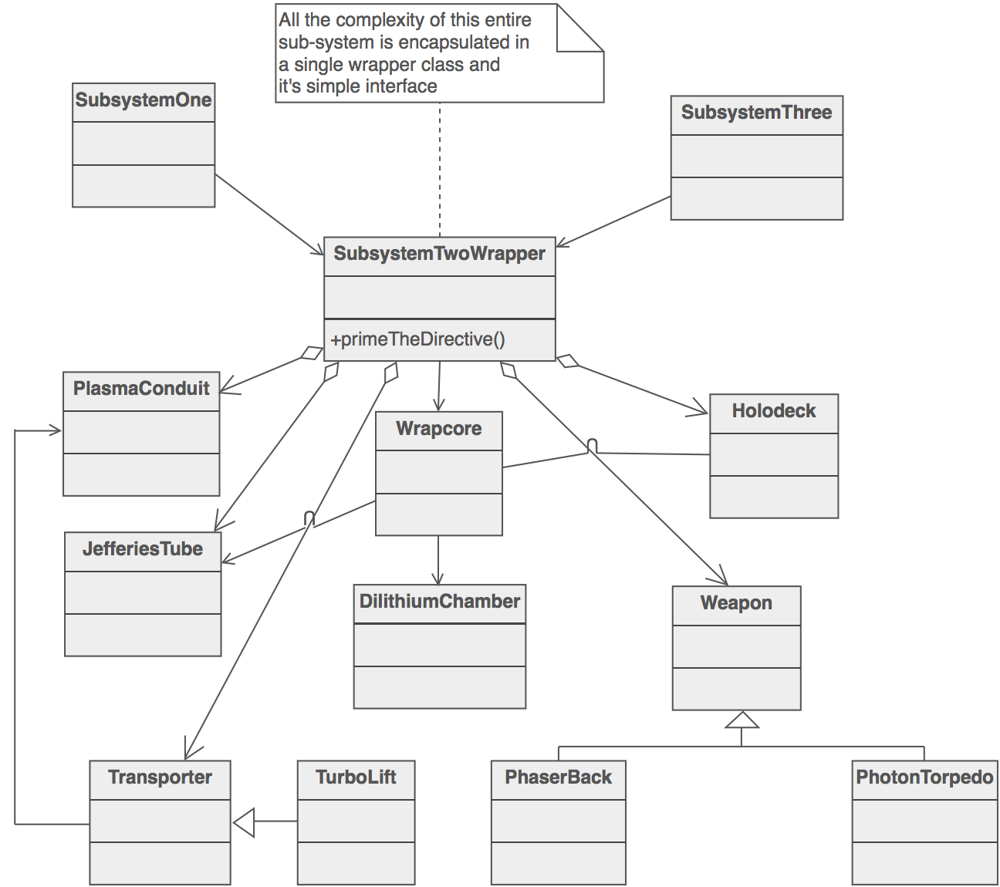
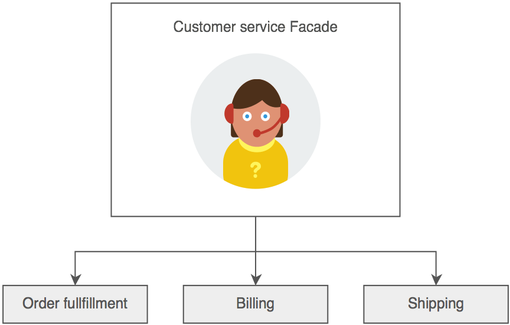

# 3 Layers Moduleアーキテクチャー(上級編＆本番運用向け)
Ref: https://www.terraform-best-practices.com/key-concepts

まずは以下のシナリオを考えてみましょう:
1) bastion EC2を作成し, IAM roleとinstance profileとセキュリティグループをEC2に関連付け、EC2のプライベートIPをSSM parameter storeに保存する
2) ALBを作成し, ALBのDNSをR53 A recordに追加する
3) RDSを作成し, カスタムKMSキーを使ってデータとEncryptする


上記の1)-3)のシナリオの場合, それぞれのTerraform Remote AWS modules (EC2, VPC, Route53, etc)の`*.tf`を`2.1_naive_terraform_modules/`内の`modules/`フォルダーに保存します:
```sh
.
── us-east-1 
│   ├── prod
│   │   ├── backend.config
│   │   ├── main.tf # <----- エントリーポイント（i.e. main()）
├── modules # <------ modules are organized under this dir
│   ├── compute
│   │   ├── ec2
│   │   ├── ec2_key_pair
│   │   ├── security_group
│   │   └── ssm
│   ├── networkbr
│   │   ├── route53
│   │   │   ├── hosted_zone
│   │   │   └── record
│   │   └── vpc
│   └── storage
│       ├── dynamodb
│       ├── efs
│       └── s3
```


## アンチパターン１： Single Class Resposibility Principleを破る
single class responsibility principleによると, 例えばIAM roleとsecurity groupを`modules/compute/ec2/main.tf`にごっちゃにするのはよくありません。 

```sh
.
├── modules 
│   ├── compute
│   │   ├── ec2 # <----- IAM roleやSGをEC2のmain.tfに入れるべからず
```


## アンチパターン２： AbstractionとEncapsulationを破る (main()が他のクラスの中身を知りすぎる)

では逆に、IAM roleやSGをトップレベルの`us-east-1/prod/main.tf`に追加するのはどうでしょうか？
このアプローチの場合、新たに追加したいAWSのサービスのほとんどが`us-east-1/prod/main.tf`にAppendされ, `main.tf`が膨大になりかつモジュラライズされにくく, 管理しにくくなります。

```sh
── us-east-1 
│   ├── prod
│   │   ├── backend.config
│   │   ├── main.tf # <----- IAM roleやSGをMain()に似たMain.tfに追加すると、毎回新しいAWSサービスを追加するごとに、Main.tfを編集する必要がある
```


一般的には、main()はシンプルで短ければより良いとされます。 毎回新しいAWSサービスを追加するごとに、Main.tfを編集するアプローチをとった場合、下記のようにモジュラライズされず散らばってしまいます
```sh
# in /us-east-1/prod/main.tf

module "bastion_ec2" {
  source = "./modules/ec2/"
}

module "app_ec2" {
  source = "./modules/ec2/"
}

module "bastion_security_group" {}

module "app_security_group" {}

module "bastion_private_ip" {}

module "app_private_ip" {}

module "elb_a_record" {}

module "rds_kms_key" {}

# ひたすら新しいリソースを追加しなければいけない
.
.
.
```


## 解決方法：　Inrastructureモジュールレイヤーを追加し、サブコンポーネントをAbstractする（デザインパターンでいう、Facadeパターン）(main()はゴシップ好きであってはいけない)

例えばこのシナリオの場合：
1) bastion EC2を作成し, IAM roleとinstance profileとセキュリティグループをEC2に関連付け、EC2のプライベートIPをSSM parameter storeに保存する

bastion EC2を作成するのに必要な他のリソース（EC2,IAM role、SG、SSM Param Store）を、Infra moduleでWrapping・Modularizeし、Bastion EC2というFacade・インターフェースを作ります。

このAbstractionの仕方を __[Facade pattern](https://sourcemaking.com/design_patterns/facade)__ といい、１つのクラスが他のクラスをWrappingして、シンプルなInterfaceをクライアントに提供できます。



> - サブシステムを包括し、シンプルなInterfaceを提供. Facadeはhigher-levelな interfaceを定義し、subsystemを使いやすくする 
> - 複雑なsubsystemをシンプルなInterfaceでWrappingする


先ほどのシナリオの場合:
- `bastion` infra module (i.e. EC2, SG, SSM, IAM role)
- `app` infra module (i.e. EC2, SG, SSM parameter store, IAM role)
- `elb` infra module (i.e. ELB, Route53 record, etc)
- `rds` infra module (i.e. RDS, KMS, SSM parameter store)


Ref: https://www.terraform-best-practices.com/key-concepts

Facadeを使った場合、`2.2_three_layered_modules/`のアーキテクチャーになります:
```sh
$ tree 2.2_three_layered_modules/ -d

2.2_three_layered_modules/
├── composition
│   ├── us-east-1
│   │   ├── prod
│   │   │   └── main.tf # <---main entrypoint calling infra-module
│   │   └── staging                                       |
│   └── us-west-2                                         |
├── infra_module                                          |
│   ├── app # this will wrap multiple resource modules  <--
│   ├── bastion                                   |
│   ├── elb                                       |
│   └── rds                                       |
└── resource_module                               |
    ├── compute                                   |
    │   ├── ec2 # <-------------------------------|
    │   ├── ec2_key_pair # <----------------------|
    │   ├── security_group  # <-------------------|
    │   └── ssm # <-------------------------------|
    ├── network
    │   ├── route53
    │   │   ├── hosted_zone
    │   │   └── record
    │   └── vpc
    └── storage
        ├── dynamodb
        ├── efs
        └── s3
```

そしてトップレベルの`composition/us-east-1/prod/main.tf`は, __infra_module.bastionモジュールで必要なArgumentsをパスすればいいだけになります。__
```sh
$ tree 2.2_three_layered_modules/ -d
2.2_three_layered_modules/
├── composition
│   ├── us-east-1
│   │   ├── prod
│   │   │   └── main.tf  # <------ here
```


```sh
# トップレベル composition/us-east-1/prod/main.tf
module "bastion" {
  source = "../infra_module/bastion/"  # <-- bastionのmain()またはコンストラクターをコールしているような形。これにより、bastion.create_ec2(), bastion.create_security_group(), bastion.create_ssm_param_store()などのように、Bastion EC2のSub systemを全て知る必要がなくなる
}

module "app" {
  source = "../infra_module/app/"
}

module "elb" {
  source = "../infra_module/elb/"
}

module "rds" {
  source = "../infra_module/rds/"
}
```

そしてFacadeレイヤーである`infra_module/bastion/main.tf`は, __low-levelな__ Sub systemを定義しています (i.e. IAM role, security group, ec2 key paier, etc)
```sh
$ tree 2.2_three_layered_modules/ -d
2.2_three_layered_modules/

├── composition
├── infra_module                                         
│   ├── app 
│   ├── bastion  # <-------- here             
```

```sh
# in infra_module/bastion/main.tf  # <-- kinda like mutliple helper functions called inside bastion.main()

# sub-system 1
module "ec2" {
  source = "../resource_module/compute/ec2"
}

# sub-system 2
module "security_group" {
  source = "../resource_module/compute/security_group"
}

# sub-system 3
module "ssm_parameter_store" {
  source = "../resource_module/compute/ssm"
}

# sub-system 4
module "route53_record" {
  source = "../resource_module/network/route53/record"
}
```

これによって、`composition/us-east-1/prod/main.tf`は`infra_module/bastion/main.tf`のclient (またはCaller)になり、`module "bastion"`内のLow-levelな詳細全て（EC2, SG, SSM, IAM role, etc）を知らなくてよくなり、__abstraction と modularization__ を達成できます。