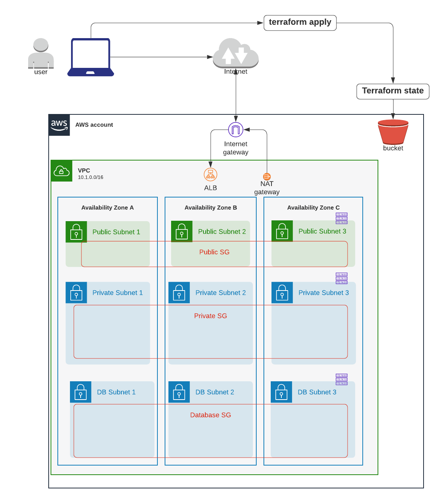

# 3つのSubnetレイヤーがあるVPCを作成



フォルダー構成:
```sh
.
├── README.md
├── composition
│   ├── eks-demo-infra # <--- Step 3: Composition layerを作成し、必要なインプット変数のValueを定義しInfra layerにパスダウン
│   │   └── ap-northeast-1
│   │       └── prod
│   │           ├── backend.config
│   │           ├── data.tf
│   │           ├── main.tf # <-----  entry point
│   │           ├── outputs.tf
│   │           ├── providers.tf
│   │           ├── terraform.tfenvs
│   │           └── variables.tf
│   └── terraform-remote-backend 
│       └── ap-northeast-1 
│           └── prod      
├── infrastructure_modules 
│   ├── terraform_remote_backend
│   └── vpc # <---- Step 2: VPCのInfrastructure Modulesを作成
└── resource_modules 
    ├── compute
    │   └── security_group  # <----- Step 1: VPCのRemote TF modulesを local Resource Modulesにコピー（Bottom up approach）Modules
    ├── database
    │   └── dynamodb
    ├── identity
    │   └── kms_key
    ├── network
    │   └── vpc # <----- Step 1: VPCのRemote TF modulesを local Resource Modulesにコピー（Bottom up approach）
    └── storage
        └── s3   
```


# Step 1: VPCのRemote TF modulesを local Resource Modulesにコピー（Bottom up approach）

## VPC

まずは、https://github.com/terraform-aws-modules/terraform-aws-vpc の全ての .tfを`resource_modules/network/vpc`にコピーします。


## Security group
https://github.com/terraform-aws-modules/terraform-aws-security-group の全ての .tfを`resource_modules/compute/security-group`にコピーします。


# Step 2: VPCのInfrastructure Modulesを作成

[AWS Terraform Remote Module's examples](https://github.com/terraform-aws-modules/terraform-aws-vpc/blob/master/examples/complete-vpc/main.tf)を参考にします。


[infrastructure_modules/vpc/main.tf](infrastructure_modules/vpc/main.tf)は、__facade__ として、VPCのSub-componentである IGW, NAT GW, subnets, route table, routesなどをAbstractします。

```sh
module "vpc" {  # <-------- STEP２
  source = "../../resource_modules/network/vpc"

  name = var.name
  cidr = var.cidr

  azs              = var.azs
  private_subnets  = var.private_subnets
  public_subnets   = var.public_subnets
  database_subnets = var.database_subnets

  enable_dns_hostnames = var.enable_dns_hostnames
  enable_dns_support   = var.enable_dns_support

  enable_nat_gateway = var.enable_nat_gateway
  single_nat_gateway = var.single_nat_gateway

  tags                 = var.tags
  public_subnet_tags   = local.public_subnet_tags
  private_subnet_tags  = local.private_subnet_tags
  database_subnet_tags = local.database_subnet_tags
}

# public subnetのSG： port 80 & 443を許可 (i.e. source CIDRは0.0.0.0/0)
module "public_security_group" {  # <-------- STEP２
  source = "../../resource_modules/compute/security_group"

  name        = local.public_security_group_name
  description = local.public_security_group_description
  vpc_id      = module.vpc.vpc_id

  ingress_rules            = ["http-80-tcp", "https-443-tcp"] # ref: https://github.com/terraform-aws-modules/terraform-aws-security-group/blob/master/examples/complete/main.tf#L44
  ingress_cidr_blocks      = ["0.0.0.0/0"]
  ingress_with_cidr_blocks = var.public_ingress_with_cidr_blocks

  # 全てのegressを許可
  egress_rules = ["all-all"]
  tags         = local.public_security_group_tags
}

# private subnetのSG: public SGからのport 80, 443のみ許可
module "private_security_group" {  # <-------- STEP２
  source = "../../resource_modules/compute/security_group"

  name        = local.private_security_group_name
  description = local.private_security_group_description
  vpc_id      = module.vpc.vpc_id

  # ref: https://github.com/terraform-aws-modules/terraform-aws-security-group/blob/master/examples/complete/main.tf#L150
  computed_ingress_with_source_security_group_id = [
    {
      rule                     = "http-80-tcp"
      source_security_group_id = module.public_security_group.this_security_group_id
      description              = "Port 80 from public SG rule"
    },
    {
      rule                     = "https-443-tcp"
      source_security_group_id = module.public_security_group.this_security_group_id
      description              = "Port 443 from public SG rule"
    },
    # bastion EC2 not created yet 
    # {
    #   rule                     = "ssh-tcp"
    #   source_security_group_id = var.bastion_sg_id
    #   description              = "SSH from bastion SG rule"
    # },
  ]
  number_of_computed_ingress_with_source_security_group_id = 2

  # allow ingress from within (i.e. Private subet内のEC2同士で接続可能にする)
  ingress_with_self = [
    {
      rule        = "all-all"
      description = "Self"
    },
  ]

  # 全てのEgressを許可
  egress_rules                                             = ["all-all"]
  tags                                                     = local.private_security_group_tags
}

# databse subnetのSG: private SGとEKS SGからのport 27017-19（mongoDB）とport 3306（MySQL）のみ許可
module "database_security_group" {  # <-------- STEP２
  source = "../../resource_modules/compute/security_group"

  name        = local.db_security_group_name
  description = local.db_security_group_description
  vpc_id      = module.vpc.vpc_id

  # EKS worker SG と private SGから許可
  computed_ingress_with_source_security_group_id           = concat(local.db_security_group_computed_ingress_with_source_security_group_id, var.databse_computed_ingress_with_eks_worker_source_security_group_ids)
  number_of_computed_ingress_with_source_security_group_id = var.create_eks ? 7 : 4

  # Open for self (rule or from_port+to_port+protocol+description)
  ingress_with_self = [
    {
      rule        = "all-all"
      description = "Self"
    },
  ]

  # 全てのEgressを許可
  egress_rules = ["all-all"]
  tags         = local.db_security_group_tags
}
```


# Step 3: Composition layerを作成し、必要なインプット変数のValueを定義しInfra layerにパスダウン

[composition/eks-demo-infra/ap-northeast-1/prod/main.tf](composition/eks-demo-infra/ap-northeast-1/prod/main.tf)（main classのmain()に似ている）

```sh
########################################
# VPC
########################################
module "vpc" {  # <-------- STEP3
  source = "../../../../infrastructure_modules/vpc" # using infra module VPC which acts like a facade to many sub-resources

  name                 = var.app_name
  cidr                 = var.cidr
  azs                  = var.azs
  private_subnets      = var.private_subnets
  public_subnets       = var.public_subnets
  database_subnets     = var.database_subnets
  enable_dns_hostnames = var.enable_dns_hostnames
  enable_dns_support   = var.enable_dns_support
  enable_nat_gateway   = var.enable_nat_gateway
  single_nat_gateway   = var.single_nat_gateway

  ## Public Security Group ##
  public_ingress_with_cidr_blocks = var.public_ingress_with_cidr_blocks

  ## Private Security Group ##
  # bastion EC2 not created yet
  # bastion_sg_id  = module.bastion.security_group_id

  ## Database security group ##
  # DB Controller EC2 not created yet
  # databse_computed_ingress_with_db_controller_source_security_group_id = module.db_controller_instance.security_group_id
  create_eks                                                           = var.create_eks
  # pass EKS worker SG to DB SG after creating EKS module at composition layer
  databse_computed_ingress_with_eks_worker_source_security_group_ids   = local.databse_computed_ingress_with_eks_worker_source_security_group_ids

  # cluster_name = local.cluster_name

  ## Common tag metadata ##
  env      = var.env
  app_name = var.app_name
  tags     = local.vpc_tags
  region   = var.region
}
```


最後にインプット変数のValueを[composition/eks-demo-infra/ap-northeast-1/prod/terraform.tfvars](composition/eks-demo-infra/ap-northeast-1/prod/terraform.tfvars)で指定します:

```sh
########################################
# Environment setting
########################################
region = "ap-northeast-1"
role_name    = "Admin"
profile_name = "aws-demo"
env = "prod"
application_name = "terraform-eks-demo-infra"
app_name = "terraform-eks-demo-infra"

########################################
# VPC
########################################
cidr                  = "10.1.0.0/16" 
azs                   = ["ap-northeast-1a", "ap-northeast-1c", "ap-northeast-1d"]
public_subnets        = ["10.1.1.0/24", "10.1.2.0/24", "10.1.3.0/24"] # 256 IPs per subnet
private_subnets       = ["10.1.101.0/24", "10.1.102.0/24", "10.1.103.0/24"]
database_subnets      = ["10.1.105.0/24", "10.1.106.0/24", "10.1.107.0/24"]
enable_dns_hostnames  = "true"
enable_dns_support    = "true"
enable_nat_gateway    = "true" # Private subnet内のEKS worker nodesがネット接続するために必要
single_nat_gateway    = "true"


## Public Security Group ##
public_ingress_with_cidr_blocks = []

create_eks = false
```


terraform apply
```sh
cd composition/eks-demo-infra/ap-northeast-1/prod

# will use remote backend
terraform init -backend-config=backend.config

# usual steps
terraform plan
terraform apply

# Successful output
Apply complete! Resources: 43 added, 0 changed, 0 destroyed.
Releasing state lock. This may take a few moments...

Outputs:

database_network_acl_id = ""
database_route_table_ids = tolist([
  "rtb-05cd8f1ee199e829d",
])
database_security_group_id = "sg-0cfa939b62d328fdd"
database_security_group_name = "scg-apne1-prod-database-20210216172630941200000002"
database_security_group_owner_id = "xxxxxxx"
database_security_group_vpc_id = "vpc-07e4383b75c37b1e0"
database_subnet_arns = [
  "arn:aws:ec2:ap-northeast-1:xxxxxxx:subnet/subnet-0235daeeafb2eb86e",
  "arn:aws:ec2:ap-northeast-1:xxxxxxx:subnet/subnet-0d4fe98223c85a7d5",
  "arn:aws:ec2:ap-northeast-1:xxxxxxx:subnet/subnet-0d1a9f4f51a7bcf14",
]
database_subnet_group = "terraform-eks-demo-infra"
database_subnets = [
  "subnet-0235daeeafb2eb86e",
  "subnet-0d4fe98223c85a7d5",
  "subnet-0d1a9f4f51a7bcf14",
]
database_subnets_cidr_blocks = [
  "10.1.105.0/24",
  "10.1.106.0/24",
  "10.1.107.0/24",
]
igw_id = "igw-0c731c8c529ac6291"
nat_ids = [
  "eipalloc-0a19db1dfc7f28e10",
]
nat_public_ips = tolist([
  "13.115.36.4",
])
natgw_ids = [
  "nat-04c7aac5dd187894e",
]
private_network_acl_id = ""
private_route_table_ids = [
  "rtb-05cd8f1ee199e829d",
]
private_security_group_id = "sg-081c4c5ed67883b98"
private_security_group_name = "scg-apne1-prod-private-20210216172630729700000001"
private_security_group_owner_id = "xxxxxxx"
private_security_group_vpc_id = "vpc-07e4383b75c37b1e0"
private_subnets = [
  "subnet-059466b92e5120afa",
  "subnet-088cbeb573a80e947",
  "subnet-016792c80e93d31bf",
]
private_subnets_cidr_blocks = [
  "10.1.101.0/24",
  "10.1.102.0/24",
  "10.1.103.0/24",
]
public_network_acl_id = ""
public_route_table_ids = [
  "rtb-0867c95134399ef38",
]
public_security_group_id = "sg-0771d52c3ba5d9642"
public_security_group_name = "scg-apne1-prod-public-20210216172630960800000003"
public_security_group_owner_id = "xxxxxxx"
public_security_group_vpc_id = "vpc-07e4383b75c37b1e0"
public_subnets = [
  "subnet-0f5d3c1c7f306792b",
  "subnet-090c4f0f00583036b",
  "subnet-0a82b1828528f6aa7",
]
public_subnets_cidr_blocks = [
  "10.1.1.0/24",
  "10.1.2.0/24",
  "10.1.3.0/24",
]
vpc_cidr_block = "10.1.0.0/16"
vpc_enable_dns_hostnames = true
vpc_enable_dns_support = true
vpc_id = "vpc-07e4383b75c37b1e0"
vpc_instance_tenancy = "default"
vpc_main_route_table_id = "rtb-03701d293fea25d41"
vpc_secondary_cidr_blocks = []
```
