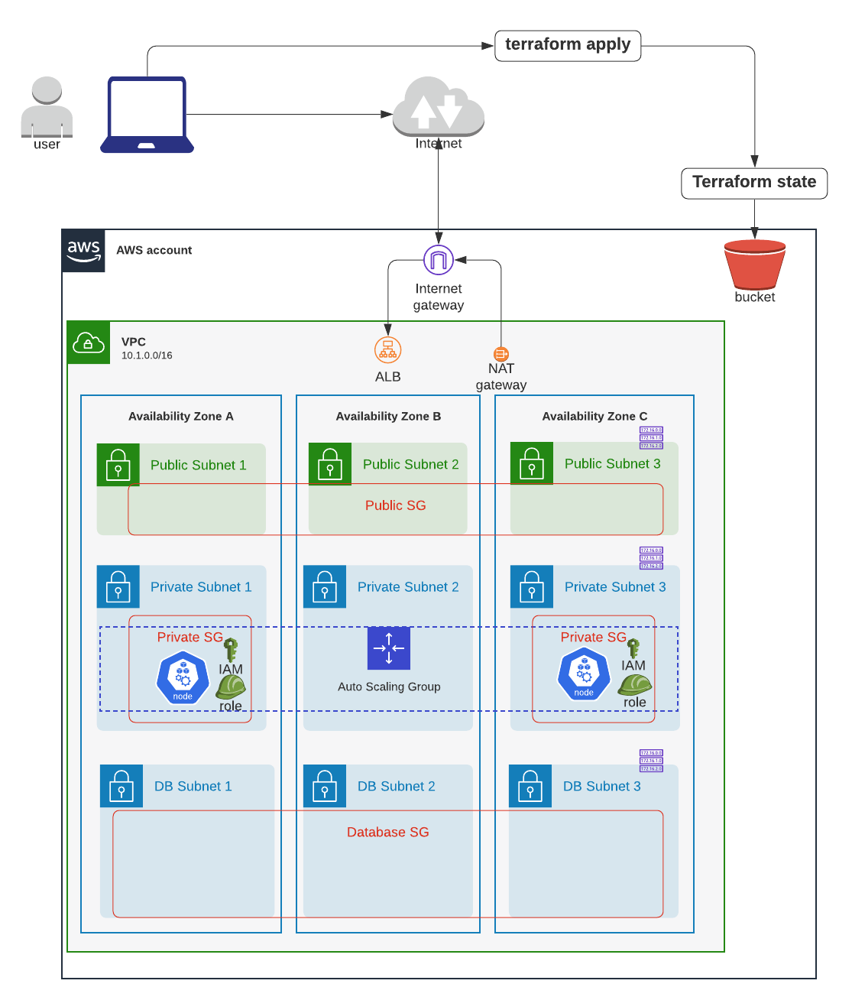

# EKS Clusterを作成




フォルダー構成:
```sh
.
├── README.md
├── composition
│   ├── eks-demo-infra # <--- Step 3: Composition layerを作成し、必要なインプット変数のValueを定義しInfra layerにパスダウン
│   │   └── ap-northeast-1
│   │       └── prod
│   │           ├── backend.config
│   │           ├── data.tf
│   │           ├── main.tf # <----- this is the entry point for EKS
│   │           ├── outputs.tf
│   │           ├── providers.tf
│   │           ├── terraform.tfenvs
│   │           └── variables.tf
│   └── terraform-remote-backend 
│       └── ap-northeast-1 
│           └── prod      
├── infrastructure_modules 
│   ├── eks # <---- Step 2: EKSのInfrastructure Modulesを作成
│   │   ├── data.tf
│   │   ├── main.tf
│   │   ├── outputs.tf
│   │   ├── template
│   │   │   └── ssm_document_cleanup_docker_images.yaml
│   │   └── variables.tf
│   ├── terraform_remote_backend
│   └── vpc
└── resource_modules 
    ├── compute
    │   ├── ec2_key_pair
    │   └── security_group
    ├── container
    │   ├── ecr
    │   │   ├── main.tf
    │   │   ├── outputs.tf
    │   │   └── variables.tf
    │   └── eks # <----- Step 1: EKSのRemote TF modulesを local Resource Modulesにコピー（Bottom up approach）
    │       ├── _user_data
    │       │   ├── main.tf
    │       │   ├── outputs.tf
    │       │   ├── variables.tf
    │       │   └── versions.tf
    │       ├── eks-managed-node-group
    │       │   ├── main.tf
    │       │   ├── outputs.tf
    │       │   ├── variables.tf
    │       │   └── versions.tf
    │       ├── fargate-profile
    │       │   ├── main.tf
    │       │   ├── outputs.tf
    │       │   ├── variables.tf
    │       │   └── versions.tf
    │       ├── karpenter
    │       │   ├── main.tf
    │       │   ├── outputs.tf
    │       │   ├── variables.tf
    │       │   └── versions.tf
    │       ├── main.tf
    │       ├── modules
    │       │   ├── _user_data
    │       │   │   ├── main.tf
    │       │   │   ├── outputs.tf
    │       │   │   ├── variables.tf
    │       │   │   └── versions.tf
    │       │   ├── eks-managed-node-group
    │       │   │   ├── main.tf
    │       │   │   ├── outputs.tf
    │       │   │   ├── variables.tf
    │       │   │   └── versions.tf
    │       │   ├── fargate-profile
    │       │   │   ├── main.tf
    │       │   │   ├── outputs.tf
    │       │   │   ├── variables.tf
    │       │   │   └── versions.tf
    │       │   └── self-managed-node-group
    │       │       ├── main.tf
    │       │       ├── outputs.tf
    │       │       ├── variables.tf
    │       │       └── versions.tf
    │       ├── node_groups.tf
    │       ├── outputs.tf
    │       ├── self-managed-node-group
    │       │   ├── main.tf
    │       │   ├── outputs.tf
    │       │   ├── variables.tf
    │       │   └── versions.tf
    │       ├── templates
    │       │   ├── aws_auth_cm.tpl
    │       │   ├── bottlerocket_user_data.tpl
    │       │   ├── linux_user_data.tpl
    │       │   └── windows_user_data.tpl
    │       ├── variables.tf
    │       └── versions.tf
    ├── database
    │   └── dynamodb
    ├── network
    │   └── vpc 
    └── storage
        └── s3   
```


# Step 1: EKSのRemote TF modulesを local Resource Modulesにコピー（Bottom up approach）

まずは、https://github.com/terraform-aws-modules/terraform-aws-eks の全ての .tf を`resource_modules/container/eks`にコピーします。


その後にTerraform planをするとエラーが出てくるので、マニュアルでエラーを修正します。


[resource_modules/container/eks/workers.tf](resource_modules/container/eks/workers.tf)で, 
`var.workers_role_name != "" ? null : coalescelist(aws_eks_cluster.this[*].name, [""])[0], 0, 31`を`substr()`関数でラッピングします
```sh
resource "aws_iam_role" "workers" {
  name_prefix           = substr(var.workers_role_name != "" ? null : coalescelist(aws_eks_cluster.this[*].name, [""])[0], 0, 31)
```


次に、[resource_modules/container/eks/variables.tf](resource_modules/container/eks/variables.tf)で`key_name` インプット変数を定義し、Externalizeさせます。
```sh
# externalize this var so value can be injected at higher level (infra modules)
variable "key_name" {
  default = ""
}
```

そして[resource_modules/container/eks/local.tf](resource_modules/container/eks/local.tf)で、`key_name` インプット変数を、ローカル変数`key_name`にAssignします。
```sh
workers_group_defaults_defaults = {
    root_volume_type              = "gp2"
    key_name                      = var.key_name       # The key pair name that should be used for the instances in the autoscaling group
```


# Step 2: EKSのInfrastructure Modulesを作成

[AWS EKS Terraform Remote Module's examples](https://github.com/terraform-aws-modules/terraform-aws-eks/blob/master/examples/basic/main.tf)を参考にします。


[infrastructure_modules/eks/main.tf](infrastructure_modules/eks/main.tf)は、__facade__ として、EKSのSub-componentであるEKS worker nodes, IAM roles, worker launch template, security groups, auto scaling groupsなどをAbstractします。


```sh
# EKS worker nodeにSSHするためのKeypair
module "key_pair" {  # <-------- STEP2
  source = "../../resource_modules/compute/ec2_key_pair"

  key_name   = local.key_pair_name
  public_key = local.public_key
}

# ref: https://github.com/terraform-aws-modules/terraform-aws-eks/blob/master/examples/complete/main.tf#L5-L33
module "eks_cluster" {  # <-------- STEP2
  source = "../../resource_modules/container/eks"

  create_eks      = var.create_eks
  cluster_version = var.cluster_version
  cluster_name    = var.cluster_name
  kubeconfig_name = var.cluster_name
  vpc_id          = var.vpc_id
  subnets         = var.subnets

  worker_groups                        = var.worker_groups
  node_groups                          = var.node_groups
  worker_additional_security_group_ids = var.worker_additional_security_group_ids

  key_name = module.key_pair.key_name

  # WARNING: changing this will force recreating an entire EKS cluster!!!
  # enable k8s secret encryption using AWS KMS. Ref: https://github.com/terraform-aws-modules/terraform-aws-eks/blob/master/examples/secrets_encryption/main.tf#L88
  cluster_encryption_config = [
    {
      provider_key_arn = module.k8s_secret_kms_key.arn
      resources        = ["secrets"]
    }
  ]

  tags = var.tags
}

# ########################################
# ## KMS for K8s secret's DEK (data encryption key) encryption
# ########################################
module "k8s_secret_kms_key" {  # <-------- STEP2
  source = "../../resource_modules/identity/kms_key"

  name                    = local.k8s_secret_kms_key_name
  description             = local.k8s_secret_kms_key_description
  deletion_window_in_days = local.k8s_secret_kms_key_deletion_window_in_days
  tags                    = local.k8s_secret_kms_key_tags
  policy                  = data.aws_iam_policy_document.k8s_api_server_decryption.json
  enable_key_rotation     = true
}
```


そして、EC2にSSHするのに使う publicとprivate keyを`ssh-keygen`コマンドを使って作成し、public keyのコンテンツを [infrastructure_modules/eks/data.tf](infrastructure_modules/eks/data.tf)で`public_key`にAssign:

```sh
locals {
  ## Key Pair ##
  key_pair_name = "eks-workers-keypair-${var.region_tag[var.region]}-${var.env}-${var.app_name}"
  # `ssh-keygen`コマンドを使ってpublicとprivate key作成
  public_key    = "XYZXYZ"

```


# Step 3: Composition layerを作成し、必要なインプット変数のValueを定義しInfra layerにパスダウン

[composition/eks-demo-infra/ap-northeast-1/prod/main.tf](composition/eks-demo-infra/ap-northeast-1/prod/main.tf)

```sh
########################################
# EKS
########################################
module "eks" {  # <-------- STEP3
  source = "../../../../infrastructure_modules/eks"

  ## EKS ##
  create_eks      = var.create_eks
  cluster_version = var.cluster_version
  cluster_name    = local.cluster_name
  vpc_id          = local.vpc_id
  subnets         = local.private_subnets

  # note: either pass worker_groups or node_groups
  # this is for unmanaged (unmanaged by EKSCTL API) node group
  worker_groups = var.worker_groups

  # this is for (EKS API) managed node group
  node_groups = var.node_groups

  # specify AWS Profile if you want kubectl to use a named profile to authenticate instead of access key and secret access key
  kubeconfig_aws_authenticator_env_variables = local.kubeconfig_aws_authenticator_env_variables

  ## Common tag metadata ##
  env             = var.env
  app_name        = var.app_name
  tags            = local.eks_tags
  region          = var.region
}
```

また`kubernetes` providerも`providers.tf`で指定します
```sh
terraform {
  required_version = ">= 0.14"
  backend "s3" {} # use backend.config for remote backend

  required_providers {
    aws    = ">= 3.28, < 4.0"
    random = "~> 2"
    kubernetes = "~>1.11"  # <-------- STEP3
    local = "~> 1.2"
    null = "~> 2.1"
    template = "~> 2.1"
  }
}

# ref: https://registry.terraform.io/providers/hashicorp/kubernetes/latest/docs
provider "kubernetes" {
  # if you use default value of "manage_aws_auth = true" then you need to configure the kubernetes provider as per the doc: https://github.com/terraform-aws-modules/terraform-aws-eks/blob/v12.1.0/README.md#conditional-creation, https://github.com/terraform-aws-modules/terraform-aws-eks/issues/911
  host                   = element(concat(data.aws_eks_cluster.cluster[*].endpoint, tolist([""])), 0)
  cluster_ca_certificate = base64decode(element(concat(data.aws_eks_cluster.cluster[*].certificate_authority.0.data, tolist([""])), 0))
  token                  = element(concat(data.aws_eks_cluster_auth.cluster[*].token, tolist([""])), 0)
  load_config_file       = false # set to false unless you want to import local kubeconfig to terraform
}
```

`data.tf`
```sh
data "aws_eks_cluster" "cluster" {
  count = var.create_eks ? 1 : 0
  name  = module.eks.cluster_id
}

data "aws_eks_cluster_auth" "cluster" {
  count = var.create_eks ? 1 : 0
  name  = module.eks.cluster_id
}
```


最後にインプット変数のValueを[composition/eks-demo-infra/ap-northeast-1/prod/terraform.tfvars](composition/eks-demo-infra/ap-northeast-1/prod/terraform.tfvars)で指定します:

```sh
########################################
# EKS
########################################
cluster_version = 1.19

# if set to true, AWS IAM Authenticator will use IAM role specified in "role_name" to authenticate to a cluster
authenticate_using_role = true

# if set to true, AWS IAM Authenticator will use AWS Profile name specified in profile_name to authenticate to a cluster instead of access key and secret access key
authenticate_using_aws_profile = false

# WARNING: mixing managed and unmanaged node groups will render unmanaged nodes to be unable to connect to internet & join the cluster when restarting.
# how many groups of K8s worker nodes you want? Specify at least one group of worker node
# gotcha: managed node group doesn't support 1) propagating taint to K8s nodes and 2) custom userdata. Ref: https://eksctl.io/usage/eks-managed-nodes/#feature-parity-with-unmanaged-nodegroups
node_groups = {}

# note (only for unmanaged node group)
worker_groups = [
  {
    name                 = "worker-group-prod-1"
    instance_type        = "m3.medium" # since we are using AWS-VPC-CNI, allocatable pod IPs are defined by instance size: https://docs.google.com/spreadsheets/d/1MCdsmN7fWbebscGizcK6dAaPGS-8T_dYxWp0IdwkMKI/edit#gid=1549051942, https://github.com/awslabs/amazon-eks-ami/blob/master/files/eni-max-pods.txt
    asg_max_size         = 2
    asg_min_size         = 1
    asg_desired_capacity = 1 # this will be ignored if cluster autoscaler is enabled: asg_desired_capacity: https://github.com/terraform-aws-modules/terraform-aws-eks/blob/master/docs/autoscaling.md#notes
    tags = [
      {
        "key"                 = "unmanaged-node"
        "propagate_at_launch" = "true"
        "value"               = "true"
      },
    ]
  },
]
```


terraform apply
```sh
cd composition/eks-demo-infra/ap-northeast-1/prod

# will use remote backend
terraform init -backend-config=backend.config

# usual steps
terraform plan
terraform apply

# およそ15分かかります
module.eks.module.eks_cluster.null_resource.wait_for_cluster[0]: Still creating... [14m51s elapsed]
module.eks.module.eks_cluster.null_resource.wait_for_cluster[0]: Still creating... [15m1s elapsed]
module.eks.module.eks_cluster.null_resource.wait_for_cluster[0]: Creation complete after 15m6s [id=2913039165535485096]
data.aws_eks_cluster_auth.cluster[0]: Reading...
data.aws_eks_cluster.cluster[0]: Reading...
data.aws_eks_cluster_auth.cluster[0]: Read complete after 0s [id=eks-apne1-prod-terraform-eks-demo-infra]
data.aws_eks_cluster.cluster[0]: Read complete after 1s [id=eks-apne1-prod-terraform-eks-demo-infra]
module.eks.module.eks_cluster.kubernetes_config_map.aws_auth[0]: Creating...
module.eks.module.eks_cluster.kubernetes_config_map.aws_auth[0]: Creation complete after 2s [id=kube-system/aws-auth]

# Successful output
Apply complete! Resources: 36 added, 0 changed, 0 destroyed.
```


## Step 4: kubeconfigファイルを設定して、EKS clusterにアクセスする
Ref: https://kubernetes.io/docs/tasks/access-application-cluster/configure-access-multiple-clusters/


デフォルトでkubectl CLIは、環境変数`KUBECONFIG`で指定されたファイルがなければ、`~/.kube/config`に保存されたKubeconfigファイルを使います。


### Scenario 1: デフォルトのkubeconfigがEmptyな場合
`~/.kube/config`に上書きしましょう。

```sh
# kubeconfigのコンテンツが、アウトプット変数に保存されているので表示
terraform output eks_kubeconfig

# ローカルに保存されているkubeconfigのファイル名のアウトプット変数を表示
terraform output eks_kubeconfig_filename

# または、表示するだけでなくデフォルトのファイルパスに上書き
terraform output eks_kubeconfig > `~/.kube/config`

# クラスター認証をチェック
kubectl cluster-info

# 成功した場合のアウトプット
Kubernetes master is running at https://EFFDE7B864F8D3778BD3417E5572FAE0.gr7.ap-northeast-1.eks.amazonaws.com
CoreDNS is running at https://EFFDE7B864F8D3778BD3417E5572FAE0.gr7.ap-northeast-1.eks.amazonaws.com/api/v1/namespaces/kube-system/services/kube-dns:dns/proxy

To further debug and diagnose cluster problems, use 'kubectl cluster-info dump'.
```

### Scenario 2: デフォルトのkubeconfigがEmptyではない場合： マニュアルで編集

### Scenario 3: デフォルトのkubeconfigがEmptyではない場合：　違う kubeconfig fileに保存したい場合

`kubectl` コマンドの`-kubeconfig` argumentでファイルパスを指定することで、複数のKubeconfigファイルを管理できます。

```sh
# デフォルトではない、カスタムなファイルパスに上書き
terraform output eks_kubeconfig > `~/.kube/eks-apne1-prod-terraform-eks-demo-infra`

# カスタムなKubeconfigファイルを`--kubeconfig`で指定して、クラスター認証をチェック
kubectl cluster-info \
  --kubeconfig=./kubeconfig_eks-apne1-prod-terraform-eks-demo-infra

# 成功した場合のアウトプット
Kubernetes master is running at https://EFFDE7B864F8D3778BD3417E5572FAE0.gr7.ap-northeast-1.eks.amazonaws.com
CoreDNS is running at https://EFFDE7B864F8D3778BD3417E5572FAE0.gr7.ap-northeast-1.eks.amazonaws.com/api/v1/namespaces/kube-system/services/kube-dns:dns/proxy

To further debug and diagnose cluster problems, use 'kubectl cluster-info dump'.

# --kubeconfigで指定必要！
kubectl get po --kubeconfig=./kubeconfig_eks-apne1-prod-terraform-eks-demo-infra


# ただ、--kubeconfigで毎回指定するのは面倒なので、Shellの環境変数 `KUBECONFIG`にパスを設定可能
export KUBECONFIG="${PWD}/kubeconfig_eks-apne1-prod-terraform-eks-demo-infra"

# --kubeconfigで指定不要！
kubectl get po
```


`eks` moduleのみを削除したい場合、`-target=`でmoduleのパスを指定
```
terraform state list

terraform destroy -target=module.eks
```