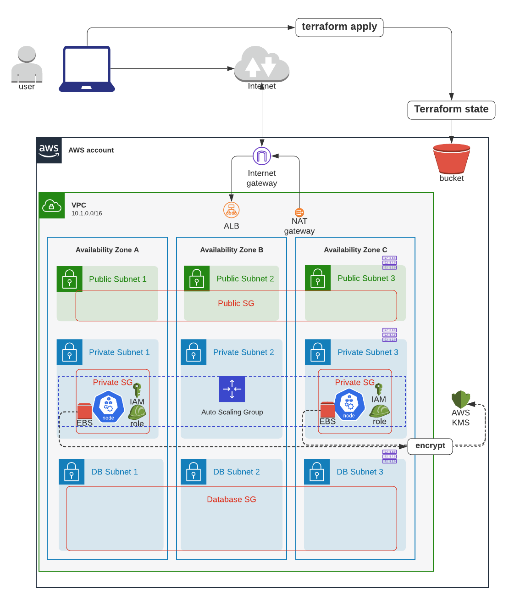
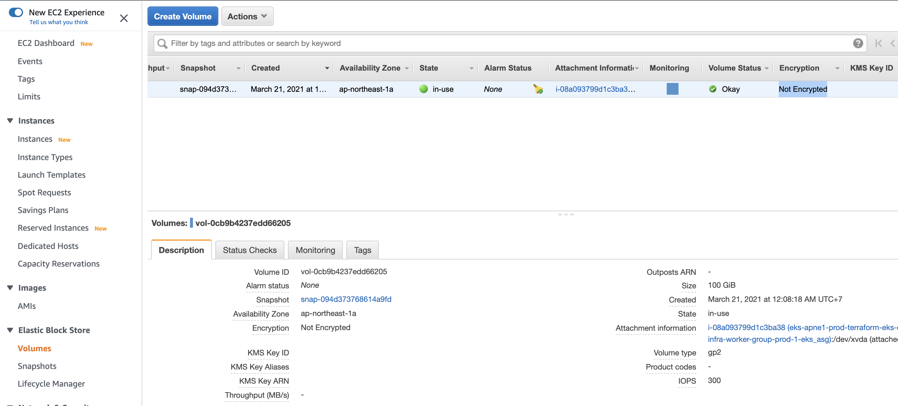
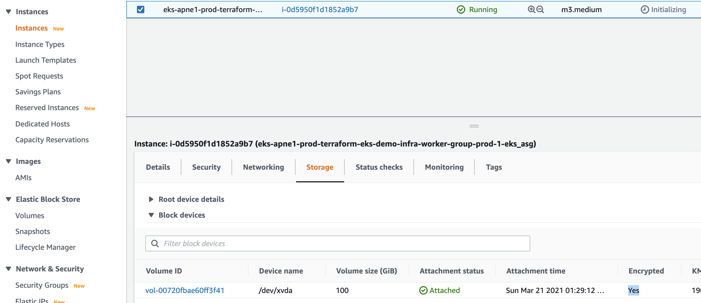
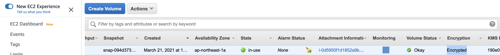

# EKS worker nodeにAttachされたAWS EBS Volumesを暗号化する



# Step 1: EBS root volumeを暗号化するAttributeをResource layerで見つける

In [resource_modules/container/eks/self-managed-node-group/main.tf](resource_modules/container/eks/self-managed-node-group/main.tf):

```sh
resource "aws_launch_template" "this" {
  count = var.create && var.create_launch_template ? 1 : 0

  dynamic "block_device_mappings" {
    for_each = var.block_device_mappings

    content {
      device_name = try(block_device_mappings.value.device_name, null)

      dynamic "ebs" {
        for_each = try([block_device_mappings.value.ebs], [])

        content {
          delete_on_termination = try(ebs.value.delete_on_termination, null)
          encrypted             = try(ebs.value.encrypted, null) # <------- HERE
          iops                  = try(ebs.value.iops, null)
          kms_key_id            = try(ebs.value.kms_key_id, null)
          snapshot_id           = try(ebs.value.snapshot_id, null)
          throughput            = try(ebs.value.throughput, null)
          volume_size           = try(ebs.value.volume_size, null)
          volume_type           = try(ebs.value.volume_type, null)
        }
      }

      no_device    = try(block_device_mappings.value.no_device, null)
      virtual_name = try(block_device_mappings.value.virtual_name, null)
    }
  }
```


# Step 2: EBS root volumeを暗号化するAttributeをComposition layerの`local.tf`で定義
暗号化するためにAWS KMS Key moduleをInfra layerに作成

```sh
# note (only for unmanaged node group)
# gotcha: need to use kubelet_extra_args to propagate taints/labels to K8s node, because ASG tags not being propagated to k8s node objects.
# ref: https://github.com/kubernetes/autoscaler/issues/1793#issuecomment-517417680
# ref: https://github.com/kubernetes/autoscaler/issues/2434#issuecomment-576479025
# example: https://github.com/terraform-aws-modules/terraform-aws-eks/blob/master/examples/self_managed_node_group/main.tf#L102-L194
self_managed_node_groups = {
  prod = {
    name          = "worker-group-prod-1"
    instance_type = "m3.medium" # since we are using AWS-VPC-CNI, allocatable pod IPs are defined by instance size: https://docs.google.com/spreadsheets/d/1MCdsmN7fWbebscGizcK6dAaPGS-8T_dYxWp0IdwkMKI/edit#gid=1549051942, https://github.com/awslabs/amazon-eks-ami/blob/master/files/eni-max-pods.txt
    max_size      = 1
    min_size      = 1
    desired_size  = 1 # this will be ignored if cluster autoscaler is enabled: asg_desired_capacity: https://github.com/terraform-aws-modules/terraform-aws-eks/blob/master/docs/autoscaling.md#notes

    # use KMS key to encrypt EKS worker node's root EBS volumes
    # ref: https://github.com/terraform-aws-modules/terraform-aws-eks/blob/master/examples/self_managed_node_group/main.tf#L204C11-L215
    block_device_mappings = {
      xvda = {
        device_name = "/dev/xvda"
        ebs = {
          volume_size = 100
          volume_type = "gp3"
          encrypted   = true # <------ HERE
          delete_on_termination = true
        }
      }
    }

    tags = {
      "unmanaged-node"                    = "true"
      "k8s.io/cluster-autoscaler/enabled" = "true" # need this tag so clusterautoscaler auto-discovers node group: https://github.com/terraform-aws-modules/terraform-aws-eks/blob/master/docs/autoscaling.md
      "k8s_namespace"                     = "prod"
      "env"                               = "prod"
    }
  },
}
```


# Step 3: Terraform apply

```sh
cd composition/eks-demo-infra/ap-northeast-1/prod

# will use remote backend
terraform init -backend-config=backend.config

# usual steps
terraform plan
terraform apply

# output 
  + create
  ~ update in-place
+/- create replacement and then destroy

Terraform will perform the following actions:

  # module.eks.module.eks_cluster.aws_autoscaling_group.workers[0] will be updated in-place
  ~ resource "aws_autoscaling_group" "workers" {
        id                        = "eks-apne1-prod-terraform-eks-demo-infra-worker-group-prod-120210320170812217400000002"
      ~ launch_configuration      = "eks-apne1-prod-terraform-eks-demo-infra-worker-group-prod-120210320170807199800000001" -> (known after apply)
        name                      = "eks-apne1-prod-terraform-eks-demo-infra-worker-group-prod-120210320170812217400000002"
        # (22 unchanged attributes hidden)

        # (6 unchanged blocks hidden)
    }

  # module.eks.module.eks_cluster.aws_launch_configuration.workers[0] must be replaced
+/- resource "aws_launch_configuration" "workers" {
      ~ arn                              = "arn:aws:autoscaling:ap-northeast-1:266981300450:launchConfiguration:fb6b389a-6608-4eaf-8327-44ff21ad6a60:launchConfigurationName/eks-apne1-prod-terraform-eks-demo-infra-worker-group-prod-120210320170807199800000001" -> (known after apply)
      ~ id                               = "eks-apne1-prod-terraform-eks-demo-infra-worker-group-prod-120210320170807199800000001" -> (known after apply)
      + key_name                         = (known after apply)
      ~ name                             = "eks-apne1-prod-terraform-eks-demo-infra-worker-group-prod-120210320170807199800000001" -> (known after apply)
      - vpc_classic_link_security_groups = [] -> null
        # (9 unchanged attributes hidden)

      + ebs_block_device {
          + delete_on_termination = (known after apply)
          + device_name           = (known after apply)
          + encrypted             = (known after apply) # <--------- this changed
          + iops                  = (known after apply)
          + no_device             = (known after apply)
          + snapshot_id           = (known after apply)
          + volume_size           = (known after apply)
          + volume_type           = (known after apply)
        }

      + metadata_options {
          + http_endpoint               = (known after apply)
          + http_put_response_hop_limit = (known after apply)
          + http_tokens                 = (known after apply)
        }

      ~ root_block_device {
          ~ encrypted             = false -> true # forces replacement # <--------- this changed
            # (4 unchanged attributes hidden)
        }
    }

  # module.eks.module.eks_cluster.random_pet.workers[0] must be replaced
+/- resource "random_pet" "workers" {
      ~ id        = "light-aardvark" -> (known after apply)
      ~ keepers   = {
          - "lc_name" = "eks-apne1-prod-terraform-eks-demo-infra-worker-group-prod-120210320170807199800000001"
        } -> (known after apply) # forces replacement
        # (2 unchanged attributes hidden)
    }

  # module.eks.module.eks_node_ebs_kms_key.aws_kms_alias.this will be created
  + resource "aws_kms_alias" "this" {
      + arn            = (known after apply)
      + id             = (known after apply)
      + name           = "alias/cmk-apne1-prod-eks-node-ebs-volume"
      + target_key_arn = (known after apply)
      + target_key_id  = (known after apply)
    }

  # module.eks.module.eks_node_ebs_kms_key.aws_kms_key.this will be created
  + resource "aws_kms_key" "this" {
      + arn                      = (known after apply)
      + customer_master_key_spec = "SYMMETRIC_DEFAULT"
      + deletion_window_in_days  = 30
      + description              = "Kms key used for EKS node's EBS volume"
      + enable_key_rotation      = true
      + id                       = (known after apply)
      + is_enabled               = true
      + key_id                   = (known after apply)
      + key_usage                = "ENCRYPT_DECRYPT"
      + policy                   = jsonencode(
            {
              + Statement = [
                  + {
                      + Action    = "kms:*"
                      + Effect    = "Allow"
                      + Principal = {
                          + AWS = "arn:aws:iam::266981300450:root"
                        }
                      + Resource  = "*"
                      + Sid       = "Allow access for Key Administrators"
                    },
                  + {
                      + Action    = [
                          + "kms:ReEncrypt*",
                          + "kms:GenerateDataKey*",
                          + "kms:Encrypt",
                          + "kms:DescribeKey",
                          + "kms:Decrypt",
                        ]
                      + Effect    = "Allow"
                      + Principal = {
                          + AWS = [
                              + "arn:aws:iam::266981300450:root",
                              + "arn:aws:iam::266981300450:role/eks-apne1-prod-terraform-eks-de20210320164725216500000001",
                              + "arn:aws:iam::266981300450:role/aws-service-role/autoscaling.amazonaws.com/AWSServiceRoleForAutoScaling",
                            ]
                        }
                      + Resource  = "*"
                      + Sid       = "Allow service-linked role use of the CMK"
                    },
                  + {
                      + Action    = "kms:CreateGrant"
                      + Condition = {
                          + Bool = {
                              + kms:GrantIsForAWSResource = [
                                  + "true",
                                ]
                            }
                        }
                      + Effect    = "Allow"
                      + Principal = {
                          + AWS = [
                              + "arn:aws:iam::266981300450:role/eks-apne1-prod-terraform-eks-de20210320164725216500000001",
                              + "arn:aws:iam::266981300450:role/aws-service-role/autoscaling.amazonaws.com/AWSServiceRoleForAutoScaling",
                            ]
                        }
                      + Resource  = "*"
                      + Sid       = "Allow attachment of persistent resources"
                    },
                ]
              + Version   = "2012-10-17"
            }
        )
      + tags                     = {
          + "Application" = "terraform-eks-demo-infra"
          + "Environment" = "prod"
          + "Name"        = "alias/cmk-apne1-prod-eks-node-ebs-volume"
        }
    }

Plan: 4 to add, 1 to change, 2 to destroy.
```

# Step 5: root EBS volumeがencryptされているかチェック

コンソールでAWS EC2 -> Volumeでみると暗号化されていない


EC2 (worker node)を再起動し、AWS ASGが新しいLaunch Configを使って 新しいEC2を起動し、暗号化されたEBSをAttachさせる


