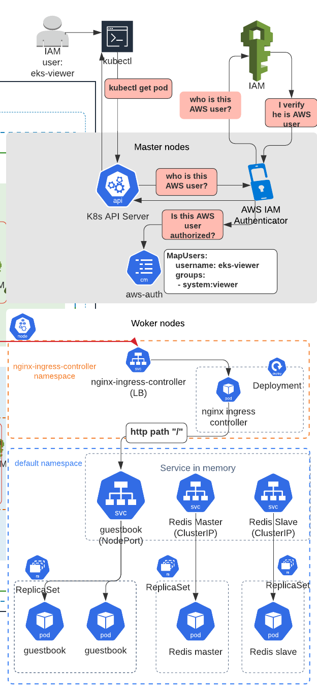
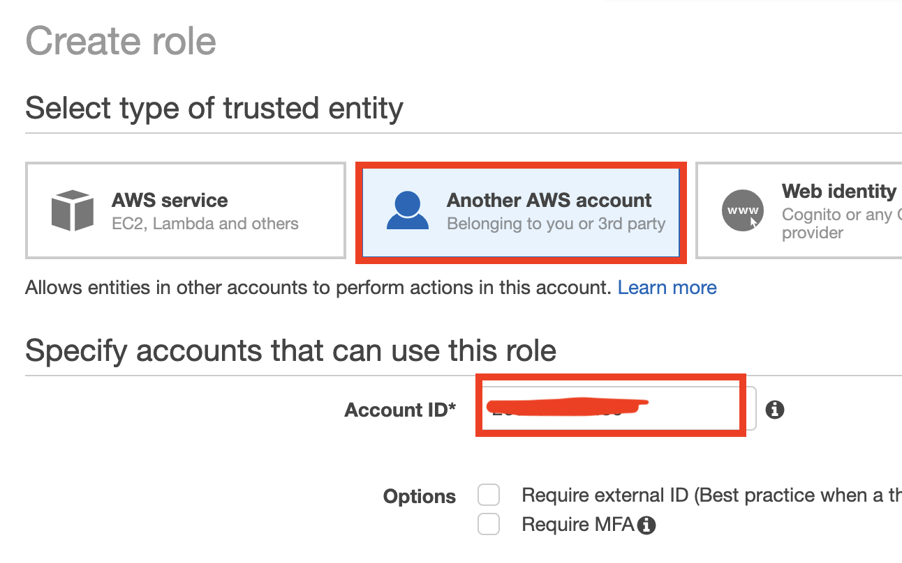
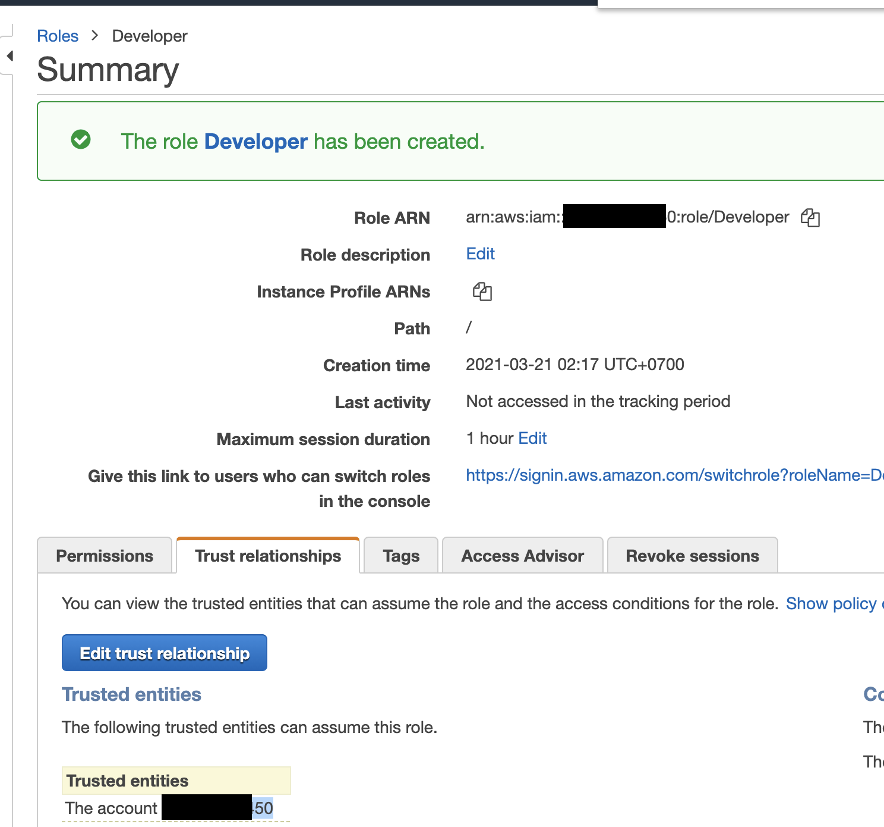

# Security: AWS Userの認証 (aws-iam-authenticator) と 認可(RBAC: Role Based Access Control, aws-auth configmapとclusterrolebindingを利用）




# Step 1: まずはAWS IAM roles/users/accountsを `aws-auth` ConfigMapを使ってK8sクラスターに追加する方法を理解する

[rresource_modules/container/eks/main.tf](rresource_modules/container/eks/main.tf)に `aws_auth_configmap_data`というresource typeがあり、このResourceがK8s `aws-auth` configmap を作成します。このConfigMapに存在するAWS IAM role/user/accountのみが、クラスター内に認証できます。

```sh
aws_auth_configmap_data = {
    mapRoles = yamlencode(concat(
      [for role_arn in local.node_iam_role_arns_non_windows : {
        rolearn  = role_arn
        username = "system:node:{{EC2PrivateDNSName}}"
        groups = [
          "system:bootstrappers",
          "system:nodes",
        ]
        }
      ],
      [for role_arn in local.node_iam_role_arns_windows : {
        rolearn  = role_arn
        username = "system:node:{{EC2PrivateDNSName}}"
        groups = [
          "eks:kube-proxy-windows",
          "system:bootstrappers",
          "system:nodes",
        ]
        }
      ],
      # Fargate profile
      [for role_arn in local.fargate_profile_pod_execution_role_arns : {
        rolearn  = role_arn
        username = "system:node:{{SessionName}}"
        groups = [
          "system:bootstrappers",
          "system:nodes",
          "system:node-proxier",
        ]
        }
      ],
      var.aws_auth_roles # <------- HERE
    ))
    mapUsers    = yamlencode(var.aws_auth_users)
    mapAccounts = yamlencode(var.aws_auth_accounts)
}
```


# Step 2: `aws_auth_roles`ローカル変数を`data.tf`に定義、Infraレイヤーにパスダウン

[composition/eks-demo-infra/ap-northeast-1/prod/main.tf](composition/eks-demo-infra/ap-northeast-1/prod/main.tf)

```sh
########################################
# EKS
########################################
module "eks" {
  source = "../../../../infrastructure_modules/eks"

  ## EKS ##
  create_eks                     = var.create_eks
  cluster_version                = var.cluster_version
  cluster_name                   = local.cluster_name
  cluster_endpoint_public_access = var.cluster_endpoint_public_access
  vpc_id                         = module.vpc.vpc_id
  subnets                        = module.vpc.private_subnets

  # note: either pass worker_groups or node_groups
  # this is for (EKSCTL API) unmanaged node group
  self_managed_node_groups = var.self_managed_node_groups

  # this is for (EKS API) managed node group
  eks_managed_node_groups = var.eks_managed_node_groups

  manage_aws_auth_configmap = var.manage_aws_auth_configmap
  create_aws_auth_configmap = var.create_aws_auth_configmap
  # add roles that can access K8s cluster
  aws_auth_roles = local.aws_auth_roles # <------------------ STEP 2
  # add IAM users who can access K8s cluster
  aws_auth_users = var.aws_auth_users
```

[composition/eks-demo-infra/ap-northeast-1/prod/data.tf](composition/eks-demo-infra/ap-northeast-1/prod/data.tf)でローカル変数を定義
```sh
locals{
  aws_auth_roles = var.authenticate_using_role == true ? concat(var.aws_auth_roles, [
    {
      rolearn  = "arn:aws:iam::${var.account_id}:role/${var.role_name}"   # <---------------- AWS IAM role ARN
      username = "k8s_terraform_builder"
      groups   = ["system:masters"] # <---------------- K8s group
    },
}
```

なぜローカル変数を使うかというと、`arn:aws:iam::${data.aws_caller_identity.this.account_id}:role/${var.role_name}`をインプット変数ではEvaluateできないからです。


# Step 3: `aws_auth_roles`インプット変数をResource layerにパスダウン

[infrastructure_modules/eks/main.tf](infrastructure_modules/eks/main.tf)
```sh
# ref: https://github.com/terraform-aws-modules/terraform-aws-eks/blob/master/examples/complete/main.tf#L5-L33
module "eks_cluster" {
  source = "../../resource_modules/container/eks"

  create = var.create_eks

  cluster_name                   = var.cluster_name
  cluster_version                = var.cluster_version
  cluster_endpoint_public_access = var.cluster_endpoint_public_access

  vpc_id     = var.vpc_id
  subnet_ids = var.subnets

  # Self Managed Node Group(s)
  # self_managed_node_groups takes precedence to self_managed_node_group_defaults
  self_managed_node_groups = var.self_managed_node_groups

  # use KMS key to encrypt EKS worker node's root EBS volumes
  self_managed_node_group_defaults = {
    key_name = module.key_pair.key_name

    iam_role_additional_policies = {}
  }

  # aws-auth configmap
  manage_aws_auth_configmap = var.manage_aws_auth_configmap
  create_aws_auth_configmap = var.create_aws_auth_configmap
  aws_auth_roles            = var.aws_auth_roles  # <-------- STEP 3: pass down aws_auth_roles to resource layer's input variable
```


また`aws_auth_roles`インプット変数を[infrastructure_modules/eks/variables.tf](infrastructure_modules/eks/variables.tf)に定義

```sh
variable "aws_auth_roles" {
  description = "List of role maps to add to the aws-auth configmap"
  type        = list(any)
  default     = []
}
```


# Step 4: AWS IAM role `Developer`が`aws-auth` configmapに存在していないことをチェック

Terraform applyをする前に, `kube-system` namespace内の`aws-auth` configmapのValueをチェック
```sh
$ kubectl describe configmap aws-auth -n kube-system 

Name:         aws-auth
Namespace:    kube-system
Labels:       app.kubernetes.io/managed-by=Terraform
              terraform.io/module=terraform-aws-modules.eks.aws
Annotations:  <none>

Data
====
mapAccounts:
----
[]

mapRoles:
----
- "groups":
  - "system:bootstrappers"    
  - "system:nodes"
  "rolearn": "arn:aws:iam::xxxx:role/eks-apne1-prod-terraform-eks-de2021032016565461450000000f" # <---- デフォルトでは, EKS clusterを作成したEntityのみクラスター内に認証可能
  "username": "system:node:{{EC2PrivateDNSName}}"

mapUsers:
----
[]

Events:  <none>
```


# Step 5: Terraform apply

Then run terraform commands
```sh
cd composition/eks-demo-infra/ap-northeast-1/prod

# will use remote backend
terraform init -backend-config=backend.config

# usual steps
terraform plan
terraform apply

# output 
  + create
  ~ update in-place
+/- create replacement and then destroy

Terraform will perform the following actions:

    # module.eks.module.eks_cluster.kubernetes_config_map.aws_auth[0] will be updated in-place
  ~ resource "kubernetes_config_map" "aws_auth" {
      ~ data        = {
          ~ "mapRoles"    = <<-EOT
                - "groups":
                  - "system:bootstrappers"
                  - "system:nodes"
                  "rolearn": "arn:aws:iam::xxx:role/eks-apne1-prod-terraform-eks-de2021032016565461450000000f" # <------ CHANGE
                  "username": "system:node:{{EC2PrivateDNSName}}"
              + - "groups":
              +   - "system:masters"
              +   "rolearn": "arn:aws:iam::xxx:role/Admin"
              +   "username": "k8s_terraform_builder"
              + - "groups":
              +   - "k8s-developer"
              +   "rolearn": "arn:aws:iam::xxx:role/Developer"
              +   "username": "k8s-developer"
            EOT
            # (2 unchanged elements hidden)
        }
        id          = "kube-system/aws-auth"
        # (1 unchanged attribute hidden)

        # (1 unchanged block hidden)
    }

Plan: 0 to add, 1 to change, 0 to destroy.
```


# Step 6: `aws-auth` configmapに`Developer` AWS IAM roleが追加されていて、認証できるかチェック

## 6.1 `aws-auth` configmap をチェック

```sh
$ k describe configmap aws-auth -n kube-system 

Name:         aws-auth
Namespace:    kube-system
Labels:       app.kubernetes.io/managed-by=Terraform
              terraform.io/module=terraform-aws-modules.eks.aws
Annotations:  <none>

Data
====
mapAccounts:
----
[]

mapRoles:
----
- "groups":
  - "system:bootstrappers"
  - "system:nodes"
  "rolearn": "arn:aws:iam::xxx:role/eks-apne1-prod-terraform-eks-de2021032016565461450000000f"
  "username": "system:node:{{EC2PrivateDNSName}}"
- "groups":
  - "system:masters"
  "rolearn": "arn:aws:iam::xxx:role/Admin"   # <---------- ADDED
  "username": "k8s_terraform_builder"
- "groups":
  - "k8s-developer"
  "rolearn": "arn:aws:iam::xxx:role/Developer" # <---------- ADDED
  "username": "k8s-developer"

mapUsers:
----
[]

Events:  <none>
```


## 6.2 Admin AWS UserがDeveloper IAM roleをAsssumeするために、まずは `DeveloperRoleAssumeRolePolicy` IAM policyを作成し、`Developer` roleをAssumeできるよう定義
```sh
{
    "Version": "2012-10-17",
    "Statement": [
        {
            "Sid": "VisualEditor0",
            "Effect": "Allow",
            "Action": "sts:AssumeRole",
            "Resource": "arn:aws:iam::ACCOUNT_NUMBER:role/Developer"
        }
    ]
}
```


## 6.3 次にAWS IAM role `Developer`を作成し、適当なデモPermissionsを追加（S3 readアクセスなど）
__注釈__ Trust relaionshipで自分のAWS account #を入力することで、 `Developer` roleがそのアカウント内のAWS IAM usersによってAssumeできるようにする.





## 6.4 AWS IAM user を作成し、Step6.2で作成した `DeveloperRoleAssumeRolePolicy` policyを関連付ける


## 6.5 `Developer` roleを`goemon`ユーザーからAssumeし、AWSに認証できるかチェック

`[profile aws-demo-developer]` を `~/.aws/config`に追加
```sh
[profile aws-demo]
region = ap-northeast-1

[profile aws-demo-developer]
role_arn = arn:aws:iam::ACCOUNT_NUMBER:role/Developer  # <------ aws-demo-developer profileでAssumeしたいIAM role ARNを指定
source_profile = aws-demo-goemon  # <-----認証に使うAWS Profile nameを指定 
region = ap-northeast-1
```

`[aws-demo-goemon]`を `~/.aws/credentials`に追加
```sh
[aws-demo] # <----- AWS Profile name for IAM user "aws-demo"
aws_access_key_id = xxxxx
aws_secret_access_key = xxxx

[aws-demo-goemon] # <----- IAM user "goemon"のCredentials 
aws_access_key_id = zzz
aws_secret_access_key = zzz
```


最後に、`AWS_PROFILE=aws-demo-developer`に設定するだけで、`goemon`ユーザーとして`Developer` roleをAssumeできる
```sh
# `~/.aws/config`で定義したProfile name
export AWS_PROFILE=aws-demo-developer

# verity authentication to AWS works
aws sts get-caller-identity
{
    "UserId": "AROAT4KKTLDRGDN6S672W:botocore-session-1616267869",
    "Account": "xxxx",
    "Arn": "arn:aws:sts::xxxx:assumed-role/Developer/botocore-session-1616267869" # <---- assuming Developer role is SUCCESS!
}
```


## 6.6 K8s cluster に`Developer` AWS IAM roleとして認証できるかチェック

```sh
# kubectl コマンドを実行し、認証取れるかテスト
kubectl get configmap -n kube-system

# expected output (認証は取れたが認可はできていない。認証も取れない場合は`error: You must be logged in to the server (Unauthorized)`というエラーが返ってくる)
Error from server (Forbidden): pods is forbidden: User "k8s-developer" cannot list resource "pods" in API group "" in the namespace "default"
```

`aws-demo` profileに変更 (`aws-demo`Profileは、EKSを作成したAdminなので、K8sのAdminでもある)
```sh
export AWS_PROFILE=aws-demo
```

`aws_auth_roles` [composition/eks-demo-infra/ap-northeast-1/prod/data.tf](composition/eks-demo-infra/ap-northeast-1/prod/data.tf) の`Developer` IAM roleをコメントアウトして、Developerが認証できなくなるかテスト
```sh
aws_auth_roles = var.authenticate_using_role == true ? concat(var.aws_auth_roles, [
    {
      rolearn  = "arn:aws:iam::${data.aws_caller_identity.this.account_id}:role/${var.role_name}"
      username = "k8s_terraform_builder"
      groups   = ["system:masters"]
    },
    # {
    #   rolearn  = "arn:aws:iam::${data.aws_caller_identity.this.account_id}:role/Developer"
    #   username = "k8s-developer"
    #   groups   = ["k8s-developer"]
    # },
  ]) : var.aws_auth_roles
```

```sh
terraform apply

# plan output
  # module.eks.module.eks_cluster.kubernetes_config_map.aws_auth[0] will be updated in-place
  ~ resource "kubernetes_config_map" "aws_auth" {
      ~ data        = {
          ~ "mapRoles"    = <<-EOT
                - "groups":
                  - "system:bootstrappers"
                  - "system:nodes"
                  "rolearn": "arn:aws:iam::xxx:role/eks-apne1-prod-terraform-eks-de2021032016565461450000000f"
                  "username": "system:node:{{EC2PrivateDNSName}}"
                - "groups":
                  - "system:masters"
                  "rolearn": "arn:aws:iam::xxx:role/Admin"
                  "username": "k8s_terraform_builder"
              - - "groups":
              -   - "k8s-developer"
              -   "rolearn": "arn:aws:iam::xxx:role/Developer" # <----- this role will be removed
              -   "username": "k8s-developer"
            EOT
            # (2 unchanged elements hidden)
        }
        id          = "kube-system/aws-auth"
        # (1 unchanged attribute hidden)

        # (1 unchanged block hidden)
    }

Plan: 0 to add, 1 to change, 0 to destroy.
```

```sh
kubectl describe configmap aws-auth -n kube-system 

Name:         aws-auth
Namespace:    kube-system
Labels:       app.kubernetes.io/managed-by=Terraform
              terraform.io/module=terraform-aws-modules.eks.aws
Annotations:  <none>

Data
====
mapAccounts:
----
[]

mapRoles:
----
- "groups":
  - "system:bootstrappers"
  - "system:nodes"
  "rolearn": "arn:aws:iam::xxx:role/eks-apne1-prod-terraform-eks-de2021032016565461450000000f"
  "username": "system:node:{{EC2PrivateDNSName}}"
- "groups":
  - "system:masters"
  "rolearn": "arn:aws:iam::xxx:role/Admin"  # <------ Developer roleはなくなった
  "username": "k8s_terraform_builder"

mapUsers:
----
[]

Events:  <none>
```


まずは`goemon`ユーザーとして、K8sクラスターへの認証をチェック
```sh
export AWS_PROFILE=aws-demo-goemon

aws sts get-caller-identity
{
    "UserId": "AIDAT4KKTLDRB2KPIQ4Y5",
    "Account": "xxx",
    "Arn": "arn:aws:iam::xxx:user/goemon"
}

kubectl get pod

# expected result（認証エラー）
error: You must be logged in to the server (Unauthorized)
```


今度は`goemon`ユーザーとして`Developer` roleをAssumeし、K8sクラスターへの認証をチェック
```sh
export AWS_PROFILE=aws-demo-developer

aws sts get-caller-identity
{
    "UserId": "AROAT4KKTLDRGDN6S672W:botocore-session-1616267869",
    "Account": "xxx",
    "Arn": "arn:aws:sts::xxx:assumed-role/Developer/botocore-session-1616267869"
}

kubectl get pod

# expected result（認証エラー）
error: You must be logged in to the server (Unauthorized)
```


`aws_auth_roles` [composition/eks-demo-infra/ap-northeast-1/prod/data.tf](composition/eks-demo-infra/ap-northeast-1/prod/data.tf)をアンコメントアウト
```sh
aws_auth_roles = var.authenticate_using_role == true ? concat(var.aws_auth_roles, [
    {
      rolearn  = "arn:aws:iam::${data.aws_caller_identity.this.account_id}:role/${var.role_name}"
      username = "k8s_terraform_builder"
      groups   = ["system:masters"]
    },
    {
      rolearn  = "arn:aws:iam::${data.aws_caller_identity.this.account_id}:role/Developer"
      username = "k8s-developer"
      groups   = ["k8s-developer"]
    },
  ]) : var.aws_auth_roles
```

`aws-demo` profileとしてterraform apply
```sh
export AWS_PROFILE=aws-demo
terraform apply
```


認証は取れたが認可は取れていない、Developer roleの状態
```sh
export AWS_PROFILE=aws-demo-developer

aws sts get-caller-identity
{
    "UserId": "AROAT4KKTLDRGDN6S672W:botocore-session-1616267869",
    "Account": "xxx",
    "Arn": "arn:aws:sts::xxx:assumed-role/Developer/botocore-session-1616267869"
}

kubectl get pod

# expected result　（認証OK、認可エラー）
Error from server (Forbidden): pods is forbidden: User "k8s-developer" cannot list resource "pods" in API group "" in the namespace "default"
```

この認可エラーは想定通りで、その理由は
```sh
  {
    rolearn  = "arn:aws:iam::${data.aws_caller_identity.this.account_id}:role/Developer"
    username = "k8s-developer"
    groups   = ["k8s-developer"] # <---- K8s group name
  },
```
で指定されたk8s group `k8s-developer`がK8s clusterrolebindingで定義されていないからです。


# Step 7: ClusterRoleBinding `k8s-developer`を作成

デフォルトでいくつかのClusterroleが作成されています。例えば`view` cluster roleは、Read permissionsが与えられています。
```sh
export AWS_PROFILE=aws-demo

# clusterroleをリストアップ
kubectl get clusterrole | grep view

system:aggregate-to-view                                               2021-03-20T16:54:56Z
system:public-info-viewer                                              2021-03-20T16:54:56Z
view                                                                   2021-03-20T16:54:56Z
```


次に`view` clusterrole を、ClusterRoleBindingを使って`k8s-developer` k8s groupにBindし、`k8s-developer`がRead permissionsを得ることができます。（AWSでいう、`view`というIAM Policyを`k8s-developer`というIAM Groupに追加するのに似ている）

[composition/eks-demo-infra/ap-northeast-1/prod/clusterrolebinding_k8s_developer.yaml](composition/eks-demo-infra/ap-northeast-1/prod/clusterrolebinding_k8s_developer.yaml),
```sh
apiVersion: rbac.authorization.k8s.io/v1beta1
kind: ClusterRoleBinding # <----- K8sオブジェクト
metadata:
  name: k8s-developer
roleRef:
  apiGroup: rbac.authorization.k8s.io
  kind: ClusterRole
  name: view # <------ "view" clusterroleを、下のGroup名に関連付ける
subjects:
- apiGroup: rbac.authorization.k8s.io
  kind: Group
  name: k8s-developer # <------ "k8s-developer" k8s groupを指定および作成
```

Apply
```sh
kubectl apply -f clusterrolebinding_k8s_developer.yaml

# アウトプット 
clusterrolebinding.rbac.authorization.k8s.io/k8s-developer created
```

作成されたClusterRoleBindingをチェック
```sh
kubectl get clusterrolebinding | grep k8s-developer

# アウトプット  
k8s-developer        ClusterRole/view         26s

# describeで詳細をチェック
kubectl describe clusterrolebinding k8s-developer

Name:         k8s-developer
Labels:       <none>
Annotations:  <none>
Role:
  Kind:  ClusterRole
  Name:  view　# <------　Viewがk8s-developerにBindされているのがわかる
Subjects:
  Kind   Name           Namespace
  ----   ----           ---------
  Group  k8s-developer  # <------
```


これにより、

1. `aws-demo-developer` AWS ProfileがK8sクラスター内に認証され（実際には、AWS IAM user `goemon`がIAM role `Developer`をAssumeしている）、
2. かつ`Developer` IAM roleはK8sの`k8s-developer` groupに相当し（`aws-auth` ConfigMapにより）、
3. その`k8s-developer` groupは`view` ClusterroleがBindされているので（`k8s-developer` clusterrolebindingにより）、認可が取れてK8sクラスター内のObjectsをReadできるようになります。


PodなどをReadしてみる
```sh
export AWS_PROFILE=aws-demo-developer

kubectl get pod

# expected
No resources found in default namespace.


kubectl get configmap -n kube-system

# works as well
NAME                                 DATA   AGE
aws-auth                             3      172m
coredns                              1      3h5m
cp-vpc-resource-controller           0      3h5m
eks-certificates-controller          0      3h6m
extension-apiserver-authentication   6      3h6m
kube-proxy                           1      3h5m
kube-proxy-config                    1      3h5m
```