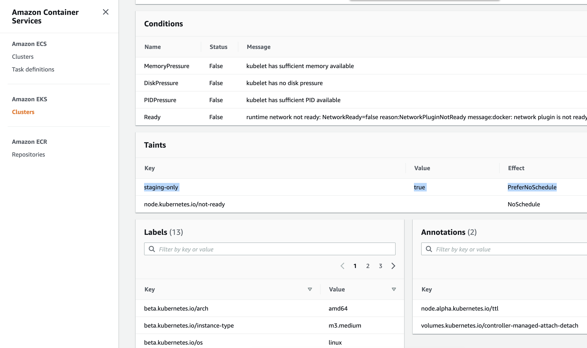

# K8s taintとlabelをworker nodesに追加

# Step 1: まずはWorker nodesの既存のtaintsとlabelsをチェック

```sh
# まずはNodeの名前をリストアップ
kubectl get node

# Nodeの詳細をDescribe
kubectl describe node ip-10-1-xx-xx.ap-northeast-1.compute.internal

# output shows labels and taints
Name:               ip-10-1-xxx-xxx.ap-northeast-1.compute.internal
Roles:              <none>
Labels:             beta.kubernetes.io/arch=amd64 # <---------- labels
                    beta.kubernetes.io/instance-type=m3.medium
                    beta.kubernetes.io/os=linux
                    failure-domain.beta.kubernetes.io/region=ap-northeast-1
                    failure-domain.beta.kubernetes.io/zone=ap-northeast-1a
                    kubernetes.io/arch=amd64
                    kubernetes.io/hostname=ip-10-1-xxx-xxx.ap-northeast-1.compute.internal
                    kubernetes.io/os=linux
                    node.kubernetes.io/instance-type=m3.medium
                    topology.kubernetes.io/region=ap-northeast-1
                    topology.kubernetes.io/zone=ap-northeast-1a
Annotations:        node.alpha.kubernetes.io/ttl: 0
                    volumes.kubernetes.io/controller-managed-attach-detach: true
CreationTimestamp:  Sun, 21 Mar 2021 01:30:28 +0700
Taints:             <none>    # <---------- Taint
```


# Step 2: taintsとlabelsを追加

## 2.1 (Naive approach) Manualでkubectl CLIを使ってtaintsとlabelsを追加
```sh
# add taint to node
kubectl taint nodes NODE_NAME deployment-env=staging:NoSchedule 

# add label to node
kubectl label node NODE_NAME deployment-env=staging
```

ここで問題なのが、EKS worker nodesはAWS ASGによってScale outとInするので、いつEC2が起動するかわからなく、マニュアルでTaintとLabelを追加できません。その場合、PodがNodeにScheduleされないなどの問題が起きます。

自動でTaintとLabelを追加するには、EC2のUserdata script（またはBootstrap scriptとも言われる）で設定する必要があります。


## 2.2 (Best practice) EKS Unmanaged Node Groupsを使って、EC2のUserdata scriptからTaintとLabelを設定


[label example](https://aws.amazon.com/blogs/opensource/improvements-eks-worker-node-provisioning/)
```
--kubelet-extra-args --node-labels=mykey=myvalue,nodegroup=NodeGroup1
```

[taint example](https://stackoverflow.com/questions/53198315/tainting-in-k8s)
```
--kubelet-extra-args --register-with-taints=key=value:NoSchedule
```

LabelとTaintを両方設定する場合 
```sh
kubelet_extra_args  = "--node-labels=env=staging,unmanaged-node=true --register-with-taints=staging-only=true:PreferNoSchedule"   # for unmanaged nodes, taints and labels work only with extra-arg, not ASG tags. Ref: https://aws.amazon.com/blogs/opensource/improvements-eks-worker-node-provisioning/                           
```


ちなみに, `bootstrap_extra_args`は、[resource_modules/container/eks/node_groups.tf](resource_modules/container/eks/node_groups.tf)に存在するAttributeで、ここでAssignしたいValueをComposition layerの`terraform.tfvars`で定義して、トップ・ダウンでパスしていきます
```sh
module "self_managed_node_group" {
  bootstrap_extra_args     = try(each.value.bootstrap_extra_args, var.self_managed_node_group_defaults.bootstrap_extra_args, "")
```


[composition/eks-demo-infra/ap-northeast-1/prod/terraform.tfvars](composition/eks-demo-infra/ap-northeast-1/prod/terraform.tfvars), で`bootstrap_extra_args`を定義

```sh
# note (only for unmanaged node group)
# gotcha: need to use kubelet_extra_args to propagate taints/labels to K8s node, because ASG tags not being propagated to k8s node objects.
# ref: https://github.com/kubernetes/autoscaler/issues/1793#issuecomment-517417680
# ref: https://github.com/kubernetes/autoscaler/issues/2434#issuecomment-576479025
# example: https://github.com/terraform-aws-modules/terraform-aws-eks/blob/master/examples/self_managed_node_group/main.tf#L102-L194
self_managed_node_groups = {
  prod = {
    name          = "worker-group-prod-1"
    instance_type = "m3.medium" # since we are using AWS-VPC-CNI, allocatable pod IPs are defined by instance size: https://docs.google.com/spreadsheets/d/1MCdsmN7fWbebscGizcK6dAaPGS-8T_dYxWp0IdwkMKI/edit#gid=1549051942, https://github.com/awslabs/amazon-eks-ami/blob/master/files/eni-max-pods.txt
    max_size      = 1
    min_size      = 1
    desired_size  = 1 # this will be ignored if cluster autoscaler is enabled: asg_desired_capacity: https://github.com/terraform-aws-modules/terraform-aws-eks/blob/master/docs/autoscaling.md#notes
    

    # use KMS key to encrypt EKS worker node's root EBS volumes
    # ref: https://github.com/terraform-aws-modules/terraform-aws-eks/blob/master/examples/self_managed_node_group/main.tf#L204C11-L215
    block_device_mappings = {
      xvda = {
        device_name = "/dev/xvda"
        ebs = {
          volume_size = 100
          volume_type = "gp3"
          encrypted   = true
          delete_on_termination = true
        }
      }
    }
    
    bootstrap_extra_args     = "--kubelet-extra-args '--node-labels=env=prod,unmanaged-node=true,k8s_namespace=prod  --register-with-taints=prod-only=true:NoSchedule'" # <------------------ STEP 2 # for unmanaged nodes, taints and labels work only with extra-arg, not ASG tags. Ref: https://aws.amazon.com/blogs/opensource/improvements-eks-worker-node-provisioning/
    

    tags = {
      "unmanaged-node"                    = "true"
      "k8s.io/cluster-autoscaler/enabled" = "true" # need this tag so clusterautoscaler auto-discovers node group: https://github.com/terraform-aws-modules/terraform-aws-eks/blob/master/docs/autoscaling.md
      "k8s_namespace"                     = "prod"
      "env"                               = "prod"
    }
  },
}
```


# Step 3: Terraform apply

Then run terraform commands
```sh
cd composition/eks-demo-infra/ap-northeast-1/prod

# will use remote backend
terraform init -backend-config=backend.config

# usual steps
terraform plan
terraform apply

# output 
  + create
  ~ update in-place
+/- create replacement and then destroy

Terraform will perform the following actions:

      # module.eks.module.eks_cluster.aws_autoscaling_group.workers[0] will be updated in-place
  ~ resource "aws_autoscaling_group" "workers" {
        id                        = "eks-apne1-prod-terraform-eks-demo-infra-worker-group-prod-120210320170812217400000002"
      ~ launch_configuration      = "eks-apne1-prod-terraform-eks-demo-infra-worker-group-prod-120210320182257015500000001" -> (known after apply)
        name                      = "eks-apne1-prod-terraform-eks-demo-infra-worker-group-prod-120210320170812217400000002"
        # (22 unchanged attributes hidden)

        # (6 unchanged blocks hidden)
    }

  # module.eks.module.eks_cluster.aws_launch_configuration.workers[0] must be replaced
+/- resource "aws_launch_configuration" "workers" {
      ~ arn                              = "arn:aws:autoscaling:ap-northeast-1:266981300450:launchConfiguration:bb396006-1941-4be7-8fc0-0c769fe2aa3a:launchConfigurationName/eks-apne1-prod-terraform-eks-demo-infra-worker-group-prod-120210320182257015500000001" -> (known after apply)
      ~ id                               = "eks-apne1-prod-terraform-eks-demo-infra-worker-group-prod-120210320182257015500000001" -> (known after apply)
      + key_name                         = (known after apply)
      ~ name                             = "eks-apne1-prod-terraform-eks-demo-infra-worker-group-prod-120210320182257015500000001" -> (known after apply)
      ~ user_data_base64                 = "xxx" -> "zzz" # forces replacement # <------ EC2 userdata config will change due to "kubelet_extra_args" 
      - vpc_classic_link_security_groups = [] -> null
        # (8 unchanged attributes hidden)

      + ebs_block_device {
          + delete_on_termination = (known after apply)
          + device_name           = (known after apply)
          + encrypted             = (known after apply)
          + iops                  = (known after apply)
          + no_device             = (known after apply)
          + snapshot_id           = (known after apply)
          + volume_size           = (known after apply)
          + volume_type           = (known after apply)
        }

      + metadata_options {
          + http_endpoint               = (known after apply)
          + http_put_response_hop_limit = (known after apply)
          + http_tokens                 = (known after apply)
        }

        # (1 unchanged block hidden)
    }

  # module.eks.module.eks_cluster.random_pet.workers[0] must be replaced
+/- resource "random_pet" "workers" {
      ~ id        = "sterling-glider" -> (known after apply)
      ~ keepers   = {
          - "lc_name" = "eks-apne1-prod-terraform-eks-demo-infra-worker-group-prod-120210320182257015500000001"
        } -> (known after apply) # forces replacement
        # (2 unchanged attributes hidden)
    }

Plan: 2 to add, 1 to change, 2 to destroy.
```


# Step 4: マニュアルでEC2 worker nodesを再起動し、Step3でUpdateされたUserdata scriptを含む新しいLaunch configを元にASGが新しいEC2を起動するようにし、EC2にTaintとLabelを追加させる


```sh
# NodeのDNSを取得
kubectl get node

# Nodeの詳細
kubectl describe node ip-10-1-xx-xx.ap-northeast-1.compute.internal

# 設定したTaintとLabelが追加されたのがわかる
Name:               ip-10-1-101-130.ap-northeast-1.compute.internal
Roles:              <none>
Labels:             beta.kubernetes.io/arch=amd64
                    beta.kubernetes.io/instance-type=m3.medium
                    beta.kubernetes.io/os=linux
                    env=staging      # <------------ label from "kubelet_extra_args"
                    failure-domain.beta.kubernetes.io/region=ap-northeast-1
                    failure-domain.beta.kubernetes.io/zone=ap-northeast-1a
                    kubernetes.io/arch=amd64
                    kubernetes.io/hostname=ip-10-1-101-130.ap-northeast-1.compute.internal
                    kubernetes.io/os=linux
                    node.kubernetes.io/instance-type=m3.medium
                    topology.kubernetes.io/region=ap-northeast-1
                    topology.kubernetes.io/zone=ap-northeast-1a
                    unmanaged-node=true
Annotations:        node.alpha.kubernetes.io/ttl: 0
                    volumes.kubernetes.io/controller-managed-attach-detach: true
CreationTimestamp:  Sun, 21 Mar 2021 04:09:53 +0700
Taints:             node.kubernetes.io/not-ready:PreferNoSchedule
                    staging-only=true:PreferNoSchedule # <------------ taint from "kubelet_extra_args"
```

またコンソールで、AWS EKS > Clusters > eks-apne1-prod-terraform-eks-demo-infra > Node: ip-10-1-xx-xx.ap-northeast-1.compute.internalからもチェックできる

