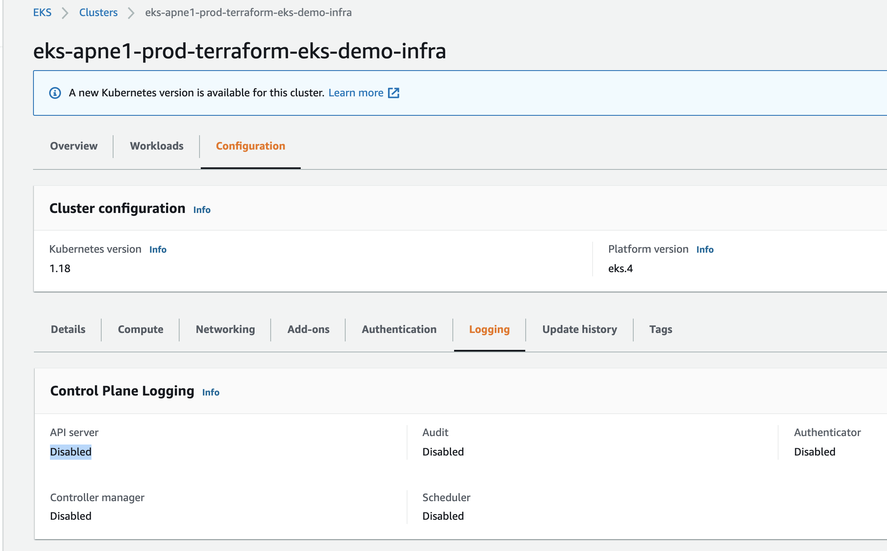
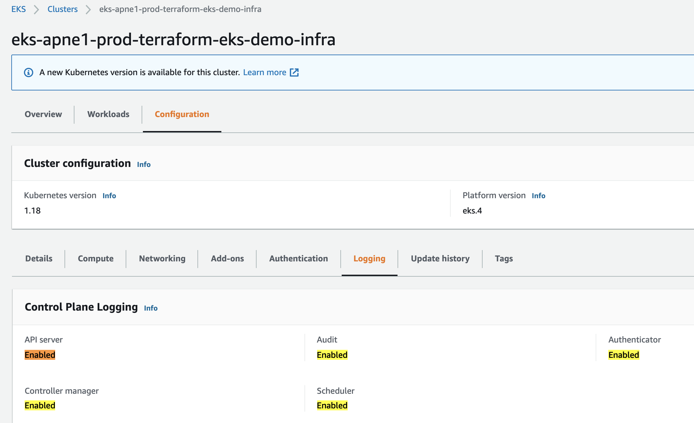

# K8s コントロールプレーン (Master Components)のLoggingを有効化

デフォルトでは, コントロールプレーン(Controller manager, API server, Audit, Scheduler, Authenticator)のログは無効化されています。




# Step 1: まずはコントロールプレーンのログを有効化するための、resource moduleで必要なインプット変数を理解する

[resource_modules/container/eks/cluster.tf](resource_modules/container/eks/cluster.tf)内の, `aws_eks_cluster`resourceが`enabled_cluster_log_types`というAttributeを持っている:
```sh
resource "aws_eks_cluster" "this" {
  count                     = var.create_eks ? 1 : 0
  name                      = var.cluster_name
  enabled_cluster_log_types = var.cluster_enabled_log_types # <----- this
```

[resource_modules/container/eks/variables.tf](resource_modules/container/eks/variables.tf)に, このインプット変数の説明がある
```sh
variable "cluster_enabled_log_types" {
  default     = []
  description = "A list of the desired control plane logging to enable. For more information, see Amazon EKS Control Plane Logging documentation (https://docs.aws.amazon.com/eks/latest/userguide/control-plane-logs.html)" # <----- this
  type        = list(string)
}

variable "cluster_log_retention_in_days" {
  default     = 90
  description = "Number of days to retain log events. Default retention - 90 days."
  type        = number
}
```


# Step 2: `cluster_enabled_log_types`というインプット変数を、トップレベルの`Composition` layerにあるterraform.tfvarsで定義

[composition/eks-demo-infra/ap-northeast-1/prod/terraform.tfvars](composition/eks-demo-infra/ap-northeast-1/prod/terraform.tfvars)
```sh
enabled_cluster_log_types     = ["api", "audit", "authenticator", "controllerManager", "scheduler"]  # <-------- STEP 2
cluster_log_retention_in_days = 365 # default 90 days
```

[composition/eks-demo-infra/ap-northeast-1/prod/main.tf](composition/eks-demo-infra/ap-northeast-1/prod/main.tf)で, `enabled_cluster_log_types`インプット変数をinfrastructure layerのインプット変数にパスする:
```sh
########################################
# EKS
########################################
module "eks" {
  source = "../../../../infrastructure_modules/eks"

  ## EKS ##
  create_eks                     = var.create_eks
  cluster_version                = var.cluster_version
  cluster_name                   = local.cluster_name
  cluster_endpoint_public_access = var.cluster_endpoint_public_access
  vpc_id                         = module.vpc.vpc_id
  subnets                        = module.vpc.private_subnets

  # note: either pass worker_groups or node_groups
  # this is for (EKSCTL API) unmanaged node group
  self_managed_node_groups = var.self_managed_node_groups

  # this is for (EKS API) managed node group
  eks_managed_node_groups = var.eks_managed_node_groups

  manage_aws_auth_configmap = var.manage_aws_auth_configmap
  create_aws_auth_configmap = var.create_aws_auth_configmap
  # add roles that can access K8s cluster
  aws_auth_roles = local.aws_auth_roles
  # add IAM users who can access K8s cluster
  aws_auth_users = var.aws_auth_users

  enabled_cluster_log_types     = var.enabled_cluster_log_types # <-------- STEP 2
  cluster_log_retention_in_days = var.cluster_log_retention_in_days

```

また`enabled_cluster_log_types`と`cluster_log_retention_in_days`のインプット変数を[composition/eks-demo-infra/ap-northeast-1/prod/variables.tf](composition/eks-demo-infra/ap-northeast-1/prod/variables.tf)に定義
```sh
variable "enabled_cluster_log_types" {  # <------ STEP 2
  default     = []
  description = "A list of the desired control plane logging to enable. For more information, see Amazon EKS Control Plane Logging documentation (https://docs.aws.amazon.com/eks/latest/userguide/control-plane-logs.html)"
  type        = list(string)
}

variable "cluster_log_retention_in_days" {  # <------ STEP 2
  default     = 90
  description = "Number of days to retain log events. Default retention - 90 days."
  type        = number
}
```


# Step 3: `enabled_cluster_log_types`インプット変数をinfrastructure layerからresource module layerへパスダウン

[infrastructure_modules/eks/main.tf](infrastructure_modules/eks/main.tf)
```sh
# ref: https://github.com/terraform-aws-modules/terraform-aws-eks/blob/master/examples/complete/main.tf#L5-L33
module "eks_cluster" {
  source = "../../resource_modules/container/eks"

  create = var.create_eks

  cluster_name                   = var.cluster_name
  cluster_version                = var.cluster_version
  cluster_endpoint_public_access = var.cluster_endpoint_public_access

  vpc_id     = var.vpc_id
  subnet_ids = var.subnets

  # Self Managed Node Group(s)
  # self_managed_node_groups takes precedence to self_managed_node_group_defaults
  self_managed_node_groups = var.self_managed_node_groups

  # use KMS key to encrypt EKS worker node's root EBS volumes
  self_managed_node_group_defaults = {
    key_name = module.key_pair.key_name

    iam_role_additional_policies = {}
  }

  # aws-auth configmap
  manage_aws_auth_configmap = var.manage_aws_auth_configmap
  create_aws_auth_configmap = var.create_aws_auth_configmap
  aws_auth_roles            = var.aws_auth_roles
  aws_auth_users            = var.aws_auth_users

  # Extend node-to-node security group rules. Ref: https://github.com/terraform-aws-modules/terraform-aws-eks/blob/master/examples/self_managed_node_group/main.tf#L78
  # WARNING: need this for metrics-server to work, asn well as istio ingress/egress's readiness to work at http://:15021/healthz/ready. Ref: https://github.com/kubernetes-sigs/metrics-server/issues/1024#issuecomment-1124870217
  node_security_group_additional_rules = {
    ingress_self_all = {
      description = "Node to node all ports/protocols"
      protocol    = "-1"
      from_port   = 0
      to_port     = 0
      type        = "ingress"
      self        = true
    },
    egress_all = {
      description = "Node to all ports/protocols" # WARNING: need this for egress to mongoDB 27017-27019
      protocol    = "-1"
      from_port   = 0
      to_port     = 0
      type        = "egress"
      cidr_blocks = ["0.0.0.0/0"]
    },
    ingress_cluster_api_ephemeral_ports_tcp = {
      description                   = "Cluster API to K8S services running on nodes"
      protocol                      = "tcp"
      from_port                     = 1025
      to_port                       = 65535
      type                          = "ingress"
      source_cluster_security_group = true
    },
  }

  # WARNING: needs this to allow kubeseal to work. Ref: https://github.com/bitnami-labs/sealed-secrets/issues/699#issuecomment-1064424553
  cluster_security_group_additional_rules = {
    egress_nodes_ephemeral_ports_tcp = {
      description                = "Cluster API to K8S services running on nodes"
      protocol                   = "tcp"
      from_port                  = 1025
      to_port                    = 65535
      type                       = "egress"
      source_node_security_group = true
    }
  }

  # WARNING: changing this will force recreating an entire EKS cluster!!!
  # enable k8s secret encryption using AWS KMS. Ref: https://github.com/terraform-aws-modules/terraform-aws-eks/blob/master/examples/secrets_encryption/main.tf#L88
  cluster_encryption_config = {
    provider_key_arn = module.k8s_secret_kms_key.arn
    resources        = ["secrets"]
  }

  # enable_irsa                   = var.enable_irsa
  cluster_enabled_log_types     = var.enabled_cluster_log_types # <------- STEP 3
  cluster_log_retention_in_days = var.cluster_log_retention_in_days

  tags = var.tags
}
```

また`enabled_cluster_log_types`と`cluster_log_retention_in_days`のインプット変数を[infrastructure_modules/eks/variables.tf](infrastructure_modules/eks/variables.tf)に定義

```sh
variable "enabled_cluster_log_types" { # <----- STEP 3
  default     = []
  description = "A list of the desired control plane logging to enable. For more information, see Amazon EKS Control Plane Logging documentation (https://docs.aws.amazon.com/eks/latest/userguide/control-plane-logs.html)"
  type        = list(string)
}

variable "cluster_log_retention_in_days" { # <----- STEP 3
  default     = 90
  description = "Number of days to retain log events. Default retention - 90 days."
  type        = number
}
```


# Step 4: Terraform apply

```sh
cd composition/eks-demo-infra/ap-northeast-1/prod

# will use remote backend
terraform init -backend-config=backend.config

# usual steps
terraform plan
terraform apply

# output 
  + create
  ~ update in-place
+/- create replacement and then destroy

Terraform will perform the following actions:

      # module.eks.module.eks_cluster.data.template_file.userdata[0] will be read during apply
  # (config refers to values not yet known)
 <= data "template_file" "userdata"  {
      ~ id       = "6dcf640bbea6d3bedf141829385d1a94b8eb0ffbfd854947ed75bea8522fe030" -> (known after apply)
      ~ rendered = <<-EOT
            #!/bin/bash -e
            
            # Allow user supplied pre userdata code
            
            
            # Bootstrap and join the cluster
            /etc/eks/bootstrap.sh --b64-cluster-ca 'zzz' --apiserver-endpoint 'https://8BCC4AF6E74FFBAEDA5F0675CCD92C4F.gr7.ap-northeast-1.eks.amazonaws.com'  --kubelet-extra-args "--node-labels=env=prod,unmanaged-node=true --register-with-taints=prod-only=true:NoSchedule" 'eks-apne1-prod-terraform-eks-demo-infra'
            
            # Allow user supplied userdata code
        EOT -> (known after apply)
        # (2 unchanged attributes hidden)
    }

  # module.eks.module.eks_cluster.aws_autoscaling_group.workers[0] will be updated in-place
  ~ resource "aws_autoscaling_group" "workers" {
        id                        = "eks-apne1-prod-terraform-eks-demo-infra-worker-group-prod-120210321184411189300000015"
      ~ launch_configuration      = "eks-apne1-prod-terraform-eks-demo-infra-worker-group-prod-120210321184834432000000001" -> (known after apply)
        name                      = "eks-apne1-prod-terraform-eks-demo-infra-worker-group-prod-120210321184411189300000015"
        # (22 unchanged attributes hidden)

        # (6 unchanged blocks hidden)
    }

  # module.eks.module.eks_cluster.aws_cloudwatch_log_group.this[0] will be created
  + resource "aws_cloudwatch_log_group" "this" {
      + arn               = (known after apply)
      + id                = (known after apply)
      + name              = "/aws/eks/eks-apne1-prod-terraform-eks-demo-infra/cluster"
      + retention_in_days = 365
      + tags              = {
          + "Application" = "terraform-eks-demo-infra"
          + "Environment" = "prod"
        }
    }

  # module.eks.module.eks_cluster.aws_eks_cluster.this[0] will be updated in-place
  ~ resource "aws_eks_cluster" "this" {
      ~ enabled_cluster_log_types = [  # <---------- CHANGE
          + "api",
          + "audit",
          + "authenticator",
          + "controllerManager",
          + "scheduler",
        ]
        id                        = "eks-apne1-prod-terraform-eks-demo-infra"
        name                      = "eks-apne1-prod-terraform-eks-demo-infra"
        tags                      = {
            "Application" = "terraform-eks-demo-infra"
            "Environment" = "prod"
        }
        # (9 unchanged attributes hidden)


        # (4 unchanged blocks hidden)
    }

  # module.eks.module.eks_cluster.aws_launch_configuration.workers[0] must be replaced
+/- resource "aws_launch_configuration" "workers" {
      ~ arn                              = "arn:aws:autoscaling:ap-northeast-1:266981300450:launchConfiguration:8c17c8fd-06a9-45ac-a0dd-1794397cecd7:launchConfigurationName/eks-apne1-prod-terraform-eks-demo-infra-worker-group-prod-120210321184834432000000001" -> (known after apply)
      ~ id                               = "eks-apne1-prod-terraform-eks-demo-infra-worker-group-prod-120210321184834432000000001" -> (known after apply)
      + key_name                         = (known after apply)
      ~ name                             = "eks-apne1-prod-terraform-eks-demo-infra-worker-group-prod-120210321184834432000000001" -> (known after apply)
      ~ user_data_base64                 = "zzz" -> (known after apply) # forces replacement
      - vpc_classic_link_security_groups = [] -> null
        # (8 unchanged attributes hidden)

      + ebs_block_device {
          + delete_on_termination = (known after apply)
          + device_name           = (known after apply)
          + encrypted             = (known after apply)
          + iops                  = (known after apply)
          + no_device             = (known after apply)
          + snapshot_id           = (known after apply)
          + volume_size           = (known after apply)
          + volume_type           = (known after apply)
        }

      + metadata_options {
          + http_endpoint               = (known after apply)
          + http_put_response_hop_limit = (known after apply)
          + http_tokens                 = (known after apply)
        }

        # (1 unchanged block hidden)
    }

  # module.eks.module.eks_cluster.random_pet.workers[0] must be replaced
+/- resource "random_pet" "workers" {
      ~ id        = "driving-tiger" -> (known after apply)
      ~ keepers   = {
          - "lc_name" = "eks-apne1-prod-terraform-eks-demo-infra-worker-group-prod-120210321184834432000000001"
        } -> (known after apply) # forces replacement
        # (2 unchanged attributes hidden)
    }

Plan: 3 to add, 2 to change, 2 to destroy.
```


# Step 5: control planeのlogsが有効化されているかConsoleからチェック


