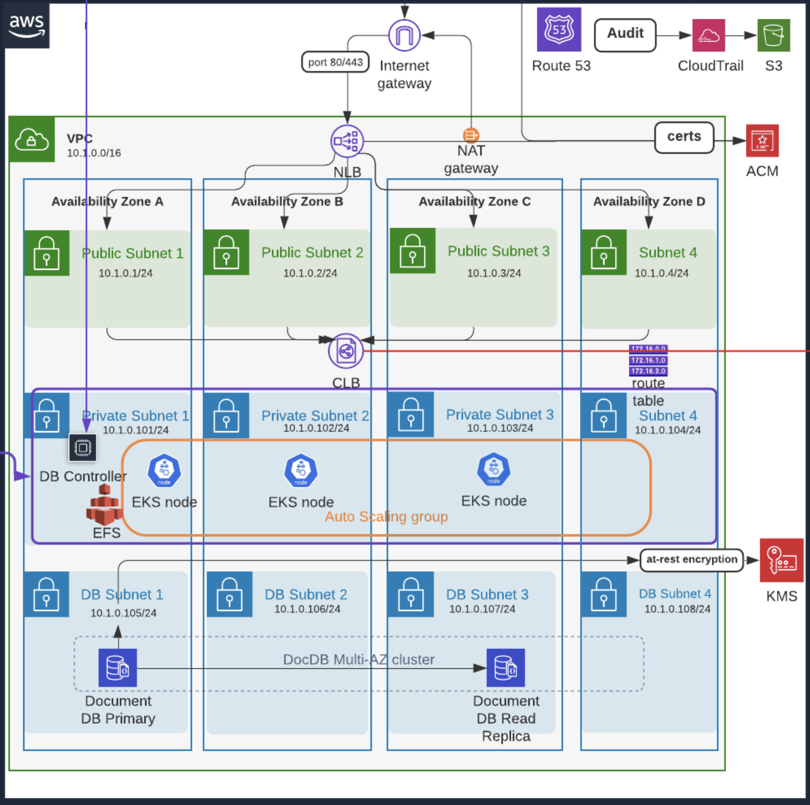
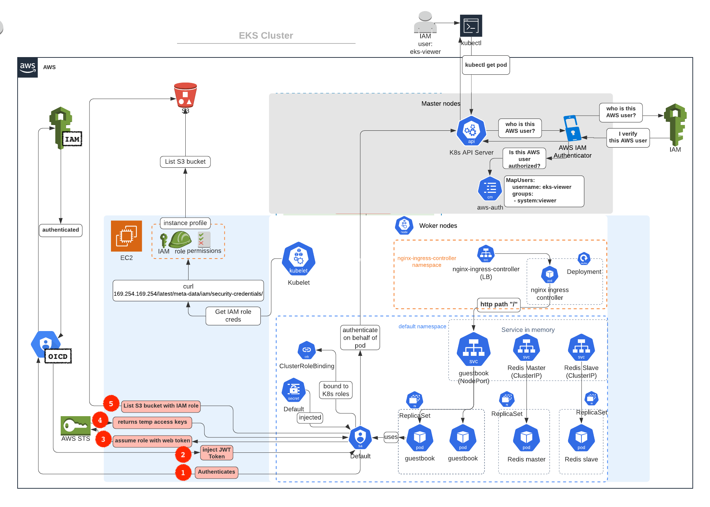

# 米シリコンバレーDevOps監修！上級編Terraform + AWS EKS & VPC


# このコースを取るべき５つの理由

## 1. 大好評！Udemyベストセラーインストラクター（x5）＆現シリコンバレーDevOpsエンジニア（AWS SAAとAWS DevOps Pro、CKA、CKAD保持）による監修

本番現場目線で、Terraform, AWS VPC, EKSを使っている経験をもとに、最新の情報(Terraform v0.14)を紹介します

下記のダイアグラムは、私が本番運用向けにTerraformのみで構築したAWSのアーキテクチャのサンプルです。



## 2. プラクティカル,　スケーラブル, そしてエクステンシブルなTerraformデザインパターンを使い、 抽象化とmodularizationが可能に

本番運用向けには、単にTerraformの基礎を学べばいいだけではありません。

一般的なソフトウェアデザインパターンもTerraformにあてはまり、このコースでは __Facade pattern__ を使い, クリーン、スケーラブル, 管理と拡張がしやすいコードを書いていきます。


例えばデモでよくみる以下のStructureは、本番向けには全く不向きです:
```sh
.
── us-east-1 
│   ├── prod
│   │   ├── backend.config
│   │   ├── main.tf  <------ # main entrypoint
├── modules # <------ modules contain reusable code
│   ├── compute
│   │   ├── ec2
│   │   ├── ec2_key_pair
│   │   ├── security_group
│   │   └── ssm
│   ├── network
│   │   ├── route53
│   │   │   ├── hosted_zone
│   │   │   └── record
│   │   └── vpc
│   └── storage
│       ├── dynamodb
│       ├── efs
│       └── s3
```

このコースでは上級レベルのTerraformベストプラクティスのデザインを使っていきます。

`2.2_three_layered_modules/`:
```sh
$ tree 2.2_three_layered_modules/ -d

2.2_three_layered_modules/
├── composition
│   ├── us-east-1
│   │   ├── prod
│   │   │   └── main.tf # <---エントリーポイント（i.e. main()）
│   │   └── staging                                       |
│   └── us-west-2                                         |
├── infra_module                                          |
│   ├── app # this will wrap multiple resource modules  <--
│   ├── bastion                                   |
│   ├── elb                                       |
│   └── rds                                       |
└── resource_module                               |
    ├── compute                                   |
    │   ├── ec2 # <-------------------------------|
    │   ├── ec2_key_pair # <----------------------|
    │   ├── security_group  # <-------------------|
    │   └── ssm # <-------------------------------|
    ├── network
    │   ├── route53
    │   │   ├── hosted_zone
    │   │   └── record
    │   └── vpc
    └── storage
        ├── dynamodb
        ├── efs
        └── s3
```


## 3. 本番運用向けのAWS EKSベストプラクティス(security, IRSA, CA, EFS, Logging etc)

このコースは、 "__AWS EKSハンズオン__" コースで学んだEKSのベストプラクティスをTerraformを使って実際にアプライしていきます。

カバーされるトピックは:
- K8s secretsやEBS volumesを暗号化
- AWSユーザーやRoleをK8sクラスター内へ認証・認可
- K8s taintsやlabelsをK8s worker nodesへ追加
- master nodeのlogを有効か
- podレベルののAWS IAM role (IRSA)
- Cluster Autoscalerを使い、ワーカーノードを自動でスケールアウト
- EKS worker nodeのuserdata scriptから、EFSをEC2に自動でmount

これらすべてをTerraformから設定します。



例えば、以下のコードはAWS IAM rolesをK8s aws-auth configmapに追加するTerraformのコードです。

[7_security_user_authentication_authorization/composition/eks-demo-infra/ap-northeast-1/prod/data.tf](7_security_user_authentication_authorization/composition/eks-demo-infra/ap-northeast-1/prod/data.tf)
```sh
map_roles = var.authenticate_using_role == true ? concat(var.map_roles, [
    {
      rolearn  = "arn:aws:iam::${data.aws_caller_identity.this.account_id}:role/${var.role_name}"
      username = "k8s_terraform_builder"
      groups   = ["system:masters"] # k8s group name
    },
    {
      rolearn  = "arn:aws:iam::${data.aws_caller_identity.this.account_id}:role/Developer" # create Developer IAM role in Console
      username = "k8s-developer"
      groups   = ["k8s-developer"]
    },
  ]) : var.map_roles
```


## 4. DevOpsとしてスキルアップし、昇給・昇格間違いなし！

このコースで学ぶTerraformとEKSの上級レベルの知識とスキルは、おそらくまだ日本ではほぼ知られていない・実践されていない最先端のものになります。

ここまでできれば、確実にSeniorレベルへのステップアップになり、転職活動や昇給にも当然役立ちます。


## 5. 幅広いコースをたったの５時間以内に凝縮
講師である自分が学んでいたときのコースを選ぶ目安は、コースの長さでもありました。すでに仕事で忙しいエンジニアなので、15-20時間以上だとFocusが持たなかったり、冗長で端的にさくっとスパッと学べないことが多いです。そのため、いかに簡潔にコンパクトに学べるかを意識してこのコースを監修しました。

